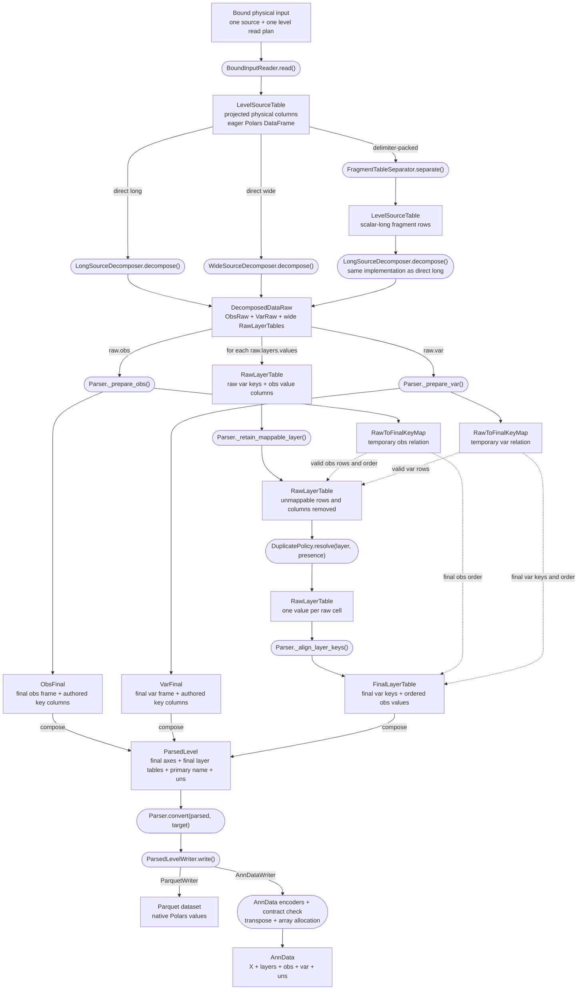
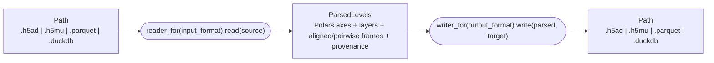

# APB2 converter architecture

> **Status:** canonical, versioned architecture and decision record for the APB2 converter.
> It was derived from the reviewed Parser V2/V5 design discussion, which remains unchanged as
> historical context. This document is the implementation baseline.
>
> **Scope:** rules-driven parsing of one quantification level from one bound physical source into
> a storage-neutral, Polars-based `ParsedLevel`; composition as `ParsedLevels`; and result I/O
> through h5ad, h5mu, Parquet-directory, and DuckDB adapters.
>
> **Out of scope:** FASTA annotation, protein inference, unrelated APB commands, and byte-for-byte
> reconstruction of vendor input.

## How to read this document

Sections 1–9 are the controlling design: decision, pipeline, algorithms, boundaries, public API,
and conclusion. The supplement is the implementation reference: DTOs, Protocols, rule schema,
configuration records, construction, Polars contracts, tests, and handoff. When an example uses a
vendor column name, it illustrates a generic contract; it never creates a vendor-specific branch.

The words **must**, **must not**, and **only** are normative. Examples are explanatory unless an
invariant or test explicitly adopts them.

## 1. Executive decision

Parser V2 is a forward-only pipeline built from fully configured runtime strategies. A parser
holds no `rules.json` model and contains no vendor, level, layout, encoding, duplicate-mode, or
output-format dispatch. `ParseRuleCompiler` consumes those declarations once, constructs the
required behavior objects, and injects them into one `Parser` per compatible quantification level.

The computational result is:

```python
ParsedLevel(
    obs=ObsFinal(...),
    var=VarFinal(...),
    primary_layer_name="Intensity",
    uns={...},
    layers={"Intensity": FinalLayerTable(...)},
    obsm={},
    varm={},
    obsp={},
    varp={},
)
```

The parser keeps measurements as wide Polars DataFrames until parsing is finished:

```text
variable-key columns | observation value columns
```

It does not create pandas indexes, NumPy/SciPy matrices, or AnnData objects.
`ParquetWriter` writes the parsed frames directly. `AnnDataWriter` alone performs layer encoding,
orientation change, NumPy allocation, pandas-index construction, AnnData contract checks, and
AnnData I/O. When the CLI omits `LEVEL`, existing parsers still return one `ParsedLevel` each;
`ParsedLevels` collects them and `MuDataWriter` loops over the corresponding configured
`AnnDataWriter` values to assemble `MuData(axis=0)`. MuData is therefore storage composition, not
a multi-level parsing algorithm. The same `ParsedLevels` value is the result-I/O boundary:

```python
parsed = reader_for(input_format).read(source)
writer_for(output_format).write(parsed, target)
```

Parquet and DuckDB preserve the Polars result exactly. AnnData and MuData deliberately project raw
layer strings to configured numeric/factor matrices. No format crossing bypasses `ParsedLevels`.

The identity model uses explicit columns rather than temporary integer IDs:

- raw source-key columns connect decomposed layers to the small raw axes;
- authored final-key columns define the public obs and var identity;
- a temporary `RawToFinalKeyMap` relates the two during preparation and layer alignment;
- equal raw keys define quantitative duplicate cells;
- different raw keys that materialize to one valid final key are a canonicalization error, not a
  quantitative duplicate.

This algorithm is derived from each effective rule. AlphaDIA, DIA-NN, FragPipe, MaxQuant,
Spectronaut, WOMBAT, and the other packaged documents exercise the same code. Vendor- or
level-specific key algorithms are forbidden.

### 1.1 Why Polars is part of the design

The agreed target-workload benchmark selected Polars 1.43:

| Step | Polars 1.43 | pandas 3.0 + PyArrow | pandas 3.0 conventional |
| --- | ---: | ---: | ---: |
| read TSV, 9 columns | **0.107 s** | 1.980 s | 1.945 s |
| build axis keys | **0.005 s** | 0.038 s | 0.086 s |
| factorize | **0.027 s** | 0.056 s | 0.054 s |
| scatter to three dense layers | 0.008 s | 0.013 s | **0.004 s** |
| deduplicate axis frames | **0.008 s** | 0.039 s | 0.032 s |
| **total** | **0.155 s** | **2.130 s** | **2.120 s** |

Polars was approximately 13.7 times faster end to end. Parser V2 therefore uses concrete
`pl.DataFrame` and `pl.Series` types. It does not introduce a dataframe-engine facade or a runtime
engine switch. Explicit key fields and stable-order contracts keep the model understandable and
make a later dataframe migration possible without redesigning identity, but pandas compatibility
is not an active runtime abstraction.

The benchmark's dense-scatter row compares the legacy end-to-end workload; it is decision
evidence, not a Parser V2 stage. Parser V2 keeps wide frames and allocates arrays only in
`AnnDataWriter`.

### 1.2 Explicit deviations from V5

The specification stays close to V5. These are the only intentional changes:

| Specification decision | V5 design replaced or clarified | Motivation |
| --- | --- | --- |
| `Parser.convert(parsed, target)` writes an already parsed result | V5 showed `parsed = parser.parse()` followed by `parser.convert(target)`, while `convert()` called `parse()` again | Prevent a hidden second read and parse; make `parse()` and `convert()` exactly the two operations requested |
| `WorkingParseConfiguration` | V5 called the pre-source value `ResolvedParseConfiguration` | Reserve *resolved* for `ResolvedLevelPlan`, where physical source evidence is actually resolved |
| `EffectiveRule` carries the document-level `Input` beside the composed level declaration and recognition | V5 called `project_effective_rule(document.rule(...))` even though `rule()` returned only the level rule, leaving no source for `InputContract` | Make the projection a total function of its argument and avoid a second facade lookup into `RuleDocument` |
| `ResolvedLevelPlan` also carries retained modification configs, duplicate mode, and provenance; the facade drops separate duplicate/provenance getters | V5 required the compiler to combine one resolved plan with additional field-like facade calls and did not expose modification configs at all | Make source resolution return one complete parser-construction value, close the missing dependency, and remove two indirections |
| `LevelReadPlan` partitions every projected delimited column into `text_sources` or `native_numeric_sources` | V5 used only `string_sources` and left other columns to dataframe inference | Preserve lexical evidence where required and eliminate inference-window failures for plain numeric layers |
| The main graph expands the packed-fragment path | V5 explained separator-to-long reuse in section 3 but hid it behind the main `SourceDecomposer` arrow | Make the controlling overview agree with the executable sequence |
| Input-policy schema is small and explicit | V5 gave a localized Spectronaut example but left the storage types implicit | Keep shared format defaults in code; rules declare only extension hints, an optional exact folder file name, and observed detection exceptions |
| AnnData pandas-dtype normalization is explicitly writer-owned | V5 placed pandas conversion in `AnnDataWriter` but did not state the Arrow-extension compatibility responsibility | Prevent AnnData/HDF5 restrictions from leaking back into parsing |
| Multi-key AnnData indexes are writer-generated collision-free strings | V5 used pandas `set_index(list(key_columns))`, which creates a `MultiIndex` for several keys | Keep semantic identity in ordinary key columns and satisfy AnnData's string-index storage contract only at the adapter boundary |
| Parquet output is a directory dataset with an explicit manifest | V5 referred to one `.parquet` target although `ParsedLevel` contains several axes, layers, and metadata values | Define a lossless backend contract without flattening unrelated tables into one file |
| `ParsedLevel.uns` and `ParsedLevel.layers` are concrete ordered `dict` values | V5 returned abstract `Mapping` fields even though parsing constructs and writers rely on deterministic authored order | Accept abstractions at inputs, but return the exact concrete result and make ordering explicit |
| Numeric aggregate compatibility is checked during compilation | V5 allowed aggregate construction and specified a runtime rejection for string/factor values | Reject a rule/read-plan combination that cannot satisfy the strategy before parsing a large source; retain a runtime guard for malformed data |
| Numeric aggregate leaves a cell null when it has no semantically present scalar | V5 retained pandas' `0.0` result for a physically present but all-missing group while also requiring a no-contribution cell to stay missing | A wide `RawLayerTable` deliberately carries values, not a physical-cell ledger; null versus absent contribution cannot be recovered after pivot. The null result is information-honest and avoids reintroducing provenance solely to manufacture zero |
| Schema 0.3 removes `keep_all_as_raw_table` from `DuplicateMode` | V5 retained the legacy declaration but required compilation to fail because no final result contract existed | A clean schema must not validate an unexecutable mode; removing it deletes a dead registry path and keeps `ParsedLevel` singular |
| Modification normalizers accept the exact source-series tuple and return a concrete derived-column dict | V5 wrapped those values in `ModificationSourceColumns` and `NormalizedSequenceColumns`, each adding only one redundant field layer | Preserve the narrow capability while deleting two forwarding DTOs and their construction code |
| `ColumnComputer` receives only its configured input-series tuple; source resolution prunes computations blocked by absent optional inputs | V5 passed the complete axis frame and a `skipped` set into every computed-column strategy | Name the smallest capability, consume optionality once, and remove runtime absence branches from every computer |
| Duplicate resolution receives one configured `RawValuePresence` per layer | V5 deferred all missing-sentinel interpretation to the writer, so `keep_first` could retain a sentinel such as AlphaDIA's `0` and discard a later real value | Determine only whether a raw scalar claims a cell; do not convert or replace the scalar, preserving late encoding and Parquet values |
| `ParseRuleFacade.resolve_source(SourceEvidence)` replaces `resolve_header(header)` | V5 expected a column-name sequence to produce numeric formats, read dtypes, and Parquet compatibility decisions | Pass the exact physical evidence required for one atomic resolved plan and remove hidden compiler side channels |
| Vendor-parameter parsing retains the `vendor_params` name and lives in the independent `parserV2/vendor_params/` child; parent-level `conversion_facade.py` translates its complete `Parameters` record to rule-owned `SearchParameterEvidence` | The first specification placed `vendor_params` beside `parserV2` and required a second outer composition layer | Give the CLI one Parser V2-only boundary without renaming the established parameter model, remove the legacy top-level package, and keep both `parse_quant` and `vendor_parse_rules` independent of it |
| Parser V2 owns its boundary errors: rule applicability in `vendor_parse_rules/document.py`, shared parse/source errors in `parse_quant/errors.py`, and strategy-local errors beside their raiser | V5 named error categories but did not assign them to the folder dependency graph; importing the existing top-level `apb2.errors` would be an upward dependency | Keep catchable errors at the boundary that defines their meaning without creating a generic cross-package error module |
| `parserV2` has an explicit downward import graph: `parse_quant/data` owns pipeline values, `parse_quant/parameters` owns working and source-resolved parameters, `parse_quant/contracts.py` owns Parser-consumed Protocols, reader and writer modules live directly in `parse_quant`, parent-level `parse_rule_facade.py` translates `RuleDocument` into parameters, and the inward-only `vendor_parse_rules/schema/` child owns Pydantic storage declarations | V5 named implementation areas but did not assign concrete modules or prohibit child-to-parent and sibling-child imports | Make directory nesting express dependency direction: a module owned by one child moves into that child; only genuine cross-child composition stays in the parent |
| One-class private helpers are private methods; module-level `make_*` and `*_for` names are reserved for construction and selection | V5 showed several one-client parser and writer helpers as free functions | Put implementation details with their sole owner, reduce module namespace and forwarding code, and keep the construction boundary visible |
| Omitted CLI level composes compatible `ParsedLevel` values as MuData | The initial specification explicitly excluded MuData assembly | Match APB's compound-conversion contract without changing parsing: one parser per level, one output-adapter loop, and one `.h5mu` container |
| Result I/O operates on `ParsedLevels` through format-selected readers and writers | V5 specified only parser-owned one-level writing | Give later tools and `apb2 reformat` one storage-neutral boundary; keep `Parser.convert()` unchanged because Parser still owns one level |
| `ParsedLevel` includes axis-aligned and sparse pairwise Polars frames | V5 stopped at axes, layers, and `uns` | Carry the AnnData/MuData slots later tools need without importing their containers into computation |

No other architectural novelty is introduced. In particular, this specification does not restore
the V4 reverse path, temporary IDs, parser-side arrays, a Builder, a generic dataframe facade, or a
broad transformation object.

## 2. Controlling architecture

Rectangles name data values. Rounded boxes name functions or injected behavior. Dashed arrows are
temporary alignment evidence, not ownership. Exactly one physical-shape path is constructed for a
parser.



Persisted-result crossing is a second, storage-only pipeline:



The input and output formats are consumed at this composition boundary. Neither reader nor writer
retains the enum or asks what another adapter is.

The required order is:

```text
select one effective rule and one physical source
    -> bind the source and inspect its header
    -> resolve one level plan atomically against delimited dialect or Parquet schema evidence
    -> read only the level's transitive physical source closure
    -> decompose long, wide, or delimiter-packed physical shape
    -> construct distinct small ObsRaw and VarRaw tables with explicit raw_key_columns
    -> preserve each layer as a wide RawLayerTable
    -> normalize and materialize final axis keys on the small axis tables
    -> reject distinct raw keys that collapse to one valid final key
    -> remove layer rows or columns that cannot map to valid final keys
    -> resolve repeated raw measurement cells column-wise
    -> align raw var keys and obs column order to the validated final axes
    -> discard temporary raw-to-final maps
    -> return ParsedLevel
    -> serialize only when the caller supplies that ParsedLevel to convert()
```

Omitting the CLI level changes only the outer composition:

```text
compile_parsers(document.levels)
    -> for each compatible Parser: parse() -> ParsedLevel
    -> ParsedLevels({level: parsed_level, ...}, shared_uns)
    -> MuDataWriter loops over levels
    -> each level's configured AnnDataWriter.to_anndata(parsed_level)
    -> prefix modality var_names and assemble MuData(axis=0)
    -> atomic .h5mu write
```

Each selected parser still performs its own ordinary single-level read and parse. Sharing a full
source read across levels is a separate performance design and is not implied by MuData output.

### 2.1 Dependency direction

Directory nesting is an import rule, not decoration. For any package `A/` with child packages
`A/B/` and `A/C/`:

```text
A/*.py  ->  A/B/*     allowed: parent module imports downward
A/*.py  ->  A/C/*     allowed: parent module imports downward
A/B/*   ->  A/*.py    forbidden: child imports upward
A/C/*   ->  A/*.py    forbidden: child imports upward
A/B/*   ->  A/C/*     forbidden: sibling child imports sideways
A/C/*   ->  A/B/*     forbidden: sibling child imports sideways
```

A module placed directly in `A/` that merely forwards to `A/B/` belongs in `A/B/`. Placement follows
ownership as well as imports: a parent-level module needs a responsibility owned by `A`, such as
composing `A/B/` and `A/C/` or implementing `A`'s external boundary. An external dependency does
not justify moving an `A/B`-owned module above `A/B/`. This gives `parserV2` the following
direction:

```text
parserV2/*.py
    |
    +--> vendor_parse_rules/*
    |
    +--> parse_quant/*
    |
    +--> vendor_params/*

vendor_parse_rules/*   -X->   parserV2/*.py, parse_quant/*, or vendor_params/*
parse_quant/*          -X->   parserV2/*.py, vendor_parse_rules/*, or vendor_params/*
vendor_params/*        -X->   parserV2/*.py, vendor_parse_rules/*, or parse_quant/*

vendor_parse_rules/*.py  ---> vendor_parse_rules/schema/*  allowed
vendor_parse_rules/schema/* -X-> vendor_parse_rules/*.py    forbidden
vendor_params/registry.py ---> vendor_params/parsers/*       allowed
vendor_params/parsers/*.py ---> vendor_params/parsers/shared/* allowed
vendor_params/parsers/shared/* -X-> vendor-specific parser modules forbidden
```

The workflow owns the Protocols it consumes in `parse_quant/contracts.py`. Modules directly in
`parse_quant/` may import its `data/` and `parameters/` children. No module anywhere under
`parse_quant/` imports a module directly in `parserV2/` or imports `vendor_parse_rules`. No module
under `vendor_parse_rules/` imports a parent module or `parse_quant`.

The computational modules—`parser.py`, `decomposition.py`, `fragments.py`, `axis_columns.py`,
`duplicates.py`, and `modifications.py`—import neither Pydantic models, physical readers, writers,
`anndata`, pandas, NumPy, nor PyArrow storage APIs. Physical boundary modules live directly in
`parse_quant/`: the delimited and vendor-Parquet inputs, the AnnData/MuData and result-Parquet
readers and writers, and DuckDB I/O. Their backend dependencies remain confined to those modules.
`result_io.py` composes the result adapters. Child modules under `parse_quant/data/` and
`parse_quant/parameters/` never import upward into any of them.

`parse_rule_facade.py` therefore cannot live inside `vendor_parse_rules`. It is a parent-level
module because it consumes `vendor_parse_rules.RuleDocument` and produces values from
`parse_quant.parameters`. `compile.py` is the other parent-level module because it composes the
rule child and the parse child. The reader and writer modules do not bridge those children; they
depend only on parse-owned values and therefore belong in `parse_quant`.

Those adapter modules import only the exact downward data and parameter modules required by their
signatures, plus their external framework. They do not import Parser, raw parse state, runtime
strategies, or `parse_quant/contracts.py`. Structural typing proves conformance to the client-owned
Protocols when `compile.py` performs the wiring.

## 3. Identity and join columns

### 3.1 The rule-derived key plan

For each axis, source resolution starts from the authored keys:

```python
obs_keys = effective_rule.axis.obs_keys
var_keys = effective_rule.axis.var_keys
```

It walks the selected and computed-column dependency graph and produces:

```python
@dataclass(frozen=True, slots=True)
class AxisKeyPlan:
    raw_key_columns: tuple[str, ...]
    key_input_columns: tuple[str, ...]
    final_key_columns: tuple[str, ...]
```

The three sets mean:

| Field | Meaning | Lifetime |
| --- | --- | --- |
| `raw_key_columns` | Physical reader columns, resolved wide-header captures, or separator outputs whose complete tuple distinguishes raw source identity before logical coercion and key computation | `ObsRaw`, `VarRaw`, raw layers, temporary key map |
| `key_input_columns` | Direct logical inputs of the authored final key after key-phase materialization, or the selected key itself | Local axis-preparation frame only |
| `final_key_columns` | Authored `axis.obs_keys` or `axis.var_keys` | `ObsFinal`, `VarFinal`, final layers, output adapters |

The dependency walk obeys these rules:

1. A directly selected final key adds its logical selected name to `key_input_columns` and its
   physical source to `raw_key_columns`.
2. A computed final key adds its declared direct inputs to `key_input_columns`.
3. Computed inputs are recursively expanded to physical selections, normalized modification
   sources, resolved wide captures, or synthesized separator outputs.
4. If a key depends on a normalized sequence, every physical modification source that can change
   that sequence belongs to the raw key.
5. Fragment identity may include the separator's synthesized `label_output`.
6. A wide obs key may originate from the already resolved `(?P<sample>...)` header capture.
7. Missing evidence that makes a final key impossible makes the level incompatible. An optional
   column may be skipped only when no final-key dependency requires it.
8. Several authored keys concatenate their closures in authored order and remove repeated column
   names without reordering.
9. No computed operation is assumed globally injective or non-injective. The observed mapping is
   validated after execution.

Every value that can affect final identity must be in the raw-key closure. Payload metadata may
change public obs or var columns, but it must never change final identity.

### 3.2 Generic examples, not special cases

The AlphaDIA v1.10 ion declaration is one readable example:

```python
AxisKeyPlan(
    raw_key_columns=("sequence", "mods", "mod_sites", "charge"),
    key_input_columns=("ProForma_peptidoform", "Charge"),
    final_key_columns=("ProForma_ion",),
)
```

The same derivation yields different values for other rules:

| Effective rule | Final var keys | Key inputs | Raw-key origin |
| --- | --- | --- | --- |
| DIA-NN protein | `Protein_Group` | `Protein_Group` | selected physical `Protein.Group` |
| DIA-NN fragment | `ProForma_fragment` | `ProForma_ion`, `fragment_label` | recursive precursor sources plus separator output |
| Spectronaut fragment | six authored fragment columns | the same six logical columns | their selected physical sources |
| Sage peptidoform | `ProForma_peptidoform` | declared sequence input | selected sequence plus modification evidence |
| a `coalesce` key | authored computed output | declared coalesce inputs | recursively selected physical sources |

These are test cases for one algorithm. They are not registry keys or branches.

### 3.3 Raw duplicates and canonicalization collisions

A raw wide layer may contain repeated var rows:

```text
sequence  mods         mod_sites  charge  A      B      C
PEPMIDE   Oxidation@M  4          2       10.0   12.0   null
PEPMIDE   Oxidation@M  4          2       11.0   null   9.0
OTHER     null         null       3        5.0    6.0   7.0
```

`DuplicatePolicy.resolve()` groups by `RawLayerTable.raw_var_key_columns`, asks the injected
layer-specific `RawValuePresence` which raw scalars claim a cell, and applies its policy
independently to each observation value column. The policy answers only:

> How do several raw scalar values claiming one `(raw var key, raw obs key, layer)` cell become
> one scalar value?

The supported answers are:

- `ErrorOnDuplicates`: reject a cell with more than one present value;
- `KeepFirstDuplicate`: select the first present value in stable physical order;
- `AggregateNumericDuplicates`: sum already-numeric scalar values and reject strings or factors.

`RawValuePresence` may recognize null, a declared numeric sentinel, or a sentinel extracted from a
structured numeric token. It returns a Boolean mask and never changes a scalar value. Layer
encoding is not part of duplicate resolution.

Axis preparation checks a different invariant:

```text
raw_key_a != raw_key_b  implies  final_key_a != final_key_b
```

Rows with a missing final-key component are excluded from this implication because they cannot
enter the parsed axis. If two distinct raw keys produce one valid final key,
`CanonicalKeyCollisionError` reports the final key and representative raw evidence. The configured
duplicate policy is never allowed to hide that information loss.

| Event | Raw keys | Final keys | Owner |
| --- | --- | --- | --- |
| repeated quantitative cell | equal | equal | configured `DuplicatePolicy` |
| distinct valid cells | different | different | normal flow |
| canonicalization collision | different | same valid key | fixed `CanonicalKeyCollisionError` |
| unusable identity | any | at least one missing component | fixed filtering before duplicate resolution |

This distinction catches lossy modification normalization, logical coercion, or computed-key
rules without inventing another policy family.

## 4. Physical decomposition

```python
class SourceDecomposer(Protocol):
    def decompose(self, table: LevelSourceTable, /) -> DecomposedDataRaw: ...
```

A decomposer performs physical shape conversion only. It receives source-resolved columns and
configured key sets. It receives no rule model, vendor name, level name, unresolved regex,
duplicate mode, encoder, or writer.

### 4.1 Long input

`LongSourceDecomposer`:

1. forms `ObsRaw` from the stable first row of each distinct complete obs raw-key tuple;
2. forms `VarRaw` from the stable first row of each distinct complete var raw-key tuple;
3. retains raw-key columns as ordinary Polars columns and retains stable-first payload metadata;
4. creates one wide `RawLayerTable` per resolved layer source;
5. puts raw var-key columns first and observation value columns in exactly `ObsRaw.frame` order;
6. preserves repeated raw cells as repeated var rows for the duplicate policy.

The pivot may use a local occurrence counter to prevent repeated cells from being collapsed by
the dataframe operation. That counter is an implementation detail inside `decompose()` and is
never returned as identity.

### 4.2 Wide input

`WideSourceDecomposer` receives concrete `source_column -> sample` mappings produced during source
resolution. It:

1. derives `ObsRaw` from primary-layer sample captures in stable header order;
2. derives `VarRaw` from complete raw var-key tuples in stable source-row order;
3. excludes selected and computed var-column names before matching permissive layer patterns;
4. selects each layer's resolved physical columns and places their sample-aligned values after the
   raw var-key columns;
5. represents several physical columns claiming one sample as repeated rows so the same
   `DuplicatePolicy` handles long and wide inputs;
6. omits an optional layer with no primary-axis-aligned source;
7. retains a required layer that physically matched only non-primary sample tokens as an empty
   aligned layer: raw var-key rows plus the complete primary observation columns filled with null,
   preserving current contract-check behavior.

Zero physical matches for a required layer make the source incompatible. Header regexes never
reach the decomposer.

### 4.3 Delimiter-packed fragments

Packed fragments are separated before ordinary long decomposition:

```python
class FragmentTableSeparator(Protocol):
    def separate(self, table: LevelSourceTable, /) -> LevelSourceTable: ...


class DelimitedFragmentSourceDecomposer:
    def __init__(
        self,
        separator: FragmentTableSeparator,
        long_decomposer: SourceDecomposer,
    ) -> None:
        self._separator = separator
        self._long_decomposer = long_decomposer

    def decompose(self, table: LevelSourceTable, /) -> DecomposedDataRaw:
        scalar_long = self._separator.separate(table)
        return self._long_decomposer.decompose(scalar_long)
```

The two separator implementations are:

- `PositionalFragmentTableSeparator`, which emits `frag_0`, `frag_1`, ...;
- `ColumnLabeledFragmentTableSeparator`, which emits the configured token derived from the packed
  label source.

The separator preserves authored `packed_value_sources` order, validates parallel packed lengths,
and keeps scalar values as Polars values. It does not build axes, normalize modifications, decode
layers, resolve duplicates, or allocate arrays. A zero-token packed row emits no scalar row,
matching current parser behavior.

The scalar split retains current vendor semantics: null or whitespace-only packed cells contain
zero tokens; outer whitespace and every token's surrounding whitespace are removed; trailing
delimiter terminators are removed before splitting; and an interior empty token remains an empty
scalar at its aligned position. Column-labelled separation derives `label_output` from the trimmed
label token before the first `/`. The separator performs no numeric conversion.

The ordered `packed_value_sources` are physical vendor column names, not layer names and not cell
values. They are not inferred from `measurements.layers`, because the current schema does not
require those collections to correspond one-to-one. For example:

```python
packed_value_sources = (
    "Fragment.Quant.Raw",
    "Fragment.Correlations",
)
```

For a cell `Fragment.Quant.Raw = "1200;900;450"`, positional separation emits three scalar rows
labelled `frag_0`, `frag_1`, and `frag_2`.

## 5. Parser algorithm

The top-level strategy shows the complete call sequence. Helper methods expose the obs, var, and
layer sub-algorithms without hiding them behind a broad transformation object.

```python
class Parser:
    __slots__ = (
        "level",
        "_input",
        "_decomposer",
        "_obs_plan",
        "_var_plan",
        "_modification_normalizers",
        "_duplicates",
        "_raw_value_presence",
        "_writer",
        "_provenance",
    )

    def __init__(
        self,
        *,
        level: QuantificationLevel,
        input_reader: BoundInputReader,
        decomposer: SourceDecomposer,
        obs_plan: AxisRuntimePlan,
        var_plan: AxisRuntimePlan,
        modification_normalizers: tuple[ModificationNormalizer, ...],
        duplicates: DuplicatePolicy,
        raw_value_presence: Mapping[str, RawValuePresence],
        writer: ParsedLevelWriter,
        provenance: Mapping[str, JsonValue],
    ) -> None:
        self.level = level
        self._input = input_reader
        self._decomposer = decomposer
        self._obs_plan = obs_plan
        self._var_plan = var_plan
        self._modification_normalizers = modification_normalizers
        self._duplicates = duplicates
        self._raw_value_presence = dict(raw_value_presence)
        self._writer = writer
        self._provenance = dict(provenance)

    def parse(self) -> ParsedLevel:
        source = self._input.read()
        raw = self._decomposer.decompose(source)

        obs, obs_map = self._prepare_obs(raw.obs)
        var, var_map, unknown_mod_tokens = self._prepare_var(raw.var)
        layers = self._prepare_layers(raw.layers, obs_map, var_map)
        uns = dict(self._provenance)
        if unknown_mod_tokens:
            uns["unknown_mod_tokens"] = list(unknown_mod_tokens)

        return ParsedLevel(
            obs=obs,
            var=var,
            primary_layer_name=raw.layers.primary_layer_name,
            uns=uns,
            layers=layers,
        )

    def convert(self, parsed: ParsedLevel, target: Path, /) -> None:
        self._writer.write(parsed, target)

    def _prepare_obs(
        self,
        raw: ObsRaw,
    ) -> tuple[ObsFinal, RawToFinalKeyMap]:
        frame, mapping = self._prepare_axis(
            raw.frame,
            raw.raw_key_columns,
            {},
            self._obs_plan,
        )
        return ObsFinal(frame=frame, key_columns=self._obs_plan.keys.final_key_columns), mapping

    def _prepare_var(
        self,
        raw: VarRaw,
    ) -> tuple[VarFinal, RawToFinalKeyMap]:
        derived = self._normalize_modification_columns(
            raw.frame,
            self._modification_normalizers,
        )
        frame, mapping = self._prepare_axis(
            raw.frame,
            raw.raw_key_columns,
            derived,
            self._var_plan,
        )
        return VarFinal(frame=frame, key_columns=self._var_plan.keys.final_key_columns), mapping

    def _prepare_layers(
        self,
        raw: LayersRaw,
        obs_map: RawToFinalKeyMap,
        var_map: RawToFinalKeyMap,
    ) -> dict[str, FinalLayerTable]:
        layers: dict[str, FinalLayerTable] = {}
        for layer in raw.values:
            mappable = self._retain_mappable_layer(layer, obs_map, var_map)
            resolved = self._duplicates.resolve(
                mappable,
                self._raw_value_presence[layer.layer_name],
            )
            layers[layer.layer_name] = self._align_layer_keys(
                resolved,
                obs_map,
                var_map,
            )
        return layers
```

`convert()` never calls `parse()`. This makes repeated reads impossible unless the caller explicitly
requests another parse.

### 5.1 Axis preparation

Obs and var share one staged algorithm. Var supplies normalized modification-derived columns;
obs normally supplies an empty mapping.

```python
class Parser:
    @staticmethod
    def _prepare_axis(
        raw: pl.DataFrame,
        raw_key_columns: tuple[str, ...],
        derived: Mapping[str, pl.Series],
        plan: AxisRuntimePlan,
    ) -> tuple[pl.DataFrame, RawToFinalKeyMap]:
        working = Parser._add_derived_columns(raw, derived)
        working = Parser._materialize_axis_columns(
            working,
            plan.key_phase,
        )

        mapping = RawToFinalKeyMap(
            raw_keys=working.select(list(raw_key_columns)),
            final_keys=working.select(list(plan.keys.final_key_columns)),
        )
        Parser._require_injective_key_mapping(mapping)

        valid = Parser._valid_final_key_rows(mapping.final_keys)
        final_rows = working.filter(valid)
        final_rows = Parser._materialize_axis_columns(
            final_rows,
            plan.output_phase,
        )
        return (
            Parser._finalize_axis_frame(
                final_rows,
                keys=plan.keys.final_key_columns,
                outputs=plan.outputs,
            ),
            mapping,
        )
```

The raw axes already contain one stable-first row per complete raw-key tuple. Preparation therefore
does not silently call `unique()` on the final keys. A repeated valid final key from different raw
keys is an error. Rows with missing final-key components stay only in the temporary mapping so the
corresponding raw layer rows or obs value columns can be removed.

The runtime plan is fully configured. `Parser._materialize_axis_columns()` iterates concrete
selections and computers; it does not inspect a `how`, logical type, vendor, layout, level, or
optional-source flag. The private calls in this algorithm are static methods because they use only
their explicit arguments and have one class client. Supplement H states the complete placement
rule; a helper is not made public merely to shorten this class.

### 5.2 Layer filtering, resolution, and alignment

`Parser._retain_mappable_layer()` removes:

- raw var rows whose map row has a missing final-var-key component;
- raw obs value columns whose map row has a missing final-obs-key component.

This is fixed validity filtering, not a policy. The duplicate policy then sees only cells that can
enter the result while still grouping by raw keys.

`Parser._align_layer_keys()` is the only operation that returns `FinalLayerTable`. It:

1. uses the valid variable map in `VarFinal` order as the left spine and joins raw layer rows to it,
   inserting null value rows for final variables absent from that layer;
2. replaces them with the authored final var-key columns;
3. orders rows exactly like `VarFinal.frame`;
4. selects and orders a complete value-column set exactly like valid `ObsFinal.frame` rows,
   inserting null columns for observations absent from that layer;
5. assigns unique storage column names where a multi-column obs identity cannot itself be a Polars
   column name;
6. copies layer scalar values without encoding them.

The generated storage column names are positional labels only. They are unique and disjoint from
the var-key column namespace, but they are not observation identity. `ObsFinal.frame` and
`ObsFinal.key_columns` remain the sole semantic identity.

## 6. Serialization boundary

```python
class ParsedLevelWriter(Protocol):
    def write(self, parsed: ParsedLevel, target: Path, /) -> None: ...
```

The writer receives the complete parsed result. It treats that result as read-only and creates its
own backend values.

### 6.1 Parquet

The parser-owned `ParquetWriter` persists one level by composing the collection writer. The
result-I/O `ParquetLevelsWriter` persists:

- `parsed.obs.frame` plus `parsed.obs.key_columns` metadata;
- `parsed.var.frame` plus `parsed.var.key_columns` metadata;
- every `FinalLayerTable.values` plus `var_key_columns` metadata;
- `primary_layer_name`, per-level `uns`, and shared `ParsedLevels.uns`;
- every `obsm`/`varm` aligned frame; and
- every `obsp`/`varp` sparse-coordinate frame.

It preserves Polars values and dtypes. It does not create AnnData encoders, pandas objects, or
NumPy matrices. The target is an atomic directory dataset:

```text
target.parquet/
    manifest.json
    levels/
        ion/
            obs.parquet
            var.parquet
            layers/
            obsm/
            varm/
            obsp/
            varp/
        protein/
            ...
```

`manifest.json` version 2 records level and table order, axis keys, each layer's var keys, primary
layers, both provenance scopes, every table's ordered logical Polars schema, and explicit
logical-to-physical names. A user-authored name is never interpolated into a path without that
mapping. `ParquetReader` accepts this APB2 dataset only; a vendor `.parquet` file is not a result.

### 6.2 AnnData

`AnnDataWriter` owns every lossy or backend-specific operation:

```python
class AnnDataWriter:
    def to_anndata(self, parsed: ParsedLevel, /) -> AnnData:
        encoded: dict[str, pl.DataFrame] = {}
        for name, layer in parsed.layers.items():
            n_key_columns = len(layer.var_key_columns)
            value_columns = layer.values.columns[n_key_columns:]
            raw_values = layer.values.select(value_columns)
            encoded[name] = self._encoders[name].encode(raw_values)

        self._contract.check(encoded)
        arrays = {
            name: frame.to_numpy().astype(np.float64, copy=False).T
            for name, frame in encoded.items()
        }

        obs = self._make_axis_frame(parsed.obs.frame, parsed.obs.key_columns)
        var = self._make_axis_frame(parsed.var.frame, parsed.var.key_columns)

        adata = AnnData(
            X=arrays[parsed.primary_layer_name],
            obs=obs,
            var=var,
            layers=arrays,
        )
        _write_parse_namespace(adata, parsed.uns)
        return adata

    def write(self, parsed: ParsedLevel, target: Path, /) -> None:
        _write_atomically(target, self.to_anndata(parsed).write_h5ad)
```

`_write_parse_namespace()` writes `{ "parse": parsed.uns }` below the APB-owned top-level key
`"apb"`. Parsing never replaces that top-level namespace with its own fields: `apb` may also
contain sibling namespaces owned by other APB tools.

`AnnDataWriter._make_axis_frame()` converts Polars to pandas and normalizes extension dtypes to values
supported by AnnData/HDF5. It retains every authored key as an ordinary column. For one string key,
the existing value is used as the storage index when safe. For one nonstring key or for several
keys, it creates a collision-free string representation of the complete typed key tuple. The
representation is a canonical JSON array of `[logical_type, scalar_text]` pairs, not separator
concatenation; JSON escaping and the type tag distinguish values such as embedded separators,
strings, integers, and booleans. This string is an AnnData storage requirement only; parsing never
uses it for joins, grouping, or identity.

`_make_axis_frame()` remains a private static method because it has one class client.
`_write_parse_namespace()` and `_write_atomically()` are module-private functions because both
AnnData and MuData writing use them. They remain in `parse_quant/anndata_writer.py`; neither belongs
in `data/` or `parameters/`, because either child would then need to import upward to use it.

AnnData encoders implement:

- plain numeric conversion plus blank-token and missing-sentinel handling;
- regex numeric extraction plus blank-token and localized-number conversion;
- factor-label mapping through the authored category map, retaining the current `-1` code for a
  null or unknown label.

The encoded-layer checker evaluates required-layer and occupancy contracts after encoding, when a
failed numeric interpretation is visible. These checks do not run for Parquet.

For the existing occupancy policy, a layer is suspicious only when it is below `empty_ratio` while
a sibling reaches `populated_ratio`. The checker first verifies that the encoded mapping contains
the primary and every resolved required name. Standard occupancy checking raises for the primary
and warns for other suspicious layers; strict checking raises for every suspicious retained layer.
If no sibling is populated, occupancy alone does not distinguish an empty experiment from a parse
failure and does not invent that conclusion.

### 6.3 MuData

`ParsedLevels` is the output-boundary collection, not another parsed-data model:

```python
@dataclass(slots=True)
class ParsedLevels:
    levels: dict[ParsedLevelName, ParsedLevel]
    uns: dict[str, JsonValue]
```

`MuDataWriter` holds the configured `AnnDataWriter` for each included level. It iterates the
canonical level order, calls `to_anndata()` for each `ParsedLevel`, prefixes only the AnnData
storage `var_names` (`ion:`, `pfm:`, `pep:`, `prt:`, `frg:`), constructs `MuData(modalities,
axis=0)` under MuData's non-pulling update semantics, writes shared provenance to
`mdata.uns["apb"]["parse"]`, and
atomically writes `.h5mu`. The authored unprefixed key remains an ordinary modality `.var` column.

One modality is valid; zero modalities is an error. The parsed-level names and configured writer
names must match exactly. Level-specific rule JSON and resolved-plan provenance remain inside each
modality; the MuData root contains only shared producer, selection, parameter, and ordered-level
facts.

### 6.4 Shared result-I/O capability

The result-I/O client owns two Protocols. Concrete adapters conform structurally and do not import
the Protocol declarations:

```python
class ParsedLevelsReader(Protocol):
    def read(self, source: Path, /) -> ParsedLevels: ...


class ParsedLevelsWriter(Protocol):
    def write(self, parsed: ParsedLevels, target: Path, /) -> None: ...
```

The primary API selects explicitly by one composition-boundary enum:

```python
parsed = reader_for(input_format).read(source)
writer_for(output_format).write(parsed, target)
```

`ResultFormat` contains `H5AD`, `H5MU`, `PARQUET`, and `DUCKDB`. One registry consumes it. Concrete
adapters retain no format tag and contain no format switch. The optional path conveniences
`read_parsed_levels(source)` and `write_parsed_levels(parsed, target)` infer the same enum from
`.h5ad`, `.h5mu`, `.parquet`, or `.duckdb` and delegate to the primary API.

An h5ad adapter still operates on `ParsedLevels`: its reader returns exactly one level and its
writer rejects any other cardinality before staging. This keeps one format-crossing pipeline while
preserving the parser-owned `ParsedLevelWriter` capability used by `Parser.convert()`.

### 6.5 DuckDB and the h5 result envelope

One DuckDB file contains fixed metadata plus one physical table per axis, layer, aligned frame, or
pairwise coordinate frame. Logical names map to generated `data_000000`-style table names. No
logical/vendor name is interpolated into SQL. The writer stages a complete database beside the
target; the reader opens it read-only and closes it before returning the Polars value. DuckDB asks
Polars for Arrow record batches when registering a frame, so PyArrow is an explicit runtime
dependency even though APB2 does not import it directly.

h5ad/h5mu store a versioned JSON result envelope at `uns["apb"]["result"]`, beside the existing
parse provenance at `uns["apb"]["parse"]`. The envelope distinguishes shared and per-level
provenance, records ordered logical names and axis keys, and maps names that HDF5 cannot represent
directly to safe physical keys. An h5 reader requires that envelope; it is deliberately not a
general third-party AnnData importer.

The h5 collection writers reconstruct the standard matrix encoders and occupancy contract from
the stored `plan_json`. They do not reload `rules.json`, import its Pydantic models, or resolve a
source again. A result already read from h5 is marked as matrix-projected, so a second h5 write
uses numeric identity encoding and is idempotent—including factor layers that are now numeric
codes.

### 6.6 Fidelity laws

Parquet and DuckDB are lossless result formats:

```text
read(write(parsed)) == parsed
```

The equality includes level/table order, Polars schemas, null versus NaN, logical names, every
known slot, and both provenance scopes. Parquet↔DuckDB crossings obey the same law.

h5ad and h5mu implement the configured matrix projection. Their law is:

```text
read(write(parsed)) == ann_data_projection(parsed)
ann_data_projection(ann_data_projection(parsed)) == ann_data_projection(parsed)
```

Raw numeric strings and factor labels are intentionally not recoverable after that projection.
Crossing from h5 into Parquet or DuckDB preserves the represented projected values exactly.

## 7. Architectural roles and construction

1. `RuleDocument` is the public API over one loaded `rules.json`. It retains its private `_shell`,
   accesses shell members through properties and methods, composes base plus level, and applies
   search-parameter gates and overrides.
2. `ParseRuleFacade` projects one document, level, and rule-owned parameter evidence value into a storage-model-free
   working rule, then resolves all source-evidence-dependent decisions atomically.
3. `ParseRuleCompiler` is the composition root. It binds the physical source, observes its dialect
   or schema evidence, requests one resolved level plan, constructs runtime strategies through
   registries, and injects one writer.
4. `Parser` is one fully configured level strategy. It orchestrates narrow collaborators and
   returns `ParsedLevel`.
5. `ParquetWriter` and `AnnDataWriter` are output adapters implementing the workflow-owned
   `ParsedLevelWriter` contract.
6. `MuDataWriter` is the concrete compound-output adapter. The parent composition root gives it
   the configured `AnnDataWriter` for every included level; parsing does not see it.
7. `result_io.py` is the result-I/O composition boundary. It selects immutable h5ad, h5mu,
   Parquet, or DuckDB readers and writers and owns the storage-only `reformat` use case.

```mermaid
classDiagram
    class RuleDocument {
        -_RuleDocumentSchema _shell
        +declared(level) EffectiveRule
        +rule(level, parameter_evidence) EffectiveRule
        +matches(headers) bool
    }

    class SearchParameterEvidence

    class ParseRuleFacade {
        -WorkingParseConfiguration _configuration
        +working_parameters WorkingParseConfiguration
        +resolve_source(evidence) ResolvedLevelPlan
    }

    class ParseRuleCompiler {
        -ParseRuleFacade _facade
        +compile(source) Parser
    }

    class Parser {
        +parse() ParsedLevel
        +convert(parsed, target) None
        -_prepare_obs(raw) tuple
        -_prepare_var(raw) tuple
        -_prepare_layers(raw, obs_map, var_map) dict
        -_prepare_axis(raw, keys, derived, plan)$ tuple
        -_retain_mappable_layer(layer, obs_map, var_map)$ RawLayerTable
        -_align_layer_keys(layer, obs_map, var_map)$ FinalLayerTable
    }

    class BoundInputReader {
        <<protocol>>
        +read() LevelSourceTable
    }
    class SourceDecomposer {
        <<protocol>>
        +decompose(table) DecomposedDataRaw
    }
    class FragmentTableSeparator {
        <<protocol>>
        +separate(table) LevelSourceTable
    }
    class DuplicatePolicy {
        <<protocol>>
        +resolve(layer, presence) RawLayerTable
    }
    class RawValuePresence {
        <<protocol>>
        +present(values) pl.Series
    }
    class ParsedLevelWriter {
        <<protocol>>
        +write(parsed, target) None
    }
    class ParsedLevelsReader {
        <<protocol>>
        +read(source) ParsedLevels
    }
    class ParsedLevelsWriter {
        <<protocol>>
        +write(parsed, target) None
    }
    class AnnDataLayerEncoder {
        <<protocol>>
        +encode(values) pl.DataFrame
    }
    class AnnDataLayerContractChecker {
        <<protocol>>
        +check(encoded) None
    }

    class LongSourceDecomposer
    class WideSourceDecomposer
    class DelimitedFragmentSourceDecomposer
    class AnnDataWriter
    class MuDataWriter
    class ParquetWriter
    class H5adReader
    class H5muReader
    class H5adWriter
    class H5muWriter
    class ParquetReader
    class ParquetLevelsWriter
    class DuckDBReader
    class DuckDBWriter
    class ParsedLevels
    class ParsedLevel
    class DecomposedDataRaw
    class ObsRaw
    class VarRaw
    class LayersRaw
    class RawLayerTable
    class ObsFinal
    class VarFinal
    class FinalLayerTable
    class RawToFinalKeyMap

    ParseRuleFacade ..> RuleDocument : consumes during projection
    ParseRuleFacade ..> SearchParameterEvidence : consumes
    RuleDocument ..> SearchParameterEvidence : evaluates gates and overrides
    ParseRuleCompiler *-- ParseRuleFacade
    ParseRuleCompiler --> Parser : constructs
    Parser *-- BoundInputReader
    Parser *-- SourceDecomposer
    Parser *-- DuplicatePolicy
    Parser *-- RawValuePresence : one per layer
    Parser *-- ParsedLevelWriter
    Parser --> ParsedLevel : returns
    SourceDecomposer <|.. LongSourceDecomposer
    SourceDecomposer <|.. WideSourceDecomposer
    SourceDecomposer <|.. DelimitedFragmentSourceDecomposer
    DelimitedFragmentSourceDecomposer *-- FragmentTableSeparator
    ParsedLevelWriter <|.. AnnDataWriter
    ParsedLevelWriter <|.. ParquetWriter
    ParsedLevelsReader <|.. H5adReader
    ParsedLevelsReader <|.. H5muReader
    ParsedLevelsReader <|.. ParquetReader
    ParsedLevelsReader <|.. DuckDBReader
    ParsedLevelsWriter <|.. H5adWriter
    ParsedLevelsWriter <|.. H5muWriter
    ParsedLevelsWriter <|.. ParquetLevelsWriter
    ParsedLevelsWriter <|.. DuckDBWriter
    AnnDataWriter *-- AnnDataLayerEncoder
    AnnDataWriter *-- AnnDataLayerContractChecker
    MuDataWriter *-- AnnDataWriter : one configured writer per level
    MuDataWriter --> ParsedLevels : writes
    ParsedLevels *-- ParsedLevel : one or more
    DecomposedDataRaw *-- ObsRaw
    DecomposedDataRaw *-- VarRaw
    DecomposedDataRaw *-- LayersRaw
    LayersRaw *-- RawLayerTable
    RawLayerTable ..> FinalLayerTable : align through key maps
    RawToFinalKeyMap ..> FinalLayerTable : temporary alignment evidence
    ParsedLevel *-- ObsFinal
    ParsedLevel *-- VarFinal
    ParsedLevel *-- FinalLayerTable
```



This class diagram shows the primary ownership and dependency direction; it is not an exhaustive
type inventory. Supplement A is the complete pipeline-data inventory, and Supplement B is the
complete runtime Protocol inventory with every implementation family.

### 7.1 Package and module boundaries

The class diagram deliberately does not encode file placement. This separate diagram is the
controlling import graph for `parserV2`:

```mermaid
flowchart TB
    subgraph PACKAGE["parserV2/"]
        subgraph ROOT_MODULES["modules directly in parserV2/ — cross-child composition"]
            CONVERSION["conversion_facade.py<br/>CLI-facing application facade"]
            DETECTION["detect_document.py<br/>header-only packaged-rule selection"]
            FACADE["parse_rule_facade.py<br/>RuleDocument -> parsing parameters"]
            COMPILE["compile.py<br/>only runtime composition root"]
        end

        subgraph PARAM_PACKAGE["vendor_params/ — never imports up or sideways"]
            PARAM_REGISTRY["registry.py<br/>software-name dispatch"]
            subgraph PARAM_PARSERS["parsers/"]
                VENDOR_PARSERS["one module per vendor grammar"]
                subgraph PARAM_SHARED["shared/ — imports no vendor parser"]
                    PARAM_FOUNDATION["model.py + common.py + unimod.py<br/>complete parameter record and shared primitives"]
                end
            end
        end

        subgraph RULES_PACKAGE["vendor_parse_rules/ — never imports up or sideways"]
            RULES["document.py + loader.py<br/>↓ inward-only schema/ child"]
        end

        subgraph PARSE_PACKAGE["parse_quant/ — never imports up or sideways"]
            DELIMITED_INPUT["delimited_input.py<br/>physical text -> LevelSourceTable"]
            PARQUET_INPUT["parquet_input.py<br/>physical Parquet -> LevelSourceTable"]
            RESULT_IO["result_io.py<br/>format registry + reformat use case"]
            ANNDATA_READER["anndata_reader.py<br/>h5ad/h5mu -> ParsedLevels"]
            ANNDATA_WRITER["anndata_writer.py<br/>ParsedLevel(s) -> h5ad/h5mu"]
            PARQUET_READER["parquet_reader.py<br/>dataset -> ParsedLevels"]
            PARQUET_WRITER["parquet_writer.py<br/>ParsedLevel(s) -> dataset"]
            DUCKDB_IO["duckdb_io.py<br/>DuckDB <-> ParsedLevels"]
            ERRORS["errors.py<br/>shared parse/source boundary errors"]
            SOURCE_DATA["data/source.py<br/>LevelSourceTable"]
            RAW_DATA["data/raw.py<br/>raw axes, layers, key map"]
            PARSED_DATA["data/parsed.py<br/>final axes, slots, ParsedLevel(s)"]
            PARAMETERS["parameters/<br/>working and source-resolved values"]
            CONTRACTS["contracts.py<br/>Parser-consumed Protocols and runtime plans"]
            PARSE["Parser, decomposers, columns,<br/>modifications, duplicate policies"]
        end
    end

    PYDANTIC["Pydantic"]
    POLARS["Polars"]
    STORAGE["pandas + NumPy + AnnData<br/>or PyArrow/Parquet storage APIs"]

    CONVERSION --> DETECTION
    CONVERSION --> COMPILE
    CONVERSION --> FACADE
    CONVERSION --> PARAM_REGISTRY
    CONVERSION --> PARAM_FOUNDATION
    CONVERSION --> RULES
    DETECTION --> COMPILE
    DETECTION --> FACADE
    DETECTION --> PARAM_FOUNDATION
    DETECTION --> RULES
    COMPILE --> FACADE
    COMPILE --> DELIMITED_INPUT
    COMPILE --> PARQUET_INPUT
    COMPILE --> PARSE
    COMPILE --> PARAMETERS
    COMPILE --> CONTRACTS
    COMPILE --> ANNDATA_WRITER
    COMPILE --> PARQUET_WRITER
    COMPILE --> ERRORS
    CONVERSION --> RESULT_IO

    FACADE --> RULES
    FACADE --> PARAMETERS
    FACADE --> ERRORS
    FACADE --> PARAM_FOUNDATION
    PARAM_REGISTRY --> VENDOR_PARSERS
    VENDOR_PARSERS --> PARAM_FOUNDATION
    DELIMITED_INPUT --> SOURCE_DATA
    DELIMITED_INPUT --> PARAMETERS
    DELIMITED_INPUT --> ERRORS
    PARQUET_INPUT --> SOURCE_DATA
    PARQUET_INPUT --> PARAMETERS
    PARSE --> SOURCE_DATA
    PARSE --> RAW_DATA
    PARSE --> PARSED_DATA
    PARSE --> PARAMETERS
    PARSE --> CONTRACTS
    CONTRACTS --> SOURCE_DATA
    CONTRACTS --> RAW_DATA
    CONTRACTS --> PARSED_DATA
    ANNDATA_WRITER --> PARSED_DATA
    ANNDATA_READER --> PARSED_DATA
    PARQUET_WRITER --> PARSED_DATA
    PARQUET_READER --> PARSED_DATA
    DUCKDB_IO --> PARSED_DATA
    RESULT_IO --> ANNDATA_READER
    RESULT_IO --> ANNDATA_WRITER
    RESULT_IO --> PARQUET_READER
    RESULT_IO --> PARQUET_WRITER
    RESULT_IO --> DUCKDB_IO

    RULES --> PYDANTIC
    PARAM_FOUNDATION --> PYDANTIC
    DELIMITED_INPUT --> POLARS
    PARQUET_INPUT --> POLARS
    PARSE --> POLARS
    ANNDATA_WRITER --> POLARS
    PARQUET_WRITER --> POLARS
    ANNDATA_WRITER --> STORAGE
    ANNDATA_READER --> STORAGE
    PARQUET_WRITER --> STORAGE
    PARQUET_READER --> STORAGE
    DUCKDB_IO --> STORAGE
```



Every project-internal arrow either stays at one directory level, points from a module to one of its
child packages, or points from a `parserV2` parent module down into a child package. No arrow starts
in `parse_quant/`, `vendor_params/`, or `vendor_parse_rules/` and ends in the parent or a
sibling child. `compile.py` may import the rule and parse children because construction and
dependency injection are its one responsibility. `parse_rule_facade.py` is the parent-level bridge
between those two child packages: it
imports the rule document and parsing parameter values, performs no parsing or I/O, and keeps the
children independent.

Parent-level `conversion_facade.py` is the CLI-facing application boundary. It may import all three
child packages, preserves the complete parameter record for provenance, translates only the two
permitted fields into rule-owned `SearchParameterEvidence`, and translates expected subsystem
failures into one `ConversionError` for the CLI.
`detect_document.py` combines header-only source inspection with rule compatibility and parameter
evidence. The top-level `apb2/cli.py` imports only `apb2.parserV2.*`; no child package imports
`conversion_facade.py` or `detect_document.py`.

The physical I/O modules sit directly in `parse_quant/` because they depend only on parse-owned
data, storage metadata, and—for source input only—source parameters. Computation modules do not
import them. `anndata_reader.py` and `anndata_writer.py` alone import pandas, NumPy, SciPy,
AnnData, or MuData; `duckdb_io.py` alone imports DuckDB and triggers the dynamic Polars-to-PyArrow
interchange. `result_io.py` is above these adapters and is the only result-format registry.

`BoundInputReader` and `ParsedLevelWriter` belong in `parse_quant/contracts.py` because `Parser` is
the client that exercises both capabilities. Concrete readers and writers satisfy those Protocols
structurally. Reader modules import only their `data/source.py`, exact source-parameter children,
and the shared parse-owned `errors.py` when binding/inspection can fail;
writer/result-reader modules import only the parsed data value, result metadata/validation, and
their physical backend. They do not import Parser, raw state, decomposition, rules, or vendor
parameters. `compile.py` performs parser-owned writer wiring; `result_io.py` performs
collection-adapter selection. `LevelSourceTable`, raw states, `ParsedLevel`, and `ParsedLevels`
form one parsing-owned data model under `parse_quant/data`, separated into source, raw, and parsed
lifecycle modules.

`ParseRuleFacade` lives in parent-level `parse_rule_facade.py`. It consumes a validated
`RuleDocument` and returns working or source-resolved values from `parse_quant/parameters`.
`parse_quant` never imports the facade, document, or Pydantic schema, while `vendor_parse_rules`
never imports the facade or parsing parameters. Placing the facade under `vendor_parse_rules/`
would require a child-to-sibling import and is therefore forbidden.

There is no Builder. Construction is one fixed compilation sequence supplied with complete inputs.
`make_<thing>()` functions construct configured runtime objects. `<thing>_for()` functions select
existing stateless implementations. A registry lookup is the only permitted dispatch point for a
declaration discriminator.

## 8. Public API

One level:

```python
document = load_rule_document(rule_path)
parameters = parse_search_parameters(parameter_source)
parameter_evidence = SearchParameterEvidence(
    acquisition_method=parameters.acquisition_method,
    combine_charge_states=parameters.combine_charge_states,
)
source = SingleFile(report_path)

facade = ParseRuleFacade(document, "ion", parameter_evidence)
parser = ParseRuleCompiler(
    facade,
    output=AnnDataOutput(checks="standard"),
).compile(source)

parsed = parser.parse()  # Contains unencoded Polars layer values.
parser.convert(parsed, Path("ion.h5ad"))
```

Several levels return a list, and the caller iterates:

```python
parsers = compile_parsers(
    document=document,
    levels=requested_levels,
    parameter_evidence=parameter_evidence,
    source=source,
    output=ParquetOutput(),
)

for parser in parsers:
    parsed = parser.parse()
    parser.convert(
        parsed,
        output_folder / parser.level,
    )
```

`compile_parsers()` preserves canonical level order, skips incompatible levels without affecting
compatible ones, and raises when no requested level is compatible. Every returned parser is fully
initialized and retains configuration only for its own level.

`AnnDataOutput` and `ParquetOutput` are composition-boundary declarations. The compiler consumes
the output choice once and injects a writer; `Parser` never receives or inspects an output tag.

Persisted results use the collection boundary even when they contain one level:

```python
parsed = reader_for(ResultFormat.PARQUET).read(Path("result.parquet"))
writer_for(ResultFormat.DUCKDB).write(parsed, Path("result.duckdb"))

# Additional path-inferred conveniences:
parsed = read_parsed_levels(Path("result.duckdb"))
write_parsed_levels(parsed, Path("result.h5mu"))
```

The CLI exposes the same storage-only pipeline as `apb2 reformat SOURCE TARGET`. It has no rule,
level, software, parameter, strictness, FASTA, or annotation option.

## 9. Architectural conclusion

The implementation must preserve these invariants:

- schema 0.3 makes `axis` identity-only, moves primary/duplicates/layers under `measurements`,
  declares bounded physical input policy, and admits only executable duplicate modes;
- one generic key-plan derivation compiles every axis of every effective rule;
- level-specific physical projection occurs during reading and before decomposition;
- delimiter-packed fragments are separated before and then reuse ordinary long decomposition;
- raw and final axis identity is explicit in columns and tuple fields, never in a hidden dataframe
  index or temporary integer code;
- `ObsRaw` and `VarRaw` contain one stable-first row per complete raw-key tuple;
- raw layers are wide DataFrames with raw var-key columns first and obs values in raw obs order;
- a layer-specific presence strategy may compute only a Boolean mask for duplicate resolution;
  retained raw scalar values remain unencoded;
- raw duplicates are resolved before final-key alignment and only by equal raw keys;
- different raw keys that collapse to one valid final key raise `CanonicalKeyCollisionError`;
- `ObsFinal`, `VarFinal`, and `FinalLayerTable` retain authored final keys as ordinary columns;
- temporary key maps are discarded before `ParsedLevel` is returned;
- parsing never coerces a layer for AnnData, creates a matrix, constructs a pandas index, or writes
  a backend object;
- Parquet and DuckDB preserve parsed Polars values; AnnData/MuData alone own encoding and array
  allocation;
- result adapters operate on `ParsedLevels`; every crossing goes through that value and never
  through a backend-to-backend shortcut;
- runtime strategies contain no Pydantic rule, vendor selector, level selector, layout switch,
  `how` switch, encoding switch, duplicate-mode switch, or output switch;
- `Parser.parse()` computes and returns; `Parser.convert(parsed, target)` writes that supplied
  result and never reparses;
- FASTA annotation remains outside this refactor.

This is the smallest forward model that retains the information needed for correct duplicate
diagnostics, efficient axis computation, backend-neutral Parquet output, and late AnnData
serialization. Implementation details and verification obligations follow in the supplement.

## Supplement

Python sketches assume the package's Python 3.13 minimum, `from __future__ import annotations`, strict Pyright, and the
imports implied by the qualified names. `...` marks an intentionally omitted method body, not an
optional value or unresolved architectural decision.

```python
type JsonScalar = None | bool | int | float | str
type JsonValue = JsonScalar | list[JsonValue] | dict[str, JsonValue]
```

### A. Pipeline data types

These are computational boundary values, not persistence models. Each key-owning type states its
keys explicitly:

| Type | Identity contract |
| --- | --- |
| `LevelSourceTable` | physical source rows; no axis identity yet |
| `ObsRaw` | `raw_key_columns` names columns in `frame` |
| `VarRaw` | `raw_key_columns` names columns in `frame` |
| `RawLayerTable` | `raw_var_key_columns` names leading columns; remaining columns align by order with `ObsRaw.frame` |
| `RawToFinalKeyMap` | equal-length `raw_keys` and `final_keys` frames define one temporary row relation |
| `ObsFinal` | `key_columns` is authored `axis.obs_keys` |
| `VarFinal` | `key_columns` is authored `axis.var_keys` |
| `FinalLayerTable` | `var_key_columns` names leading columns; remaining columns align by order with `ObsFinal.frame` |
| `ParsedLevel` | introduces no new identity; directly composes final values |

The inline comments below are literal examples of field values. Their names come from one
AlphaDIA-like ion rule only to make the values readable; compiled rules supply the actual names.

```python
@dataclass(slots=True)
class LevelSourceTable:
    frame: pl.DataFrame
    # pl.DataFrame({
    #     "sequence": ["PEPMIDE", "OTHER"],
    #     "mods": ["Oxidation@M", None],
    #     "mod_sites": ["4", None],
    #     "charge": ["2", "3"],
    #     "run_A": [100.0, 50.0],
    #     "run_B": [120.0, 60.0],
    # })


@dataclass(slots=True)
class ObsRaw:
    frame: pl.DataFrame
    # pl.DataFrame({"sample": ["A", "B", "C"]})

    raw_key_columns: tuple[str, ...]
    # ("sample",)


@dataclass(slots=True)
class VarRaw:
    frame: pl.DataFrame
    # pl.DataFrame({
    #     "sequence": ["PEPMIDE", "OTHER"],
    #     "mods": ["Oxidation@M", None],
    #     "mod_sites": ["4", None],
    #     "charge": ["2", "3"],
    #     "genes": ["GENE1", "GENE2"],
    # })

    raw_key_columns: tuple[str, ...]
    # ("sequence", "mods", "mod_sites", "charge")


@dataclass(slots=True)
class RawLayerTable:
    layer_name: str
    # "Intensity"

    raw_var_key_columns: tuple[str, ...]
    # ("sequence", "mods", "mod_sites", "charge")

    values: pl.DataFrame
    # pl.DataFrame({
    #     "sequence": ["PEPMIDE", "PEPMIDE", "OTHER"],
    #     "mods": ["Oxidation@M", "Oxidation@M", None],
    #     "mod_sites": ["4", "4", None],
    #     "charge": ["2", "2", "3"],
    #     "A": [100.0, 110.0, 50.0],
    #     "B": [120.0, None, 60.0],
    #     "C": [None, 90.0, 70.0],
    # })


@dataclass(slots=True)
class LayersRaw:
    primary_layer_name: str
    # "Intensity"

    values: tuple[RawLayerTable, ...]
    # (intensity_raw, q_value_raw)


@dataclass(slots=True)
class DecomposedDataRaw:
    obs: ObsRaw
    # ObsRaw(frame=obs_frame, raw_key_columns=("sample",))

    var: VarRaw
    # VarRaw(
    #     frame=var_frame,
    #     raw_key_columns=("sequence", "mods", "mod_sites", "charge"),
    # )

    layers: LayersRaw
    # LayersRaw(
    #     primary_layer_name="Intensity",
    #     values=(intensity_raw, q_value_raw),
    # )


@dataclass(slots=True)
class RawToFinalKeyMap:
    raw_keys: pl.DataFrame
    # pl.DataFrame({
    #     "sequence": ["PEPMIDE", "OTHER"],
    #     "mods": ["Oxidation@M", None],
    #     "mod_sites": ["4", None],
    #     "charge": ["2", "3"],
    # })

    final_keys: pl.DataFrame
    # pl.DataFrame({
    #     "ProForma_ion": ["PEPM[UNIMOD:35]IDE/2", "OTHER/3"],
    # })


@dataclass(slots=True)
class ObsFinal:
    frame: pl.DataFrame
    # pl.DataFrame({"sample": ["A", "B", "C"]})

    key_columns: tuple[str, ...]
    # ("sample",)


@dataclass(slots=True)
class VarFinal:
    frame: pl.DataFrame
    # pl.DataFrame({
    #     "ProForma_ion": ["PEPM[UNIMOD:35]IDE/2", "OTHER/3"],
    #     "genes": ["GENE1", "GENE2"],
    # })

    key_columns: tuple[str, ...]
    # ("ProForma_ion",)


@dataclass(slots=True)
class FinalLayerTable:
    layer_name: str
    # "Intensity"

    var_key_columns: tuple[str, ...]
    # ("ProForma_ion",)

    values: pl.DataFrame
    # pl.DataFrame({
    #     "ProForma_ion": ["PEPM[UNIMOD:35]IDE/2", "OTHER/3"],
    #     "A": [100.0, 50.0],
    #     "B": [120.0, 60.0],
    #     "C": [90.0, 70.0],
    # })


@dataclass(slots=True)
class ParsedLevel:
    obs: ObsFinal
    # ObsFinal(frame=obs_final_frame, key_columns=("sample",))

    var: VarFinal
    # VarFinal(frame=var_final_frame, key_columns=("ProForma_ion",))

    primary_layer_name: str
    # "Intensity"

    uns: dict[str, JsonValue]
    # {"software_name": "AlphaDIA", "quantification_level": "ion"}

    layers: dict[str, FinalLayerTable]
    # {"Intensity": intensity_final, "QValue": q_value_final}

    obsm: dict[str, pl.DataFrame]
    # {"sample_covariates": pl.DataFrame({"batch": ["A", "B", "A"]})}

    varm: dict[str, pl.DataFrame]
    # {"protein_scores": pl.DataFrame({"score": [0.91, 0.73]})}

    obsp: dict[str, pl.DataFrame]
    # sparse coordinates with exactly: row | column | value

    varp: dict[str, pl.DataFrame]
    # sparse coordinates with exactly: row | column | value


@dataclass(slots=True)
class ParsedLevels:
    levels: dict[ParsedLevelName, ParsedLevel]
    # {"ion": ion_level, "protein": protein_level}

    uns: dict[str, JsonValue]
    # shared result provenance, distinct from each ParsedLevel.uns
```

Every `obsm` frame has the same row count and order as `obs.frame`; every `varm` frame aligns to
`var.frame`. Pairwise frames use zero-based final-axis positions, contain unique coordinates, and
must stay within the corresponding axis shape. Writers validate these laws before staging.

The `RawToFinalKeyMap` frames have equal row count and order. `raw_keys` is unique by construction.
`require_injective_key_mapping()` proves that valid `final_keys` rows are unique. Key-input columns
used during computation remain in a local working frame and are not alignment state.

`RawLayerTable` and `FinalLayerTable` are two pipeline states, not a tagged union. Different
signatures consume them:

```python
class Parser:
    @staticmethod
    def _retain_mappable_layer(
        layer: RawLayerTable,
        obs: RawToFinalKeyMap,
        var: RawToFinalKeyMap,
        /,
    ) -> RawLayerTable: ...

    @staticmethod
    def _align_layer_keys(
        layer: RawLayerTable,
        obs: RawToFinalKeyMap,
        var: RawToFinalKeyMap,
        /,
    ) -> FinalLayerTable: ...


class DuplicatePolicy(Protocol):
    def resolve(
        self,
        layer: RawLayerTable,
        presence: RawValuePresence,
        /,
    ) -> RawLayerTable: ...
```

No consumer asks whether a layer is raw or final. There is no `kind`, `is_final`, shared base
class, or `isinstance` branch.

In both layer-table states, value-column names are collision-free storage labels. Their ordered
position aligns them with rows of the corresponding obs frame; the labels themselves are not obs
identity. A decomposer may therefore use positional labels when a raw obs key is composite,
duplicated as text, or collides with a var-key column name. Semantic identity remains solely in
`ObsRaw.frame` or `ObsFinal.frame` plus its explicit key tuple.

### B. Runtime Protocols and plans

Protocols are defined with the workflow that consumes them. Each has at least two real or agreed
implementations and names the smallest capability the client exercises.

```python
class BoundInputReader(Protocol):
    def read(self) -> LevelSourceTable: ...


class SourceDecomposer(Protocol):
    def decompose(self, table: LevelSourceTable, /) -> DecomposedDataRaw: ...


class FragmentTableSeparator(Protocol):
    def separate(self, table: LevelSourceTable, /) -> LevelSourceTable: ...


class ModificationNormalizer(Protocol):
    sources: tuple[str, ...]

    def normalize(
        self,
        columns: tuple[pl.Series, ...],
        /,
    ) -> dict[str, pl.Series]: ...


class AxisValueCoercer(Protocol):
    def coerce(
        self,
        values: pl.Series,
        *,
        name: str,
        source: str,
    ) -> pl.Series: ...


class ColumnComputer(Protocol):
    name: str
    inputs: tuple[str, ...]

    def compute(
        self,
        columns: tuple[pl.Series, ...],
        /,
    ) -> pl.Series: ...


class RawValuePresence(Protocol):
    def present(self, values: pl.Series, /) -> pl.Series: ...


class DuplicatePolicy(Protocol):
    def resolve(
        self,
        layer: RawLayerTable,
        presence: RawValuePresence,
        /,
    ) -> RawLayerTable: ...


class ParsedLevelWriter(Protocol):
    def write(self, parsed: ParsedLevel, target: Path, /) -> None: ...


class ParsedLevelsReader(Protocol):
    def read(self, source: Path, /) -> ParsedLevels: ...


class ParsedLevelsWriter(Protocol):
    def write(self, parsed: ParsedLevels, target: Path, /) -> None: ...


class AnnDataLayerEncoder(Protocol):
    def encode(self, values: pl.DataFrame, /) -> pl.DataFrame: ...


class AnnDataLayerContractChecker(Protocol):
    def check(self, encoded: Mapping[str, pl.DataFrame], /) -> None: ...
```

`Parser._normalize_modification_columns()` selects each normalizer's declared `sources` from
`VarRaw.frame` in that order, passes the exact series tuple, and merges the returned derived-column
dictionaries. The normalizer receives neither the broad var frame nor a one-field wrapper around
those series.

Every modification normalizer returns its ProForma and stripped-sequence columns plus the fixed
`unknown_mod_tokens` list column. Under `unknown_policy="preserve"`, an unmatched raw token remains
in the rendered ProForma identity and is also reported independently. `Parser` collects the distinct
tokens in first-observed order into `ParsedLevel.uns["unknown_mod_tokens"]`; it omits that key when
no unknown token occurred. Both writers persist the diagnostic through their existing
`ParsedLevel.uns` path. `ParsedLevel.uns` is the content of the parser tool namespace: AnnData stores
it below `adata.uns["apb"]["parse"]`, while Parquet stores it in the parser-owned
dataset manifest.

`RawValuePresence.present()` returns a non-null Boolean series with the same length and row order as
its input. It may inspect tokens but may not return converted measurement values.

Every axis series returned by `ModificationNormalizer`, `AxisValueCoercer`, or `ColumnComputer`
has the same length and row order as its input series; the orchestrator assigns declared output
names. `AnnDataLayerEncoder.encode()` returns the same row count, column count, column order, and
column names as its value-only input frame, changing only scalar representation and dtypes. These
shape contracts are checked at each collaborator boundary.

| Protocol | Exact question it answers | Implementations |
| --- | --- | --- |
| `BoundInputReader` | Read one already bound source using one resolved level projection | delimited table, Parquet table; later file-set reader only when a declared file set exists |
| `SourceDecomposer` | Convert one physical table shape to common raw axes and wide raw layers | long, wide, delimiter-fragment composition |
| `FragmentTableSeparator` | Turn one packed fragment table into scalar-long rows | positional labels, column-derived labels |
| `ModificationNormalizer` | Normalize one declared vendor modification representation | token-regex, site-list |
| `AxisValueCoercer` | Coerce one selected axis series to one declared logical type | string, integer, number, boolean |
| `ColumnComputer` | Materialize one declared computed column | coalesce, join-nonempty, stripped sequence, ProForma sequence, ProForma ion, ProForma fragment |
| `RawValuePresence` | Mark raw layer scalars that semantically claim a cell without converting them | null-only, plain numeric, regex numeric |
| `DuplicatePolicy` | Resolve repeated values of each raw wide cell | error, keep first, numeric aggregate |
| `ParsedLevelWriter` | Persist one parsed level | AnnData, Parquet |
| `ParsedLevelsReader` | Read one APB2 result | h5ad, h5mu, Parquet dataset, DuckDB |
| `ParsedLevelsWriter` | Persist one APB2 result collection | h5ad, h5mu, Parquet dataset, DuckDB |
| `AnnDataLayerEncoder` | Encode one layer value block for AnnData | plain numeric, regex numeric, factor |
| `AnnDataLayerContractChecker` | Enforce encoded required/occupancy policy | standard, strict |

`MuDataWriter` is not a `ParsedLevelWriter`: its input is `ParsedLevels`, not one `ParsedLevel`.
The collection Protocol is justified by four physical reader/writer families and is owned by the
result-I/O client. Parser retains the smaller one-level capability.

The parser does not receive broad `ObsTransformation`, `VarTransformation`,
`LayerTransformation`, or `DecomposedDataTransformation` objects. Those names would hide the
algorithm rather than define a substitutable behavior.

#### B.1 Runtime axis plans

The compiler replaces storage declarations with configured collaborators:

```python
@dataclass(frozen=True, slots=True)
class SelectedAxisColumn:
    name: str
    source: str
    coercer: AxisValueCoercer


@dataclass(frozen=True, slots=True)
class AxisPhaseRuntimePlan:
    selections: tuple[SelectedAxisColumn, ...]
    computers: tuple[ColumnComputer, ...]


@dataclass(frozen=True, slots=True)
class AxisRuntimePlan:
    keys: AxisKeyPlan
    key_phase: AxisPhaseRuntimePlan
    output_phase: AxisPhaseRuntimePlan
    outputs: tuple[str, ...]
```

An optional selection that is present becomes an ordinary `SelectedAxisColumn`. An optional
selection that is absent contributes its output name to `ResolvedAxisColumnPlan.skipped`; source
resolution also removes every computation blocked by that absence. The compiler constructs the
runtime phases and retained `outputs` only from executable operations. No runtime object carries
`required: bool`, a skipped-name set, or chooses behavior from presence.

The key phase materializes exactly the selected, normalized, and computed values needed for final
identity. The output phase materializes remaining public metadata after collision validation. An
output-phase operation may not overwrite a final-key column.

Parser's private static executor makes the narrow calls explicit:

```python
class Parser:
    @staticmethod
    def _materialize_axis_columns(
        frame: pl.DataFrame,
        phase: AxisPhaseRuntimePlan,
        /,
    ) -> pl.DataFrame:
        result = frame
        for selected in phase.selections:
            values = result.get_column(selected.source)
            coerced = selected.coercer.coerce(
                values,
                name=selected.name,
                source=selected.source,
            )
            result = result.with_columns(coerced.alias(selected.name))

        for computer in phase.computers:
            inputs = tuple(result.get_column(name) for name in computer.inputs)
            result = result.with_columns(
                computer.compute(inputs).alias(computer.name)
            )
        return result
```

#### B.2 Construction names and dispatch boundary

| Runtime value | Construction or selection operation |
| --- | --- |
| input reader | source binding plus format-specific `make_reader(read_plan)` |
| source decomposer | `make_source_decomposer(resolved.decomposition, resolved.obs.source, resolved.var.source)` |
| fragment separator | `make_fragment_table_separator(config)` |
| modification normalizer | `make_modification_normalizer(config)` |
| axis coercer | `axis_coercer_for(logical_type)` |
| column computer | `make_column_computer(config)` |
| duplicate policy | `policy_for(resolved.duplicate_mode)` |
| raw-value presence | `make_raw_value_presence(config)` per resolved layer |
| parsed-level writer | output-bound constructor |
| AnnData layer encoder | `make_anndata_layer_encoder(config)` |
| AnnData layer checker | `make_anndata_layer_contract_checker(contract, checks)` |

Registry dispatch appears only at the composition root:

```python
_SOURCE_DECOMPOSERS = {
    "long": make_long_source_decomposer,
    "wide": make_wide_source_decomposer,
    "delimited_fragment": make_delimited_fragment_source_decomposer,
}

_FRAGMENT_SEPARATORS = {
    "positional": make_positional_fragment_table_separator,
    "column": make_column_labeled_fragment_table_separator,
}

_MODIFICATION_NORMALIZERS = {
    "token_regex": make_token_regex_normalizer,
    "site_list": make_site_list_normalizer,
}

_DUPLICATE_POLICIES = {
    "error": ErrorOnDuplicates,
    "keep_first": KeepFirstDuplicate,
    "aggregate": AggregateNumericDuplicates,
}

_RAW_VALUE_PRESENCE = {
    "null_only": make_null_only_presence,
    "plain_numeric": make_plain_numeric_presence,
    "regex_numeric": make_regex_numeric_presence,
}

_PARSED_LEVEL_WRITERS = {
    "anndata": make_anndata_writer,
    "parquet": make_parquet_writer,
}

_ANNDATA_LAYER_ENCODERS = {
    "plain_numeric": make_plain_numeric_anndata_encoder,
    "regex_numeric": make_regex_numeric_anndata_encoder,
    "factor": make_factor_anndata_encoder,
}
```

Computed-column operations use the same one-registry form. After construction, no strategy
retains the discriminator or repeats the selection. Schema 0.3 rejects the legacy
`keep_all_as_raw_table` value because this architecture defines no raw-table result alternative.

#### B.3 Type-role audit

| Type family | Why it exists | Why it is not something else |
| --- | --- | --- |
| `LevelSourceTable`, raw/final axes, raw/final layers, maps, `ParsedLevel` | name one pipeline invariant and carry concrete boundary data | DTOs intentionally have no invented behavior; functions consume the exact state they require |
| `AxisKeyPlan`, runtime phase plans | keep mutually dependent ordered configuration together | immutable values, not services or strategies |
| storage and working configuration unions | describe authored or resolved alternatives at the composition boundary | tags are legal here; behavior is constructed and the tags do not cross into computation |
| eleven runtime Protocols | give a client the smallest substitutable capability with named second implementations | no Protocol exists for a single helper or one-representation record |
| concrete decomposers, separators, normalizers, coercers, computers, policies, encoders, checkers, writers | implement one interchangeable algorithm | no mode field and no caller-side discrimination after construction |
| `RuleDocument`, `ParseRuleFacade`, `ParseRuleCompiler`, `Parser` | respectively own document behavior, simplified rule access, runtime composition, and parse orchestration | they do not forward the same broad object through the pipeline |

`ParseRuleFacade` earns the name because it supplies one simplified interface over effective-rule
composition, parameter resolution, dependency projection, and atomic physical-source resolution.
`ParseRuleCompiler` is descriptive rather than a GoF pattern claim: it translates declarative
configuration into an executable object graph. No class is named Factory or Builder.

### C. Rule document and `rules.json` 0.3

The rule package is a declarative storage boundary. Pydantic models validate what may be authored;
they do not implement parsing behavior. Discriminators and shape validators are correct here and
are consumed once when the facade and compiler construct runtime values.

#### C.1 `RuleDocument` retains `_shell`

```python
@dataclass(frozen=True, slots=True)
class EffectiveRule:
    input: Input
    declaration: LongRule | WideRule
    recognition: Recognition


@dataclass(frozen=True, slots=True)
class SearchParameterEvidence:
    """The complete parameter vocabulary permitted in schema-0.3 conditions."""

    acquisition_method: Literal["DDA", "DIA", "unknown"]
    combine_charge_states: bool | None


class RuleDocument:
    __slots__ = ("_shell",)

    def __init__(self, shell: _RuleDocumentSchema) -> None:
        self._shell = shell

    @property
    def path(self) -> Path: ...

    @property
    def software_name(self) -> str: ...

    @property
    def levels(self) -> tuple[QuantificationLevel, ...]: ...

    def declared(self, level: QuantificationLevel) -> EffectiveRule: ...

    def rule(
        self,
        level: QuantificationLevel,
        evidence: SearchParameterEvidence,
    ) -> EffectiveRule: ...

    def matches(self, headers: Iterable[str]) -> bool: ...
```

`RuleDocument` accesses `_shell` members; it does not copy them into a second field set.
`EffectiveRule` keeps the document-level physical input declaration, validated composed level
declaration, and its recognition together so they cannot be rebuilt differently. The input value
is the same validated schema value for every level of that document; it is not copied onto
`RuleDocument`. `ParseRuleFacade` immediately projects the complete effective value into plain
working configuration.

The lifecycle is:

```text
rules.json
    -> private _RuleDocumentSchema
    -> merge base plus one level and apply a matching parameter override
    -> validate one complete effective LongRule or WideRule
    -> EffectiveRule(input, declaration, recognition)
    -> project into WorkingParseConfiguration
```

Search-parameter gates and overrides are `RuleDocument` behavior. The raw merge representation
remains a private alias:

```python
type JsonDict = dict[str, object]
```

It must not become a wrapper class whose methods merely forward ordinary dict operations. The
merge may use several focused functions when that reads more clearly than one nested loop, but all
malformed values must reach the single effective-rule validation boundary with their authored
paths intact.

`SearchParameterEvidence` is intentionally smaller than
`parserV2.vendor_params.parsers.shared.model.Parameters`. Schema 0.3 permits only
`acquisition_method` and `combine_charge_states` in `requires_search_parameters` and
`when_search_parameters`; the schema owns that finite field vocabulary and rejects every other
condition key. Parent-level `conversion_facade.py` reads those two values from the complete
`Parameters` model and constructs `SearchParameterEvidence`; it also retains the complete record
as parse provenance. `ParseRuleFacade` consumes only the evidence. Neither `parse_quant` nor
`vendor_parse_rules` imports `vendor_params`, and the rule package imports no module above
`parserV2/vendor_parse_rules`.

#### C.2 Identity and measurements are separate

Schema 0.3 replaces the current mixed ownership:

```json
{
  "axis": {
    "obs_keys": ["raw_name"],
    "var_keys": ["ProForma_ion"],
    "x_layer": "Precursor_Intensity",
    "duplicates": {"mode": "error"}
  },
  "layers": [
    {"name": "Precursor_Intensity", "source": "precursor.intensity"}
  ]
}
```

with:

```json
{
  "axis": {
    "obs_keys": ["raw_name"],
    "var_keys": ["ProForma_ion"]
  },
  "measurements": {
    "primary_layer": "Precursor_Intensity",
    "duplicates": {"mode": "error"},
    "layers": [
      {
        "name": "Precursor_Intensity",
        "source": "precursor.intensity",
        "missing_values": [0]
      },
      {"name": "QValue", "source": "precursor.qval"},
      {"name": "Proba", "source": "precursor.proba"},
      {"name": "RT_Observed", "source": "precursor.rt.observed"}
    ]
  }
}
```

Ownership is then literal:

- `axis.obs_keys` and `axis.var_keys` are authored final identity;
- `columns.obs` and `columns.var` declare how key and payload columns are materialized;
- `measurements.layers` declare named measurements and their physical source selectors;
- `measurements.primary_layer` selects one named measurement without using AnnData's term `X`;
- `measurements.duplicates` resolves repeated composite raw measurement cells and belongs to
  neither axis alone.

There is no obs-only or var-only duplicate policy. Axis stable-first metadata distinctness is a
fixed operation. Canonical final-key collision is a fixed error.

The storage models are:

```python
type DuplicateMode = Literal[
    "error",
    "keep_first",
    "aggregate",
]


class Duplicates(ModelBase):
    mode: DuplicateMode = "error"


class Axis(ModelBase):
    obs_keys: list[str] = Field(min_length=1)
    var_keys: list[str] = Field(min_length=1)


class Measurements(ModelBase):
    primary_layer: str
    duplicates: Duplicates = Field(default_factory=Duplicates)
    layers: list[Layer] = Field(min_length=1)


type ConditionValue = None | bool | int | float | str


type SearchParameterField = Literal[
    "acquisition_method",
    "combine_charge_states",
]


class SearchParameterOverride(ModelBase):
    when_search_parameters: dict[SearchParameterField, ConditionValue] = Field(min_length=1)
    primary_layer: str


class _RuleCore(ModelBase):
    axis: Axis
    measurements: Measurements
    requires_search_parameters: dict[SearchParameterField, ConditionValue] = Field(
        default_factory=dict
    )
    # columns, roles, modifications, fragments, gates, and provenance remain siblings
```

Effective-rule validation requires unique layer names and exactly one layer named by
`primary_layer`. A primary layer is required even when its authored `required` field is false:

```python
def layer_required(rule: _RuleCore, layer: Layer) -> bool:
    return layer.required or layer.name == rule.measurements.primary_layer
```

The existing axis/column invariants remain: authored keys are nonempty and unique, every key names
a declared nonoptional axis output, computed inputs are available in declaration order, computed
names do not overwrite earlier outputs, ProForma operations have the required logical inputs, and
the dependency graph is acyclic. These checks validate authored values; they do not select runtime
behavior.

The base/level merge descends into `measurements`. Mapping fields merge key-wise,
`measurements.layers` concatenate in authored base-then-level order, and `duplicates` merges as one
nested mapping. Search-parameter overrides use the same vocabulary:

```json
{
  "when_search_parameters": {"acquisition_method": "DDA"},
  "primary_layer": "Ms1_Normalised"
}
```

The override patches `measurements.primary_layer` before effective-rule validation.

| Schema 0.2 | Parser V2 schema 0.3 |
| --- | --- |
| `axis.obs_keys`, `axis.var_keys` | unchanged |
| `axis.x_layer` | `measurements.primary_layer` |
| `axis.duplicates` | `measurements.duplicates` |
| root `layers` | `measurements.layers` |
| override `x_layer` | override `primary_layer` |

#### C.3 Layer declarations remain raw during parsing

The existing layer declaration features are retained under `measurements.layers`:

- `name` and `source` identify the logical layer and physical exact column or wide regex;
- `required` participates in source compatibility;
- numeric layers may declare `missing_values` and a one-capture `value_pattern`;
- factor layers declare their category-to-code mapping.

These declarations do not authorize parser-side conversion. Facade projection separates physical
source selection, backend-neutral raw-presence semantics, and
`AnnDataLayerEncodingDeclaration`. Every parser uses raw presence when its duplicate policy needs
to distinguish a declared missing value; a Parquet compile never constructs an encoder. An
AnnData compile additionally constructs the late value encoder.

`columns.*.types` remains an axis-column declaration. It controls coercion on the small obs or var
table. It is not a layer dtype declaration and does not cause the physical reader to eagerly parse
localized layer values.

For example, declarations such as:

```json
{
  "types": {
    "EG_IsDecoy": "boolean",
    "FG_Charge": "integer",
    "FG_Mass": "number",
    "FG_PrecMz": "number"
  }
}
```

compile to `AxisValueCoercer` values applied after decomposition on `ObsRaw` or `VarRaw`. Their
physical delimited sources remain text until then, preserving tokens for collision diagnostics and
avoiding full-table parser failures caused by localized notation.

`fragments.value_columns` remains an ordered list independent of `measurements.layers`. Header
resolution must retain at least one declared packed value source. `label_output` must not collide
with any projected physical source name.

An effective rule using `measurements.duplicates.mode = "aggregate"` must declare only plain
numeric layers with no `missing_values`, factor encoding, or regex-value extraction. Otherwise
late encoding would change the values that should have been aggregated. Source resolution also
requires resolved source columns to remain native numeric under the read plan. These conditions
are checked before the parser is constructed; `AggregateNumericDuplicates` still guards its
runtime dtype input. The current MaxQuant aggregate rule satisfies this restriction.

#### C.4 Physical input policy

Schema 0.3 keeps physical input deliberately small. Ordinary format behavior is defined once in
`vendor_parse_rules/schema/base_formats.py`, not copied into every vendor document:

| Extension hint | Reader family | Shared delimiter | Shared encoding | Shared numeric notation |
| --- | --- | --- | --- | --- |
| `.tsv` | delimited | tab | UTF-8 | decimal point, no thousands mark |
| `.txt` | delimited | tab | UTF-8 | decimal point, no thousands mark |
| `.csv` | delimited | comma | UTF-8 | decimal point, no thousands mark |
| `.parquet` | Parquet | not applicable | not applicable | native typed columns |

Rules declare only facts belonging to that vendor generation: its real extension hint, an exact
folder file name when meaningful, and an exceptional detection policy when observed data requires
one. The Pydantic storage boundary is:

```python
class DetectedDelimiter(ModelBase):
    mode: Literal["detect"]
    candidates: list[str] = Field(min_length=1)


class DetectedNumberFormat(ModelBase):
    mode: Literal["detect"]
    decimal_candidates: list[Literal[".", ","]] = Field(min_length=1)
    thousands_candidates: list[str] = Field(default_factory=list)


class Input(ModelBase):
    shape: Literal["long", "wide"]
    extensions: list[Literal[".tsv", ".txt", ".csv", ".parquet"]] = Field(min_length=1)
    file_name: str | None = Field(default=None, min_length=1)
    delimiter: DetectedDelimiter | None = None
    numbers: DetectedNumberFormat | None = None
```

The optional fields are honest only at this storage boundary. Absence means “use the shared base
format”; presence means “this rule explicitly enables bounded detection.” The facade consumes
them and emits concrete candidate tuples. No parsing strategy receives `None` or a detection mode.

DIA-NN v1 therefore says only:

```json
"input": {
  "shape": "long",
  "extensions": [".tsv"]
}
```

DIA-NN v2 uses `"extensions": [".parquet"]`. MaxQuant identifies the sole table it reads without
inventing a role hierarchy:

```json
"input": {
  "shape": "long",
  "extensions": [".txt"],
  "file_name": "evidence.txt"
}
```

Only Spectronaut currently opts into delimiter and localized/grouped-number detection:

```json
"input": {
  "shape": "long",
  "extensions": [".tsv"],
  "delimiter": {
    "mode": "detect",
    "candidates": ["\t", ";", ","]
  },
  "numbers": {
    "mode": "detect",
    "decimal_candidates": [".", ","],
    "thousands_candidates": [",", ".", " "]
  }
}
```

That exception exists because values such as `100,000,000.0` otherwise arrive as strings. Polars
does not remove the need: its CSV inference also keeps that grouped token as text. No other current
rule enables numeric detection.

Concrete paths remain caller values rather than rule fields:

```python
@dataclass(frozen=True, slots=True)
class NumericTextFormat:
    decimal_mark: Literal[".", ","]
    thousands_marks: tuple[str, ...]


@dataclass(frozen=True, slots=True)
class SingleFile:
    path: Path


@dataclass(frozen=True, slots=True)
class DelimitedFile:
    path: Path
    delimiter: str
    encoding: Literal["utf8", "utf8-lossy"]
    numbers: NumericTextFormat
    quote_char: str = '"'


@dataclass(frozen=True, slots=True)
class Folder:
    path: Path


type InputSource = SingleFile | DelimitedFile | Folder


@dataclass(frozen=True, slots=True)
class DelimitedFormatContract:
    extensions: tuple[str, ...]
    encoding: Literal["utf8", "utf8-lossy"]
    quote_char: str
    delimiter_candidates: tuple[str, ...]
    number_format_candidates: tuple[NumericTextFormat, ...]


@dataclass(frozen=True, slots=True)
class ParquetFormatContract:
    extensions: tuple[str, ...]


type PhysicalFormatContract = DelimitedFormatContract | ParquetFormatContract


@dataclass(frozen=True, slots=True)
class InputContract:
    file_name: str | None
    formats: tuple[PhysicalFormatContract, ...]
```

`DelimitedFile` supplies an explicit dialect, which the compiler still verifies against the
projected contract and compatible header. `SingleFile` uses its suffix to choose among several
declared interpretations. When a rule has exactly one physical interpretation, its extension is
a hint rather than a filename gate: a TSV-formatted cached fixture named `input_file.txt` still
binds to that sole TSV contract. `Folder` requires `file_name` and selects exactly that path. Thus
MaxQuant selects `evidence.txt` and ignores unrelated files in the same folder.

Facade projection turns each extension hint into its shared concrete contract, then applies only
the document's detection overrides. Each decimal candidate produces one `NumericTextFormat`, with
non-decimal thousands candidates retained in authored order. The binder tries that bounded set and
reports incompatible or ambiguous evidence; it never receives a Pydantic model or stored
fixed/detect mode.

Validation remains intentionally modest: strict Pydantic shapes, supported extension literals,
nonempty candidate lists, and essential complete-rule references. We author and regression-test
these documents; the schema does not accumulate validators for harmless duplicate spellings or
every theoretical combination.

Multiple input tables remain an architectural extension, not a fake option on the current input
record. The first real multi-file implementation adds a distinct source type and a reader that
assembles one `LevelSourceTable`; it does not pre-author a generic role or join language now.

#### C.5 Complete rule-package migration

Schema 0.3 is a clean generation under:

```text
apb2/src/apb2/parserV2/vendor_parse_rules/
```

The complete folder is copied and changed together if the new schema is implemented. Parser V2
must not mix models, loader, schema, or documents from two generations.

| Area | Required migration |
| --- | --- |
| `schema/*.py` | split storage declarations by cohesive ownership inside one inward-only child package: base scalars, base formats, input, axis, measurements, fragments, modifications, parameters, and complete effective rules; provide no broad umbrella re-export |
| rule composition | merge nested `measurements`; patch `measurements.primary_layer`; preserve authored layer and packed-source order |
| recognition and projection | read layers through `rule.measurements.layers`; apply shared extension defaults plus rule-owned detection exceptions; derive primary, duplicate, required, and text-source contracts from their new owners |
| generated JSON Schema | publish schema 0.3 only; reject legacy paths with `extra="forbid"` |
| all 12 packaged documents | migrate measurement paths and declare only real extension hints; MaxQuant alone adds `file_name`, Spectronaut alone enables format detection; retain all 19 effective levels and current layer selectors |
| tests | validate every document, effective level, gate/override alternative, recognition result, and migration invariant |

The unchanged current package remains the parity oracle during implementation.

### D. Rule facade and parsing parameters

#### D.1 Working parse parameters

`WorkingParseConfiguration` is the parameter-resolved working rule for one selected level. It no
longer contains Pydantic objects, but physical column matches, dialect evidence, dtypes, and
optional-source presence are still unresolved.

These storage-neutral working parameter values live in
`parse_quant/parameters/working.py`. They belong to parsing even though
`ParseRuleFacade` constructs them.

```python
@dataclass(frozen=True, slots=True)
class WorkingAxisConfiguration:
    final_key_columns: tuple[str, ...]
    columns: AxisColumnDeclaration


@dataclass(frozen=True, slots=True)
class WorkingMeasurementLayer:
    name: str
    source: str
    raw_presence: RawValuePresenceDeclaration
    ann_data_encoding: AnnDataLayerEncodingDeclaration


@dataclass(frozen=True, slots=True)
class WorkingMeasurements:
    primary_layer_name: str
    duplicate_mode: DuplicateMode
    required_layers: tuple[WorkingMeasurementLayer, ...]
    optional_layers: tuple[WorkingMeasurementLayer, ...]


@dataclass(frozen=True, slots=True)
class WorkingParseConfiguration:
    level: QuantificationLevel
    input: InputContract
    source_layout: SourceLayoutDeclaration
    obs: WorkingAxisConfiguration
    var: WorkingAxisConfiguration
    measurements: WorkingMeasurements
    modifications: tuple[ModificationConfig, ...]
    provenance: Mapping[str, JsonValue]
```

Supporting names in that record are narrow composition-boundary values, not hidden service
objects:

| Type | Contents | Consumer |
| --- | --- | --- |
| `InputContract` | projected single-table source and allowed format policies | physical source binder |
| `SourceLayoutDeclaration` | long, wide, or packed-fragment structural declaration | source resolver |
| `AxisColumnDeclaration` | selected, optional, typed, and computed axis declarations | dependency walk and runtime-plan compiler |
| `RawValuePresenceDeclaration` | null/blank and declared missing-sentinel evidence without a converted value contract | raw-presence config projector |
| `AnnDataLayerEncodingDeclaration` | numeric, regex-numeric, or factor storage declaration for one layer | AnnData config projector |
| `ModificationConfig` | plain values needed to construct one normalizer | modification-normalizer constructor |
| `JsonValue` | recursively JSON-serializable provenance value | result and writer |

None is a Protocol: each has one representation and no interchangeable algorithm. Their storage
tags, where present, are consumed only at projection or construction boundaries.

`ParseRuleFacade._project_effective_rule()`:

- copies `axis.obs_keys` and `axis.var_keys` into explicit final-key tuples;
- projects column declarations without retaining Pydantic models;
- promotes the primary layer to the required collection;
- separates source-layout, raw-presence, and AnnData-only encoding declarations;
- projects modification declarations and provenance;
- does not author raw-key columns a second time.

The raw-key closure and direct key inputs are derived later from the final keys and their declared
dependency graph. This prevents `rules.json` and a manually maintained raw-key list from drifting.

#### D.2 `ParseRuleFacade`

`ParseRuleFacade` lives at `parserV2/parse_rule_facade.py`. It is the explicit parent-level adapter
that imports both sibling packages: it consumes `vendor_parse_rules.RuleDocument` and produces
`parse_quant.parameters` values. Neither sibling imports the other.

```python
@dataclass(frozen=True, slots=True)
class DelimitedSourceEvidence:
    columns: tuple[str, ...]
    delimiter: str
    quote_char: str
    encoding: Literal["utf8", "utf8-lossy"]
    number_format: NumericTextFormat


@dataclass(frozen=True, slots=True)
class ParquetSourceEvidence:
    columns: tuple[str, ...]
    dtypes: tuple[tuple[str, pl.DataType], ...]


type SourceEvidence = DelimitedSourceEvidence | ParquetSourceEvidence


class ParseRuleFacade:
    __slots__ = ("_configuration",)

    def __init__(
        self,
        document: RuleDocument,
        level: QuantificationLevel,
        parameter_evidence: SearchParameterEvidence,
    ) -> None:
        effective = document.rule(level, parameter_evidence)
        self._configuration = self._project_effective_rule(effective)

    @property
    def working_parameters(self) -> WorkingParseConfiguration:
        return self._configuration

    def resolve_source(self, evidence: SourceEvidence) -> ResolvedLevelPlan: ...
```

Both evidence variants preserve physical header order. Parquet dtype entries have the same names
and order as `columns`. Delimited evidence contains the already selected, unambiguous dialect and
number format. These are observed boundary facts, not strategies.

The facade is a composition-boundary API, not a computation argument. `ParseRuleCompiler`
destructures its results and injects each operation with narrow values. No parser helper receives
the facade or `WorkingParseConfiguration`.

The facade receives rule-owned evidence, not the existing `Parameters` Pydantic model. The outer
APB composition layer constructs `SearchParameterEvidence` explicitly from
`parameters.acquisition_method` and `parameters.combine_charge_states`. This keeps the search-rule
vocabulary visible while preventing a sibling-package import into Parser V2.

Thus the requested adapter is explicit:

```text
RuleDocument
    -> ParseRuleFacade(...).working_parameters
    -> WorkingParseConfiguration
    -> ParseRuleFacade.resolve_source(evidence)
    -> ResolvedLevelPlan
```

#### D.3 Source-resolved parsing parameters

Every type in this section is a parsing parameter. They live under
`parse_quant/parameters/`, grouped by the operation they configure:

| Module | Parameter values |
| --- | --- |
| `working.py` | working axes, measurements, source-layout declarations, and `WorkingParseConfiguration` |
| `source.py` | source bindings, numeric format, `InputContract`, source evidence, `LevelReadPlan`, and decomposition configurations |
| `axis.py` | `AxisKeyPlan`, `AxisSourcePlan`, modification and materialization configurations, and `ResolvedAxisColumnPlan` |
| `measurements.py` | duplicate mode, raw-presence configurations, AnnData encoding and contract configurations, and `AnnDataSerializationConfig` |
| `resolved.py` | `ResolvedLevelPlan`, composing the exact values from the other parameter modules |

These classes import no Pydantic rule model, reader, writer, AnnData object, or Parser. The facade
constructs them; `compile.py` destructures them and injects configured runtime behavior.

```python
@dataclass(frozen=True, slots=True)
class LevelReadPlan:
    projected_columns: tuple[str, ...]
    text_sources: frozenset[str]
    native_numeric_sources: frozenset[str]


@dataclass(frozen=True, slots=True)
class AxisSourcePlan:
    keys: AxisKeyPlan
    payload_sources: tuple[str, ...]


@dataclass(frozen=True, slots=True)
class LongRawLayerSource:
    name: str
    source_column: str


@dataclass(frozen=True, slots=True)
class WideRawLayerSource:
    source_column: str
    sample: str


@dataclass(frozen=True, slots=True)
class WideRawLayerPlan:
    name: str
    sources: tuple[WideRawLayerSource, ...]


@dataclass(frozen=True, slots=True)
class LongDecompositionConfig:
    kind: Literal["long"]
    primary_layer_name: str
    layer_sources: tuple[LongRawLayerSource, ...]


@dataclass(frozen=True, slots=True)
class WideDecompositionConfig:
    kind: Literal["wide"]
    primary_layer_name: str
    layer_plans: tuple[WideRawLayerPlan, ...]


@dataclass(frozen=True, slots=True)
class PositionalFragmentSeparationConfig:
    kind: Literal["positional"]
    label_output: str
    delimiter: str
    packed_value_sources: tuple[str, ...]


@dataclass(frozen=True, slots=True)
class ColumnLabeledFragmentSeparationConfig:
    kind: Literal["column"]
    label_source: str
    label_output: str
    delimiter: str
    packed_value_sources: tuple[str, ...]


type FragmentSeparationConfig = (
    PositionalFragmentSeparationConfig
    | ColumnLabeledFragmentSeparationConfig
)


@dataclass(frozen=True, slots=True)
class DelimitedFragmentDecompositionConfig:
    kind: Literal["delimited_fragment"]
    separator: FragmentSeparationConfig
    long: LongDecompositionConfig


type DecompositionConfig = (
    LongDecompositionConfig
    | WideDecompositionConfig
    | DelimitedFragmentDecompositionConfig
)


@dataclass(frozen=True, slots=True)
class ResolvedAxisColumnPlan:
    source: AxisSourcePlan
    key_phase: AxisMaterializationConfig
    output_phase: AxisMaterializationConfig
    outputs: tuple[str, ...]
    skipped: frozenset[str]


@dataclass(frozen=True, slots=True)
class PlainNumericAnnDataEncodingConfig:
    kind: Literal["plain_numeric"]
    layer_name: str
    missing_values: tuple[float, ...]
    number_format: NumericTextFormat


@dataclass(frozen=True, slots=True)
class RegexNumericAnnDataEncodingConfig:
    kind: Literal["regex_numeric"]
    layer_name: str
    missing_values: tuple[float, ...]
    pattern: str
    number_format: NumericTextFormat


@dataclass(frozen=True, slots=True)
class FactorAnnDataEncodingConfig:
    kind: Literal["factor"]
    layer_name: str
    categories: tuple[tuple[str, int], ...]


type AnnDataLayerEncodingConfig = (
    PlainNumericAnnDataEncodingConfig
    | RegexNumericAnnDataEncodingConfig
    | FactorAnnDataEncodingConfig
)


@dataclass(frozen=True, slots=True)
class NullOnlyRawValuePresenceConfig:
    kind: Literal["null_only"]
    layer_name: str


@dataclass(frozen=True, slots=True)
class PlainNumericRawValuePresenceConfig:
    kind: Literal["plain_numeric"]
    layer_name: str
    missing_values: tuple[float, ...]
    number_format: NumericTextFormat


@dataclass(frozen=True, slots=True)
class RegexNumericRawValuePresenceConfig:
    kind: Literal["regex_numeric"]
    layer_name: str
    missing_values: tuple[float, ...]
    pattern: str
    number_format: NumericTextFormat


type RawValuePresenceConfig = (
    NullOnlyRawValuePresenceConfig
    | PlainNumericRawValuePresenceConfig
    | RegexNumericRawValuePresenceConfig
)


@dataclass(frozen=True, slots=True)
class AnnDataLayerContractConfig:
    primary_layer_name: str
    required_names: tuple[str, ...]
    empty_ratio: float
    populated_ratio: float


@dataclass(frozen=True, slots=True)
class AnnDataSerializationConfig:
    layer_encodings: tuple[AnnDataLayerEncodingConfig, ...]
    layer_contract: AnnDataLayerContractConfig


@dataclass(frozen=True, slots=True)
class ResolvedLevelPlan:
    level: QuantificationLevel
    read: LevelReadPlan
    decomposition: DecompositionConfig
    obs: ResolvedAxisColumnPlan
    var: ResolvedAxisColumnPlan
    modifications: tuple[ModificationConfig, ...]
    duplicate_mode: DuplicateMode
    raw_value_presence: tuple[RawValuePresenceConfig, ...]
    ann_data: AnnDataSerializationConfig
    provenance: Mapping[str, JsonValue]
```

`AxisMaterializationConfig` in `ResolvedAxisColumnPlan` is the plain declaration-to-runtime input
for one phase: resolved selections, computed-column configs, and their fixed order. The compiler
consumes it to construct `AxisPhaseRuntimePlan`; no computation receives it.

The `kind` fields above exist only in composition-boundary DTOs. Factories consume them and return
behavior types that carry no discriminator.

`resolve_source()` creates the complete `ResolvedLevelPlan` atomically. Therefore:

- one projected physical source set feeds the reader, axes, decomposer, separator, and encoders;
- optional-source presence cannot disagree between plans;
- wide regexes become concrete source-column/sample mappings;
- packed sources remain in authored order;
- required layers are resolved against the same primary sample set;
- only modification configs retained by the resolved axis dependency closure reach the compiler;
- level, duplicate mode, and provenance cannot drift from the source plans resolved with them;
- raw duplicate presence and AnnData encoding remain separate projections of the same retained
  storage-layer declarations;
- `ann_data` is routed only to `AnnDataWriter` construction.

#### D.4 Complete read dtypes in `LevelReadPlan`

For delimited text, `text_sources` includes:

- every physical selected obs/var source that will be coerced on a small axis;
- every physical source in a raw-key closure, so values such as `01` and `1` cannot collapse
  before the canonicalization check;
- every modification source;
- packed label and value sources that must be split as text;
- factor labels and regex/localized-number layer sources whose raw-presence or AnnData encoding
  needs original tokens.

A physical source used by several roles is text when any role requires lexical preservation.
Plain numeric layer sources may be read as native numeric columns. Parquet keeps its physical
schema and bypasses text-dialect parsing.

For delimited input, `text_sources` and `native_numeric_sources` are disjoint and their union is
exactly `projected_columns`. A plain numeric source is native only when its resolved number format
can be parsed directly by Polars and it is not also used by a role requiring lexical preservation.
No projected delimited column is left to inference.

This policy prevents parser failure on localized values such as grouped numerics while still
delaying layer conversion. For example, a source token like `100,000,000` remains a string when
the resolved numeric dialect says the punctuation is ambiguous or grouped; the AnnData encoder
later interprets it using `NumericTextFormat`. Parquet output preserves the string.

#### D.5 Construction phases

| Phase | Operation | Result | Still unresolved |
| --- | --- | --- | --- |
| authored file | `load_rule_document(path)` | `RuleDocument` retaining `_shell` | level, parameter evidence, source evidence |
| effective declaration | `document.rule(level, parameter_evidence)` | validated `EffectiveRule` | plain projection and source evidence |
| working parse parameters | `ParseRuleFacade(document, level, parameter_evidence).working_parameters` | `WorkingParseConfiguration` | physical matches, dialect/dtypes, and optional presence |
| source-bound level | `facade.resolve_source(evidence)` | atomic `ResolvedLevelPlan` | nothing about the selected physical layout |
| runtime composition | `ParseRuleCompiler(...).compile(source)` | fully injected `Parser` | nothing |

#### D.6 Wide initialization example

The following values illustrate the existing AlphaDIA v1.10 ion rule; no AlphaDIA-specific
constructor exists.

```python
rules_path = Path(
    "apb2/src/apb2/parserV2/vendor_parse_rules/"
    "documents/alphadia/v1_10/rules.json"
)
document = load_rule_document(rules_path)
parameter_evidence = SearchParameterEvidence(
    acquisition_method="unknown",
    combine_charge_states=None,
)
facade = ParseRuleFacade(document, "ion", parameter_evidence)

working = facade.working_parameters

assert working.obs.final_key_columns == ("sample",)
assert working.var.final_key_columns == ("ProForma_ion",)
assert working.level == "ion"
assert working.measurements.primary_layer_name == "Intensity"
assert working.measurements.duplicate_mode == "keep_first"
assert tuple(layer.name for layer in working.measurements.required_layers) == (
    "Intensity",
)
```

Given this representative header:

```python
header = (
    "sequence",
    "mods",
    "mod_sites",
    "charge",
    "genes",
    "decoy",
    "run_A",
    "run_B",
)
evidence = DelimitedSourceEvidence(
    columns=header,
    delimiter="\t",
    quote_char='"',
    encoding="utf8",
    number_format=NumericTextFormat(decimal_mark=".", thousands_marks=()),
)
resolved = facade.resolve_source(evidence)
```

the generic dependency walk yields:

```python
assert resolved.obs.source.keys == AxisKeyPlan(
    raw_key_columns=("sample",),
    key_input_columns=("sample",),
    final_key_columns=("sample",),
)

assert resolved.var.source.keys == AxisKeyPlan(
    raw_key_columns=("sequence", "mods", "mod_sites", "charge"),
    key_input_columns=("ProForma_peptidoform", "Charge"),
    final_key_columns=("ProForma_ion",),
)

assert resolved.read == LevelReadPlan(
    projected_columns=header,
    text_sources=frozenset(
        {"sequence", "mods", "mod_sites", "charge", "genes", "decoy"}
    ),
    native_numeric_sources=frozenset({"run_A", "run_B"}),
)

assert resolved.decomposition == WideDecompositionConfig(
    kind="wide",
    primary_layer_name="Intensity",
    layer_plans=(
        WideRawLayerPlan(
            name="Intensity",
            sources=(
                WideRawLayerSource(source_column="run_A", sample="run_A"),
                WideRawLayerSource(source_column="run_B", sample="run_B"),
            ),
        ),
    ),
)
```

AlphaDIA's authored zero sentinel produces a presence strategy that can skip zero during
`keep_first` without replacing the retained raw values:

```python
assert resolved.raw_value_presence == (
    PlainNumericRawValuePresenceConfig(
        kind="plain_numeric",
        layer_name="Intensity",
        missing_values=(0.0,),
        number_format=NumericTextFormat(
            decimal_mark=".",
            thousands_marks=(),
        ),
    ),
)
```

The resolved AnnData values are equally concrete:

```python
assert resolved.ann_data == AnnDataSerializationConfig(
    layer_encodings=(
        PlainNumericAnnDataEncodingConfig(
            kind="plain_numeric",
            layer_name="Intensity",
            missing_values=(0.0,),
            number_format=NumericTextFormat(
                decimal_mark=".",
                thousands_marks=(),
            ),
        ),
    ),
    layer_contract=AnnDataLayerContractConfig(
        primary_layer_name="Intensity",
        required_names=("Intensity",),
        empty_ratio=0.001,
        populated_ratio=0.5,
    ),
)
```

With `ParquetOutput`, the compiler does not construct encoders from `resolved.ann_data`.

#### D.7 Packed-fragment initialization contrast

For DIA-NN v1 fragment, the final key dependency is:

```text
ProForma_fragment
    <- ProForma_ion + fragment_label
    <- normalized Modified.Sequence + Precursor.Charge + fragment_label
```

The source-resolved separator configuration contains physical packed sources in authored order:

```python
PositionalFragmentSeparationConfig(
    kind="positional",
    label_output="fragment_label",
    delimiter=";",
    packed_value_sources=(
        "Fragment.Quant.Raw",
        "Fragment.Correlations",
    ),
)
```

The nested long config treats `fragment_label` as a normal synthesized raw-key dependency. The
separator and ordinary long decomposer are injected into
`DelimitedFragmentSourceDecomposer`; no fragment branch appears inside the long strategy.

### E. Compiler, input binding, and Polars execution

Output selection is likewise one immutable composition-boundary value:

```python
@dataclass(frozen=True, slots=True)
class AnnDataOutput:
    checks: Literal["standard", "strict"] = "standard"


@dataclass(frozen=True, slots=True)
class ParquetOutput:
    pass


type OutputDeclaration = AnnDataOutput | ParquetOutput
```

The output declaration is consumed when the compiler constructs one `ParsedLevelWriter`; it is
not stored in `Parser` and never crosses into computation.

#### E.1 Fixed compilation sequence

`ParseRuleCompiler` performs one sequence:

1. obtain `facade.working_parameters.input`;
2. bind `SingleFile`, `DelimitedFile`, or `Folder` to one physical table;
3. use extension hints to choose among multiple physical interpretations, then resolve delimiter,
   numeric-dialect, and header evidence within the facade-projected candidates;
4. call `resolved = facade.resolve_source(evidence)` exactly once;
5. construct a `BoundInputReader` from the bound source, selected physical evidence, and
   `resolved.read`;
6. construct obs and var runtime plans from the two resolved axis plans;
7. construct one source decomposer; the delimiter-fragment constructor injects one separator and
   an ordinary long decomposer;
8. construct modification normalizers from `resolved.modifications`, one raw-value presence
   strategy per retained layer, and one duplicate policy from `resolved.duplicate_mode`;
9. consume the output declaration once and construct either `ParquetWriter` or `AnnDataWriter`;
10. inject `resolved.level`, only runtime behavior, and a copy of `resolved.provenance` into
    `Parser`.

The compiler may inspect declaration/configuration unions because it is the composition root. It
must consume each discriminator at one registry and must not pass the tag into the constructed
strategy.

For MuData, `compile_mudata_parsers()` runs the same fixed sequence per compatible level with an
`AnnDataWriter` constructor. The shared `_compile_level()` operation returns the parser and the
exact writer it just injected, allowing the parent composition root to retain the same writer by
level without exposing `Parser._writer` or resolving the level twice. It returns the ordinary
parser list plus one configured `MuDataWriter`; no public compiled-parser wrapper is introduced.

Each level performs its own physical binding and header inspection and obtains its own
`ResolvedLevelPlan`, `LevelReadPlan`, strategies, and parser. No level receives the whole source
table merely because another level needs additional columns. Sharing the full read is not part of
MuData output.

#### E.2 Source binding outcomes

Source binding is allowed to branch on evidence outcomes:

- several physical interpretations exist and none accepts the extension: incompatible source;
- no delimiter candidate exposes the required header: incompatible source;
- several candidates expose a compatible header: ambiguous dialect;
- a folder contract has no exact `file_name`, or the named file is absent: incompatible source;
- an explicit `DelimitedFile` dialect is accepted when it satisfies the declared policy and header.

These are facts about a physical source, not behavior selectors inside computation.

`Folder` does not imply a Builder. It is one complete caller-supplied source value, and the
compiler resolves it in one operation. If a future rule genuinely reads several files, a new
file-set declaration and bound reader implement that behavior behind the existing
`BoundInputReader` Protocol.

#### E.3 Polars reader boundary

Delimited and Parquet readers use lazy scans for projection pushdown and collect one eager frame at
the workflow boundary:

```python
frame = (
    pl.scan_csv(
        path,
        separator=resolved_delimiter,
        quote_char=resolved_quote_char,
        encoding=resolved_encoding,
        schema_overrides={
            **{name: pl.String for name in plan.text_sources},
            **{name: pl.Float64 for name in plan.native_numeric_sources},
        },
        decimal_comma=resolved_number_format.decimal_mark == ",",
    )
    .select(list(plan.projected_columns))
    .collect()
)
return LevelSourceTable(frame=frame)
```

Parquet uses `scan_parquet(...).select(...).collect()` and retains its physical schema. A file-set
reader may scan several inputs internally but must still return exactly one `LevelSourceTable` for
the selected level.

#### E.4 Polars invariants

- column order is part of `LevelReadPlan`, raw/final layer tables, and writer contracts;
- every projected delimited column has an explicit text or native-numeric read dtype;
- stable distinct and `group_by` operations use `maintain_order=True` when output order matters;
- joins use `nulls_equal=True` and `maintain_order="left"` when joining through key maps;
- key columns normalize `NaN` versus null according to the declared logical type before equality
  and collision checks;
- raw layer values are not normalized merely to simplify grouping;
- value-column storage names are unique and disjoint from key columns;
- all transformations return new frames or otherwise preserve input values from the caller's
  perspective;
- pandas and NumPy imports are forbidden outside the AnnData adapter and tests of that adapter.

Polars has no hidden row index. The explicit key fields plus stable frame order are the complete
identity and alignment contract.

The parameter names above follow the stable Polars APIs for
[`scan_csv`](https://docs.pola.rs/api/python/stable/reference/api/polars.scan_csv.html),
[`DataFrame.join`](https://docs.pola.rs/api/python/stable/reference/dataframe/api/polars.DataFrame.join.html),
and [`group_by`](https://docs.pola.rs/api/python/stable/reference/dataframe/group_by.html).

### F. Algorithm contracts and errors

#### F.1 Raw-axis construction

For each raw axis:

```text
complete raw-key tuple -> stable first row -> retained payload columns
```

Key-affecting sources are in the complete raw-key tuple. Conflicting payload metadata for the same
raw key retains the first physical value, matching current behavior. The implementation may emit a
diagnostic, but payload conflict must not create a second identity row.

#### F.2 Long-to-wide occurrence handling

Long decomposition must preserve repeated cells without returning coordinate DTOs. One valid
vectorized implementation is:

1. compute a local zero-based occurrence within each `(raw var key, raw obs key)` group in physical
   row order;
2. pivot by `(raw var key, occurrence)` and obs storage column;
3. retain the raw var-key columns and observation value columns;
4. drop the occurrence column before constructing `RawLayerTable`.

The counter is allowed only as local pivot mechanics. No caller receives it and no subsequent join
uses it as identity.

#### F.3 Duplicate policies

Before a policy reduces a layer, its `RawValuePresence` computes a Boolean frame with the same
value-column shape. Null-only presence applies to factors and native numeric layers without
sentinels. Plain-numeric and regex-numeric presence treat null or blank text as missing and may
interpret just enough of another token to compare it with a declared missing value, but return
only Boolean presence. A nonblank token that cannot be parsed or matched remains present so
duplicate resolution cannot hide a later encoding error. Presence never returns parsed values or
mutates `RawLayerTable`.

All policies preserve raw var-key columns and input group order. Error and keep-first copy the
selected scalar unchanged. Numeric aggregate is the only policy that creates a new scalar, and it
does so only by the declared additive reduction.

- `ErrorOnDuplicates` counts semantically present values per raw wide cell and raises when the
  count exceeds one.
- `KeepFirstDuplicate` selects the first semantically present raw value per observation column,
  independently. A missing sentinel is skipped, but a selected value is not encoded.
- `AggregateNumericDuplicates` accepts only numeric Polars dtypes and sums present values per
  observation column. When no scalar is semantically present, the result stays null; it never
  manufactures `0.0` from missing data.

The aggregate policy never invokes a regex, localized-number, factor, or missing-sentinel encoder.
Rule/source compilation rejects declared inputs that necessarily produce text. If malformed data
still reaches the runtime as strings, aggregation is undefined and fails at its own boundary.

#### F.4 Canonicalization and validity

`require_injective_key_mapping()` uses missing-safe tuple equality for raw keys and valid final
keys. It reports:

- final-key column names and values;
- all distinct raw-key tuples that produced the collision;
- enough representative source values to diagnose normalization or coercion.

It runs after key-phase computation and before output-phase metadata computation. Its result is
independent of duplicate mode.

Missing final-key components remove axis rows and linked layer cells. Missing raw components are
not automatically invalid: a declared operation such as `coalesce` may still produce a valid final
key.

#### F.5 Error taxonomy

| Error category | Boundary | Meaning |
| --- | --- | --- |
| rule validation | `RuleDocument` effective-rule construction | authored schema or cross-field invariant is invalid |
| `RuleNotApplicable` | parameter gate or requested level | evidence excludes this level without poisoning other levels |
| `IncompatibleSourceError` | binding/source resolution | source cannot satisfy required format, column, layer, or key evidence |
| `AmbiguousDialectError` | source binding | several allowed physical interpretations satisfy the same rule |
| packed-length error | separator | parallel packed cells do not have equal scalar cardinality |
| `CanonicalKeyCollisionError` | axis preparation | distinct raw identities collapsed to one valid final identity |
| duplicate-cell error | `ErrorOnDuplicates` | several raw values claim one raw measurement cell |
| aggregate-type error | numeric aggregate policy | authored aggregate policy received nonnumeric raw values |
| AnnData encoding error | layer encoder | raw scalar cannot be encoded under its declared AnnData contract |
| layer-contract error | encoded-layer checker | primary/required occupancy is inconsistent with usable output |
| writer error | output adapter | backend persistence failed after parsing succeeded |

Strategies raise the error belonging to their own boundary. The parser does not catch one error
and reinterpret it as a different mode.

### G. Grounding and verification

#### G.1 Current rule coverage

The unchanged schema-0.2 package under `apb2/src/apb2/vendor_parse_rules/documents/`, audited on
2026-08-20, contains:

- 12 rule documents;
- 19 effective declared levels and therefore 38 obs/var axis plans;
- 12 long levels and 7 wide levels;
- one delimiter-packed positional fragment level;
- token-regex and site-list modification representations;
- numeric, regex-numeric, and factor layer encodings;
- 13 `error`, 5 `keep_first`, and 1 numeric `aggregate` duplicate configurations;
- direct selected keys, nested computed keys, and multi-column keys;
- parameter gates and a DIA-NN primary-layer override.

Column-labelled packed fragments are supported by the current schema but have no packaged
document. No packaged document currently declares a true multi-file input. Both therefore require
focused contract fixtures, while parity fixtures come from the packaged set.

The architecture must cover that set through declarations, not through 19 cases.

| Required behavior | Architectural owner |
| --- | --- |
| transitive level-specific source projection | `LevelReadPlan` |
| direct and computed axis keys | generic key-plan dependency walk |
| modification-dependent identity | modification sources in raw-key closure; normalizers on `VarRaw` |
| long physical shape | `LongSourceDecomposer` |
| wide physical shape | source-resolved `WideSourceDecomposer` |
| packed fragments | separator followed by reused long decomposer |
| optional selections | atomic source resolution, recorded `skipped` evidence, and pruned runtime operations |
| typed axis metadata | axis coercers on small raw axes |
| raw repeated cells | one `DuplicatePolicy` over wide raw layers |
| canonical identity loss | fixed injectivity validation |
| raw string/factor/localized layer values | preserved by parser |
| numeric/regex/factor AnnData storage | AnnData encoders in `AnnDataWriter` |
| Parquet storage | direct multi-table dataset writer |
| multiple compatible levels | ordered `list[Parser]` |

#### G.2 Rule-package tests

Tests must prove:

- all 12 copied documents validate as schema 0.3;
- all 19 effective levels and every gate/override alternative validate;
- no document contains `axis.x_layer`, `axis.duplicates`, root-level `layers`, or override
  `x_layer`;
- every effective rule has identity-only `axis` plus one valid `measurements` block;
- schema 0.3 rejects the legacy `keep_all_as_raw_table` duplicate mode;
- the primary layer names exactly one unique declared layer;
- base/level measurement merging preserves authored order;
- recognition results remain at parity with the unchanged package;
- DIA-NN v2's DDA override changes only `measurements.primary_layer` as intended;
- every input declaration has at least one supported extension hint;
- shared `.tsv`, `.txt`, `.csv`, and `.parquet` base formats are tested once;
- only Spectronaut enables delimiter and numeric-format detection;
- MaxQuant declares the exact folder `file_name` `evidence.txt`;
- every resolved delimited plan partitions all projected columns into disjoint text and
  native-numeric sets;
- every fragment declaration retains at least one packed value source and has a collision-free
  `label_output`.

Physical-input fixtures additionally cover tab, semicolon, and comma delimiters; explicit and
detected dialects; quoted delimiters; comma decimals; grouped values such as `100,000,000`;
deliberately ambiguous
numeric evidence; UTF-8 BOM input; MaxQuant `Folder` resolution to `evidence.txt`; explicit
`DelimitedFile` evidence; and Parquet physical dtypes. They assert the complete read-dtype partition and that
ambiguous evidence fails before a full table read.

#### G.3 All-axis plan tests

Every effective level must compile both axis plans. Tests assert:

- every final key is materializable;
- raw-key closure contains every physical or synthesized value that can affect the final key;
- payload-only values cannot affect identity;
- key inputs are the direct logical inputs after key-phase materialization;
- absent optional values appear only in the resolved `skipped` evidence and produce no runtime
  operation;
- wide obs keys originate from resolved captures;
- modification sources enter the closure when normalized sequence output is consumed;
- no result depends on a vendor-name or level-name branch.

Representative fixtures include AlphaDIA ion, DIA-NN protein, DIA-NN fragment, Spectronaut
fragment, WOMBAT or Sage peptidoform, an injective `coalesce`, and a colliding `coalesce`.

#### G.4 Decomposition and duplicate tests

Tests must cover:

- long and wide inputs producing the same `RawLayerTable` invariant;
- repeated long cells and repeated wide columns;
- stable primary sample order and required/optional wide layer behavior;
- positional and column-labelled packed separation;
- aligned packed-length rejection, zero-token rows, whitespace trimming, trailing terminators,
  interior empty tokens, and column labels with `/` suffixes;
- stable-first raw axis payload behavior;
- AlphaDIA-style `keep_first` with `0` followed by a real value, proving the presence mask skips
  the sentinel while the retained scalar remains unencoded;
- invalid non-null regex tokens and unknown factor labels remaining present—so `keep_first`
  cannot hide them—without producing encoded layer values;
- error, keep-first, and numeric aggregate policies over nullable values;
- numeric aggregate leaving an all-missing cell null rather than manufacturing zero;
- strings and factors rejected by numeric aggregate;
- canonical collisions under every duplicate policy;
- invalid final keys removed before duplicate resolution;
- final layers reindexed to the complete `VarFinal` row set and `ObsFinal` column set, with nulls
  where a retained layer has no value;
- multi-column obs and var keys without string-concatenated parse identity;
- no ndarray or pandas index created during any parse test.

#### G.5 Writer tests

Parquet tests verify exact Polars values, dtypes, key metadata, primary layer, `uns`, safe layer file
names, manifest order, and atomic directory replacement. Encoder construction must be absent.

AnnData tests verify plain numeric, localized numeric, regex numeric, factor, missing sentinels,
orientation, primary-layer-to-`X` selection, required/occupancy checks, single-key index
compatibility, collision-free multi-key string indexes, pandas dtype normalization, and atomic
write behavior.

Result-I/O tests use a two-level fixture with composite metadata, numeric-looking strings, factors,
nulls, NaN, Unicode and colliding logical names, aligned frames, and sparse coordinate frames.
They verify exact Parquet/DuckDB self-round-trips and crossings; canonical, idempotent h5ad/h5mu
projection; every directed columnar↔h5 crossing; target preservation on validation failure; and
rejection of vendor Parquet files without an APB2 result manifest.

`Parser.convert(parsed, target)` tests use a supplied `ParsedLevel` and prove that the reader and
parser collaborators are not called.

#### G.6 Architecture tests

Import Linter is the merge-blocking enforcement mechanism. `make lint` and therefore `make check`
run `lint-imports`. When the first Parser V2 package skeleton is created, `.importlinter` gains:

- an exhaustive `layers` contract for the `parserV2` container, with `conversion`,
  `detect_document`, `compile`, and `parse_rule_facade` above the independent
  `parse_quant | vendor_params | vendor_parse_rules` children;
- an exhaustive `layers` contract for the `parse_quant` container, with modules directly in
  `parse_quant` above the independent `data | parameters` children;
- a `forbidden` contract preventing computation modules from importing physical I/O modules; and
- `forbidden` contracts limiting readers to source data, source parameters, and shared parse errors,
  and writers to parsed data.

The contracts are added with the package skeleton, not before it: Import Linter must check real
modules rather than optional declarations that silently pass while the implementation is absent.
Built-in contracts are sufficient; do not add a custom checker or wrapper script. The resulting
static checks must verify:

- every parsing and I/O module is under `parserV2/parse_quant` and imports neither
  `vendor_parse_rules` nor any parent module;
- computation modules in `parse_quant` import neither the I/O modules, Pydantic, pandas, NumPy,
  AnnData, nor PyArrow storage objects;
- no module under `parse_quant/`, `vendor_params/`, or `vendor_parse_rules/` imports a module
  directly in `parserV2/`, and none of the three child packages imports another;
- no module under `parse_quant/data/` or `parse_quant/parameters/` imports its parent package or a
  sibling child package; imports remain within that child subtree or point to permitted external
  libraries;
- `parse_quant/delimited_input.py` and `parquet_input.py` import only `data/source.py`, the exact
  `parameters/` modules needed for binding/read evidence, shared `errors.py` when required, and
  external input libraries;
  result readers and writers import only `data/parsed.py`, result metadata/validation, shared
  result errors, and their external backend libraries; none imports Parser, raw data, contracts,
  or parsing strategies;
- `parse_rule_facade.py` is the projection boundary between `vendor_parse_rules` and
  `parse_quant.parameters`; `compile.py` owns runtime strategy construction; `detect_document.py`
  owns header-only rule selection; and `conversion_facade.py` owns the complete CLI-facing workflow;
- only parent-level Parser V2 composition modules import `vendor_params`; `conversion_facade.py`
  constructs `SearchParameterEvidence` before calling the facade;
- `parse_quant/input_adapters/` and `output_adapters/` child packages do not exist, because their
  implementations would need forbidden sibling imports into `data/` and `parameters/`;
- `parserV2/__init__.py` does not eagerly import `compile.py` or an adapter;
- `BoundInputReader` and `ParsedLevelWriter` are declared once in `parse_quant/contracts.py`;
  concrete adapters do not import those Protocols, and strict type checking at composition proves
  conformance;
- runtime strategy modules do not compare vendor, level, layout, `how`, encoding, duplicate, or
  output discriminator literals;
- registries are confined to the composition-root area;
- a module-level private helper with one class client is moved onto that class; free `make_*` and
  `*_for` functions remain construction or selection boundaries rather than forwarding wrappers;
- `RawLayerTable` and `FinalLayerTable` do not acquire a shared mode-bearing base class;
- no parser result contains `X`, a matrix, a coordinate code, or a temporary key map.

The polymorphism detector and complexity diagnostics remain gauges. Their counts are reviewed, not
optimized by adding wrappers or modules.

#### G.7 Performance verification

Benchmarks must record fixture size, machine, warm-up policy, Polars version, and stage timings.
They verify scaling rather than enforce machine-independent CI thresholds:

- modification normalization scales with distinct `VarRaw` rows, not measurement row count;
- other axis computation scales with small axis rows;
- duplicate resolution remains vectorized over wide Polars frames;
- Parquet allocates no numeric layer matrix;
- only `AnnDataWriter` allocates one final `n_obs × n_var` array per encoded layer;
- peak memory across raw, resolved, and final layer frames is measured explicitly.

### H. Implementation boundary and handoff

Parser V2 is implemented from scratch under:

```text
apb2/src/apb2/parserV2/
```

#### H.1 Concrete package and module tree

This is the recommended initial structure. It is deliberately coarser than one file per class:

```text
apb2/src/apb2/parserV2/
├── __init__.py                 # package marker; no eager imports or composition
├── conversion_facade.py        # CLI-facing workflows, summary, and error translation
├── detect_document.py          # header-only packaged document selection
├── parse_rule_facade.py        # RuleDocument -> parsing parameter values
├── compile.py                  # compiler, output declarations, registries, injection
├── vendor_params/
│   ├── __init__.py             # package marker; no broad re-exports
│   ├── registry.py             # software-name dispatch
│   └── parsers/
│       ├── __init__.py         # package marker; no broad re-exports
│       ├── shared/             # inward foundation; imports no vendor parser
│       │   ├── __init__.py     # package marker; no broad re-exports
│       │   ├── model.py        # complete Pydantic Parameters record and ParamsError
│       │   ├── common.py       # shared parameter-file parsing primitives
│       │   ├── unimod.py       # UniMod lookup used by parsing and rule projection
│       │   └── unimod_registry.toml # packaged UniMod data
│       └── <vendor>.py         # one parser per supported parameter-file grammar
├── parse_quant/
│   ├── __init__.py             # parse package marker; no adapter re-exports
│   ├── delimited_input.py       # binding, evidence, configured Polars text reader
│   ├── parquet_input.py         # binding, evidence, configured Polars Parquet reader
│   ├── anndata_reader.py        # APB2 h5ad/h5mu -> ParsedLevels
│   ├── anndata_writer.py        # ParsedLevel(s) -> h5ad/h5mu; encoders and checks
│   ├── parquet_reader.py        # APB2 Parquet dataset -> ParsedLevels
│   ├── parquet_writer.py        # ParsedLevel(s) -> APB2 Parquet dataset
│   ├── duckdb_io.py             # DuckDB <-> ParsedLevels
│   ├── result_io.py             # format registry, path inference, reformat use case
│   ├── result_metadata.py       # versioned physical-name/schema metadata
│   ├── result_validation.py     # backend-independent result invariants
│   ├── errors.py                # shared parse/source/result boundary errors
│   ├── numeric_text.py         # shared interpretation of numeric measurement tokens
│   ├── data/
│   │   ├── __init__.py         # data package marker; no broad re-exports
│   │   ├── source.py           # LevelSourceTable
│   │   ├── raw.py              # raw axes/layers, decomposition result, key map
│   │   ├── parsed.py           # final axes/layers, ParsedLevel, and ParsedLevels
│   │   └── layer_columns.py    # positional layer-column naming invariant
│   ├── parameters/
│   │   ├── __init__.py         # parameter package marker; no broad re-exports
│   │   ├── working.py          # parameter-resolved, pre-source working values
│   │   ├── source.py           # input, evidence, read, and decomposition parameters
│   │   ├── axis.py             # key, modification, and materialization parameters
│   │   ├── measurements.py     # duplicates, presence, AnnData serialization config
│   │   ├── resolved.py         # ResolvedLevelPlan composition
│   │   └── plan_json.py        # lossless JSON form of a resolved plan
│   ├── contracts.py            # every Protocol consumed by Parser + runtime plans
│   ├── parser.py               # Parser and its one-client private static helpers
│   ├── axis_columns.py         # concrete coercers and computed-column strategies
│   ├── decomposition.py        # long, wide, and composed delimiter decomposers
│   ├── fragments.py            # positional and column-labelled separators
│   ├── duplicates.py           # duplicate policies and raw-presence strategies
│   └── modifications.py        # token-regex and site-list normalizers
└── vendor_parse_rules/
    ├── __init__.py             # package marker; no broad re-exports
    ├── document.py             # EffectiveRule, RuleDocument retaining _shell
    ├── loader.py               # validation and document loading
    ├── schema_artifact.py      # developer/test schema generation; not a CLI command
    ├── schema/
    │   ├── __init__.py         # empty marker; no broad re-exports
    │   ├── base.py             # schema version, strict base, scalar aliases
    │   ├── base_formats.py     # shared extension defaults and detection declarations
    │   ├── base_modifications.py # modification storage declarations
    │   ├── input.py            # extension hints, exact file name, detection overrides
    │   ├── axis.py             # identity and axis-column declarations
    │   ├── measurements.py     # duplicate, layer, and value-pattern declarations
    │   ├── fragments.py        # packed-fragment declarations
    │   ├── parameters.py       # gates and primary-layer overrides
    │   └── rule.py             # effective rule union and complete-rule validation
    └── documents/              # packaged rules and generated JSON-Schema artifact
```

The boundary ownership behind that tree is:

| Boundary | Value crossing it | Capability owned by the client | Concrete provider |
| --- | --- | --- | --- |
| physical input -> Parser | `LevelSourceTable` in `parse_quant/data/source.py` | `BoundInputReader` in `parse_quant/contracts.py` | `parse_quant/delimited_input.py` or `parquet_input.py` |
| physical shape -> Parser algorithm | raw types in `parse_quant/data/raw.py` | `SourceDecomposer` and `FragmentTableSeparator` in `parse_quant/contracts.py` | `parse_quant/decomposition.py` and `fragments.py` |
| Parser -> persistence | `ParsedLevel` in `parse_quant/data/parsed.py` | `ParsedLevelWriter` in `parse_quant/contracts.py` | `parse_quant/anndata_writer.py` or `parquet_writer.py` |
| parsed result -> format-neutral persistence | `ParsedLevels` in `parse_quant/data/parsed.py` | `ParsedLevelsReader` and `ParsedLevelsWriter` in `parse_quant/result_io.py` | h5ad/h5mu, Parquet, and DuckDB result adapters |
| validated rule -> compilation | `ResolvedLevelPlan` in `parse_quant/parameters/resolved.py` | no Protocol: one concrete facade API | parent-level `parse_rule_facade.py` |

`BoundInputReader`, `ParsedLevelWriter`, `SourceDecomposer`, `FragmentTableSeparator`,
`ModificationNormalizer`, `AxisValueCoercer`, `ColumnComputer`, `RawValuePresence`, and
`DuplicatePolicy` all go in `parse_quant/contracts.py`: `Parser` is the client of every one of these
capabilities. They therefore share one client-owned contract module.

Concrete readers and writers do not import those Protocols. The delimited reader annotates its
`read()` result with `parse_quant.data.source.LevelSourceTable`; a writer annotates its `write()`
input with `parse_quant.data.parsed.ParsedLevel`. These are inward dependencies on exact data
values from modules directly in `parse_quant` into its `data/` child. Structural typing proves that
the adapters satisfy the Parser-owned contracts when `compile.py` injects them. `AnnDataLayerEncoder` and
`AnnDataLayerContractChecker` are different: their client is `AnnDataWriter`, so they remain private
to `parse_quant/anndata_writer.py`.

Data placement follows pipeline state and boundary:

- `parse_quant/data/source.py` owns the one value returned by input adapters and accepted by source
  decomposers: `LevelSourceTable`.
- `parse_quant/data/raw.py` owns `ObsRaw`, `VarRaw`, `RawLayerTable`, `LayersRaw`,
  `DecomposedDataRaw`, and `RawToFinalKeyMap`. No adapter imports these parse-internal states.
- `parse_quant/data/parsed.py` owns `ObsFinal`, `VarFinal`, `FinalLayerTable`, and their composition
  `ParsedLevel`. Parsing returns these values and output adapters consume them.
- `parse_quant/data/layer_columns.py` owns the collision-free positional naming convention shared
  by raw and final layer tables. It is part of their tabular representation, not a generic helper.
- `parse_quant/parameters` owns every storage-neutral value used to configure parsing: working
  declarations, source bindings and evidence, `AxisKeyPlan`, `InputContract`, `LevelReadPlan`,
  source/decomposition configurations, resolved axis/encoding/presence contracts, and
  `ResolvedLevelPlan`, together with its lossless JSON serialization in `plan_json.py`.
  `SelectedAxisColumn`, `AxisPhaseRuntimePlan`, and `AxisRuntimePlan` contain injected strategies
  and stay in `parse_quant/contracts.py`.

The data package belongs to `parse_quant` because all three states are the parsing use case's input,
intermediate value, or result. The Pydantic declarations remain explicitly separate in
the cohesive inward-only `vendor_parse_rules/schema/` child package; no umbrella re-export or
generic `model.py` obscures storage schema versus computation. `document.py` may import downward
from `schema/`, but nothing under `schema/` imports `document.py`, `loader.py`, or another parent
module.

The import law also applies to small type aliases. Storage-side `QuantificationLevel`,
`DuplicateMode`, and condition-field literals are owned by the appropriate
`vendor_parse_rules/schema/*.py` module; their
storage-neutral parsing equivalents are owned by `parse_quant/parameters`. `ParseRuleFacade`
translates between those structurally compatible values rather than making one sibling import the
other. Likewise, `parameters/working.py` and `data/parsed.py` each declare the same recursive JSON
value shape locally for provenance input and parsed output. These aliases describe scalar
structure; they are not runtime services or duplicated behavior. Do not create a shared parent
`model.py` merely to make either child import upward.

`ParseRuleFacade` belongs at parent-level `parse_rule_facade.py` because it imports two siblings:
`vendor_parse_rules.RuleDocument` as input and `parse_quant.parameters` as output. Putting it in
either sibling would create the sideways dependency this structure forbids. Its private
rule-projection and source-resolution helpers remain on the class; there is no one-client
`projection.py`. `WorkingAxisConfiguration`, `WorkingMeasurementLayer`, `WorkingMeasurements`, and
`WorkingParseConfiguration` live in `parse_quant/parameters/working.py`, not beside the facade.

The four parent-level modules are intentionally narrow:

- `parse_rule_facade.py` alone translates a rule document into parsing parameter values;
- `compile.py` alone consumes those parameters, selects implementations through registries, and
  injects configured behavior;
- `detect_document.py` alone combines header-only source evidence with packaged-rule
  compatibility; and
- `conversion_facade.py` alone acquires parameters, selects the rule route, attaches full provenance,
  and runs parse plus AnnData writing for the CLI.

The parse-owned boundary modules are likewise narrow:

- `parse_quant/delimited_input.py` and `parquet_input.py` alone translate external physical sources
  into `LevelSourceTable` and `SourceEvidence` values;
- the AnnData/MuData, result-Parquet, and DuckDB adapters alone translate between `ParsedLevels`
  and their external storage backends; parser-owned one-level writers continue accepting
  `ParsedLevel` where that is the client's exact capability;
- `parse_quant/result_io.py` is the only result-format registry and owns the storage-only
  `reformat` workflow; every crossing materializes `ParsedLevels` between adapters;
- `parse_quant/errors.py` owns only errors shared by two or more parse-owned/root consumers, such as
  `IncompatibleSourceError` and `AmbiguousDialectError`; `RuleNotApplicable` belongs to the new
  rule document, while packed-length, duplicate, aggregate, canonical-collision, encoding,
  contract, and writer errors remain beside the operation that raises them;
- computation modules in `parse_quant` do not import these boundary modules;
- child modules under `data/` and `parameters/` do not import upward into any module directly in
  `parse_quant/`; and
- `__init__.py` files do not eagerly re-export the composition root. This prevents importing
  `parse_quant.data.parsed` from executing adapter imports and creating a package-initialization
  cycle.

The tree is a placement decision, not a demand to fill every file on day one. A file is created
when its named responsibility has implementation. If two proposed files remain inseparable or one
only forwards to the other, combine them. If a parent module's responsibility belongs to one child,
move it into that child even when it also imports an external framework. Keep a module in the parent
only for a responsibility owned by the parent, such as cross-child composition.

#### H.2 Helper and factory placement

Implementation follows these placement rules:

1. A private helper called by one class and implementing that class's algorithm belongs on that
   class. It is a private `@staticmethod` when it uses only explicit arguments, and a private
   instance method when it genuinely reads instance state. Do not leave a one-client `_helper()` at
   module scope.
2. This applies recursively: a private helper used only by another private helper of the same class
   remains on that class. Tests may call the public behavior or, when necessary, the private static
   method without turning it into a public free function.
3. Construction and selection remain free factory functions at the composition boundary:
   `make_<thing>(configuration)` constructs a configured object, while `<thing>_for(key)` selects an
   existing stateless implementation. A plain `make_*` function is not called a GoF Factory Method.
4. A pure operation with two or more genuine class clients may remain a module-level function in
   their cohesive package. This is the exception for shared behavior, not permission to create a
   chain of forwarding helpers. A function whose only caller is one class moves onto that class.
5. A factory that constructs one already-selected concrete implementation may live beside that
   implementation. A registry-backed function that selects an implementation from a declaration
   discriminator lives in `compile.py`, even when all implementations happen to share one sibling
   package. Runtime modules never import that registry.

Concrete consequences in this specification are:

- `_prepare_axis`, `_materialize_axis_columns`, `_normalize_modification_columns`,
  `_retain_mappable_layer`, and `_align_layer_keys` are private Parser methods; the methods that do
  not read Parser state are static;
- rule projection and physical-source resolution helpers used only by `ParseRuleFacade` are private
  methods on that class, not functions in a separate `projection.py`;
- `_make_axis_frame`, `_write_namespace`, and `_write_atomically` are private static methods on
  `AnnDataWriter` while no second writer uses them;
- `make_source_decomposer()`, `make_column_computer()`, and `policy_for()` remain free construction
  or selection functions in the composition-root area; and
- no module-level function exists merely to forward arguments to one method or to hide an import.

Existing code may be imported unchanged only when its current contract already matches this
specification and the polymorphism-over-discrimination rule. If an existing component must change,
its Parser V2 version belongs under `parserV2`; unrelated legacy behavior is not mutated to serve
the refactor.

Implementation is forward-only. It must not add source recomposition, source traces, reverse
Protocols, FASTA integration, or compatibility aliases for schema 0.2. It must not use a negative
line-count target as an acceptance criterion. Less code is expected from deleting obsolete
representations and branches, but correctness, explicit data contracts, and readable orchestration
are the acceptance criteria.

#### H.3 Removed concepts

The implementation does not contain:

- source composers, packers, reconstruction traces, or round-trip laws;
- temporary integer axis identities or temporary-to-final coordinate maps;
- physical cell ledgers or lexical reconstruction envelopes;
- parser-side layer matrices, contributions, resolved-cell DTOs, or scatter assembly;
- pre-decomposition final-key materialization on the full source table;
- long/wide-specific duplicate-policy methods;
- string-concatenated intermediate parse identity;
- a flattened `ParsedData`, duplicated `ParsedData.X`, or an `AxisJoinMap` retained in the result;
- parser-side layer decoders;
- a Builder or service locator.

#### H.4 Final implementation gate

Implementation may begin when the following statements are accepted together:

1. schema 0.3 migrates identity, measurements, overrides, and input policy as one rule-package
   generation;
2. Polars is the concrete parse dataframe engine;
3. raw/final key columns and wide layer DataFrames are the computational model;
4. raw duplicate resolution and canonical final-key collision remain separate;
5. `Parser.parse()` returns `ParsedLevel`, and `Parser.convert(parsed, target)` writes it;
6. Parquet is a multi-table directory dataset; AnnData alone performs encoding and array
   allocation;
7. the implementation lives in `parserV2`, with legacy code serving only as parity evidence or
   unchanged compliant reuse;
8. imports follow the folder hierarchy: `parse_quant` and `vendor_parse_rules` never import upward
   or sideways; readers and writers live directly in `parse_quant`, import only its exact child
   source, parameter, or parsed-result values, and conform structurally to Parser-owned contracts;
   and
9. one-class private helpers are private methods, while free construction functions remain at the
   explicit composition boundary; and
10. omitting CLI `LEVEL` collects compatible single-level results in `ParsedLevels` and lets the
    AnnData/MuData adapter perform the only multi-level loop and `.h5mu` write;
11. result readers and writers operate on `ParsedLevels`, with exact Parquet/DuckDB fidelity and
    explicit canonical h5ad/h5mu projection.
