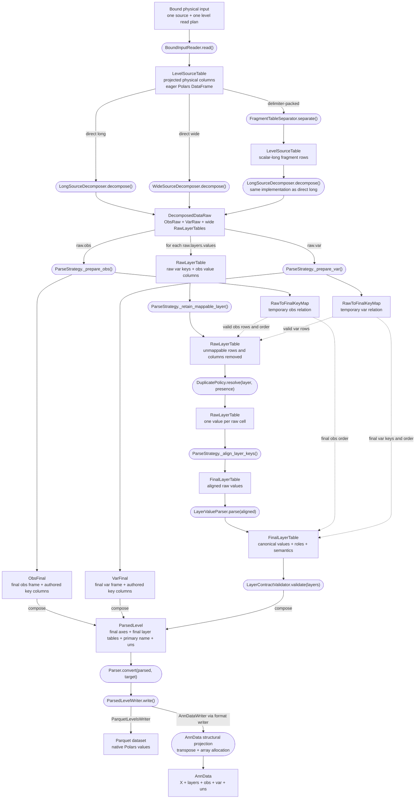

# APB2 converter architecture

> **Status:** canonical, versioned architecture and decision record for the APB2 converter.
> It was derived from the reviewed Parser V2/V5 design discussion, which remains unchanged as
> historical context. This document is the implementation baseline.
>
> **Scope:** rules-driven parsing of one quantification level from one bound physical source into
> a storage-neutral, Polars-based `ParsedLevel`; composition as `ParsedLevels`; and result I/O
> through h5ad, h5mu, Parquet-directory, and DuckDB adapters.
>
> **Out of scope:** FASTA annotation, protein inference, unrelated APB commands, and byte-for-byte
> reconstruction of vendor input.

## How to read this document

Sections 1–9 are the controlling design: decision, pipeline, algorithms, boundaries, public API,
and conclusion. The supplement is the implementation reference: DTOs, Protocols, rule schema,
configuration records, construction, Polars contracts, tests, and handoff. When an example uses a
vendor column name, it illustrates a generic contract; it never creates a vendor-specific branch.

The words **must**, **must not**, and **only** are normative. Examples are explanatory unless an
invariant or test explicitly adopts them.

The [APB metadata specification](metadata_specification.md) is authoritative for persisted namespace ownership, tool integration, composition and result-format versions. Converter examples below do not define a separate metadata contract.

The current rule storage version is schema `0.8`; [How rules-driven conversion works](rule-based.md) is the authoring guide. Earlier schema migrations remain historical context. Schema `0.8` adds explicit, independent sequence computations and named syntax/modification-map references; axis, measurement, physical-input, role, and preparation declarations retain their existing shapes.

## Current source-compilation boundary

Source compilation now returns an executable `ParseStrategy`, not a `ResolvedLevelPlan` configuration graph. The descriptions and sketches below reflect the implementation at `b6ef79b`, checked on 2026-09-21; explicitly historical migration sections describe earlier decisions.

`Pydantic RuleDocument → facade → WorkingParseConfiguration → source evidence + SourcePlanResolver → ParseStrategy → bound Parser`

The facade remains the schema adapter and now constructs executable computed-column operations directly. `WorkingParseConfiguration` and its flat axis contract live in `parse_quant/operations.py`; source resolution prunes inputs and schedules those operations, without a `ComputedColumnConfig` family or reconstruction factory. Source-dependent coercion, decomposition, layer parsing and validation are constructed after binding. No parsing module imports Pydantic or the rule schema.

Vendor guessing checks only headers and source metadata; it never compiles a strategy. Effective level detection binds each candidate once and retains its parser. Public `compile()` assembles the retained parsers, without repeating document projection or source resolution. `checks` is applied during that binding. Rule documents are validated directly, without a private shell proxy or a second long/wide recognition family. Their projected compiler contract owns header recognition. Measurement uniqueness and primary-layer validity are checked at the authored schema boundary, not again in an internal runtime constructor.

The executable strategy owns its collaborators once. `Parser.parse()` reads once and invokes `strategy.parse(source)`; `Parser.convert(result, target)` only writes. Prepared input receives the read projection and both axes' raw key tuples, not the strategy graph. `plan_json` preserves the previous serialized decisions, including skipped declarations and both axis phases, but runtime never consumes it.

Each retained layer now has one configured value parser exposing both `present()` and `parse()`. Duplicate policies consume only its narrow `RawValuePresence` capability to identify populated raw cells before duplicate reduction; value parsing follows alignment, and measurement occupancy validation follows value parsing. No parallel presence-object mapping remains. Sequence normalizers record localized rendering labels directly and return `SequenceValue`, without intermediate occurrence records or a second result wrapper; independently declared stripping remains a separate computation.

Normalizers own their immutable settings and scalar algorithms directly, without separate modification-configuration records or forwarding functions. Locations answer residue matching directly rather than allocating adjacent-residue wrappers. Source resolution constructs layer parsers from the retained declarations without `LayerValueConfig` repacking and is the sole producer of resolved layer-role metadata. `NumericTextFormat` is shared unchanged by source evidence and value/axis parsing; the numeric helper lives directly in `parse_quant`, preserving the independent `data` and `parameters` leaves. The saved-plan serializer preserves the existing JSON shape without retaining those deleted runtime wrappers.

## 1. Executive decision

Parser V2 is a forward-only pipeline built from fully configured runtime strategies. A parser
holds no `rules.json` model and contains no vendor, level, layout, encoding, duplicate-mode, or
output-format dispatch. `ParseRuleCompiler` consumes those declarations once, constructs the
required behavior objects, and injects them into one `Parser` per compatible quantification level.

Rule storage schema `0.8` declares `tables: [{input, base, levels, prepare?}]` under shared software metadata. Each table group independently selects direct input or an ordinary preparation function from the independent `joins` package. Parent composition binds and reads each selected prepared group's inputs once. A direct group and a prepared group can coexist, as in MaxQuant. Obs/var columns remain ordered sourced-or-computed entries with inline type, optionality, and semantic roles. Numeric layers may declare logical type `integer`; omitted numeric types mean `number`. The facade projects declarations into storage-neutral runtime configurations. Its `resolve_source()` delegates to parsing-owned `SourcePlanResolver`, which resolves headers, optional columns, dependency phases, wide sample expansion, notation, and physical dtypes without importing rule models.

The computational result is:

```python
ParsedLevel(
    obs=ObsFinal(...),
    var=VarFinal(...),
    primary_layer_name="Intensity",
    uns={...},
    layers={"Intensity": FinalLayerTable(...)},
    obsm={},
    varm={},
    obsp={},
    varp={},
)
```

The parser keeps measurements as wide Polars DataFrames until parsing is finished:

```text
variable-key columns | observation value columns
```

It does not create pandas indexes, NumPy/SciPy matrices, or AnnData objects.
`ParseStrategy` parses aligned layers into canonical numeric values or category codes and validates their occupancy before returning. `ParquetWriter` writes those frames directly; `AnnDataWriter` performs only structural projection, orientation change, array allocation, pandas-index construction, validation and AnnData I/O. When the CLI omits `LEVEL`, `ParserCollection` collects ordinary per-level results into `ParsedLevels`; `MuDataWriter` reuses one stateless `AnnDataWriter` to assemble `MuData(axis=0)`. MuData is storage composition, not a multi-level parsing algorithm. The same `ParsedLevels` value is the result-I/O boundary:

```python
parsed = reader_for(input_format).read(source)
writer_for(output_format).write(parsed, target)
```

Parquet and DuckDB preserve the Polars result exactly. AnnData and MuData project the already-canonical values into physical matrices and persist their semantics for readback. No format crossing bypasses `ParsedLevels`.

The identity model uses explicit columns rather than temporary integer IDs:

- raw source-key columns connect decomposed layers to the small raw axes;
- authored final-key columns define the public obs and var identity;
- a temporary `RawToFinalKeyMap` relates the two during preparation and layer alignment;
- equal raw keys define quantitative duplicate cells;
- different raw keys that materialize to one valid final key are a canonicalization error, not a
  quantitative duplicate.

This algorithm is derived from each effective rule. AlphaDIA, DIA-NN, FragPipe, MaxQuant,
Spectronaut, WOMBAT, and the other packaged documents exercise the same code. Vendor- or
level-specific key algorithms are forbidden.

### 1.1 Why Polars is part of the design

The agreed target-workload benchmark selected Polars 1.43:

| Step | Polars 1.43 | pandas 3.0 + PyArrow | pandas 3.0 conventional |
| --- | ---: | ---: | ---: |
| read TSV, 9 columns | **0.107 s** | 1.980 s | 1.945 s |
| build axis keys | **0.005 s** | 0.038 s | 0.086 s |
| factorize | **0.027 s** | 0.056 s | 0.054 s |
| scatter to three dense layers | 0.008 s | 0.013 s | **0.004 s** |
| deduplicate axis frames | **0.008 s** | 0.039 s | 0.032 s |
| **total** | **0.155 s** | **2.130 s** | **2.120 s** |

Polars was approximately 13.7 times faster end to end. Parser V2 therefore uses concrete
`pl.DataFrame` and `pl.Series` types. It does not introduce a dataframe-engine facade or a runtime
engine switch. Explicit key fields and stable-order contracts keep the model understandable and
make a later dataframe migration possible without redesigning identity, but pandas compatibility
is not an active runtime abstraction.

The benchmark's dense-scatter row compares the legacy end-to-end workload; it is decision
evidence, not a Parser V2 stage. Parser V2 keeps wide frames and allocates arrays only in
`AnnDataWriter`.

### 1.2 Explicit deviations from V5

The specification stays close to V5. These are the only intentional changes:

| Specification decision | V5 design replaced or clarified | Motivation |
| --- | --- | --- |
| `Parser.convert(parsed, target)` writes an already parsed result | V5 showed `parsed = parser.parse()` followed by `parser.convert(target)`, while `convert()` called `parse()` again | Prevent a hidden second read and parse; make `parse()` and `convert()` exactly the two operations requested |
| `WorkingParseConfiguration` | V5 called the pre-source value `ResolvedParseConfiguration` | Distinguish authored requirements and ready computations from the source-bound executable `ParseStrategy` |
| `EffectiveRule` carries table-local `Input` and optional preparation beside the composed level declaration | V5 called `project_effective_rule(document.rule(...))` even though `rule()` returned only the level rule, leaving no source for `InputContract` | Make the projection a total function of its argument and avoid a second facade lookup into `RuleDocument` |
| `ParseStrategy` carries runtime collaborators, read plan and provenance; there is no resolved configuration graph | V5 required combining resolved settings and separate facade getters before constructing operations | Bind executable operations once; persist a JSON snapshot without reconstructing runtime from it |
| `LevelReadPlan` partitions every projected delimited column into `text_sources` or `native_numeric_sources` | V5 used only `string_sources` and left other columns to dataframe inference | Preserve lexical evidence where required and eliminate inference-window failures for plain numeric layers |
| The main graph expands the packed-fragment path | V5 explained separator-to-long reuse in section 3 but hid it behind the main `SourceDecomposer` arrow | Make the controlling overview agree with the executable sequence |
| Input-policy schema is small and explicit | V5 gave a localized Spectronaut example but left the storage types implicit | Keep shared format defaults in code; rules declare only extension hints, an optional exact folder file name, and observed detection exceptions |
| AnnData pandas-dtype normalization is explicitly writer-owned | V5 placed pandas conversion in `AnnDataWriter` but did not state the Arrow-extension compatibility responsibility | Prevent AnnData/HDF5 restrictions from leaking back into parsing |
| Multi-key AnnData indexes are writer-generated collision-free strings | V5 used pandas `set_index(list(key_columns))`, which creates a `MultiIndex` for several keys | Keep semantic identity in ordinary key columns and satisfy AnnData's string-index storage contract only at the adapter boundary |
| Parquet output is a directory dataset with an explicit manifest | V5 referred to one `.parquet` target although `ParsedLevel` contains several axes, layers, and metadata values | Define a lossless backend contract without flattening unrelated tables into one file |
| `ParsedLevel.uns` and `ParsedLevel.layers` are concrete ordered `dict` values | V5 returned abstract `Mapping` fields even though parsing constructs and writers rely on deterministic authored order | Accept abstractions at inputs, but return the exact concrete result and make ordering explicit |
| Numeric aggregate compatibility is checked during compilation | V5 allowed aggregate construction and specified a runtime rejection for string/factor values | Reject a rule/read-plan combination that cannot satisfy the strategy before parsing a large source; retain a runtime guard for malformed data |
| Numeric aggregate leaves a cell null when it has no semantically present scalar | V5 retained pandas' `0.0` result for a physically present but all-missing group while also requiring a no-contribution cell to stay missing | A wide `RawLayerTable` deliberately carries values, not a physical-cell ledger; null versus absent contribution cannot be recovered after pivot. The null result is information-honest and avoids reintroducing provenance solely to manufacture zero |
| Schema 0.3 removes `keep_all_as_raw_table` from `DuplicateMode` | V5 retained the legacy declaration but required compilation to fail because no final result contract existed | A clean schema must not validate an unexecutable mode; removing it deletes a dead registry path and keeps `ParsedLevel` singular |
| Sequence computations select their declared inputs with Polars and return a frame plus diagnostics | An implicit normalizer produced both stripped and normalized intermediate columns | Honor authored dependencies, allow independent execution, and carry diagnostics outside the column namespace |
| `ColumnComputer` applies named Polars expressions to the axis frame; source resolution prunes unavailable optional inputs and computations | V5 passed a `skipped` set into every computed-column strategy | Consume optionality once and let Polars own table execution without runtime absence branches |
| Duplicate policies consume the layer parser's narrow `RawValuePresence` capability | V5 deferred missing-sentinel interpretation to the writer, so `keep_first` could retain a sentinel and discard a real value | Determine raw occupancy before reduction; parse retained values after alignment, identically for every backend |
| `ParseRuleFacade.resolve_source(SourceEvidence)` replaces `resolve_header(header)` | V5 expected a column-name sequence to produce numeric formats, read dtypes, and Parquet compatibility decisions | Pass the exact physical evidence required for one atomic resolved plan and remove hidden compiler side channels |
| Vendor-parameter parsing retains the `vendor_params` name and lives in the independent `parserV2/vendor_params/` child; `detect_document.search_parameter_evidence()` translates its complete `Parameters` record to rule-owned `SearchParameterEvidence` | The first specification placed `vendor_params` beside `parserV2` and required a second outer composition layer | Give applications one public in-memory boundary without renaming the established parameter model, and keep both `parse_quant` and `vendor_parse_rules` independent of it |
| Parser V2 owns its boundary errors: rule applicability in `vendor_parse_rules/document.py`, shared parse/source errors in `parse_quant/errors.py`, and strategy-local errors beside their raiser | V5 named error categories but did not assign them to the folder dependency graph; importing the existing top-level `apb2.errors` would be an upward dependency | Keep catchable errors at the boundary that defines their meaning without creating a generic cross-package error module |
| `parserV2` has an explicit directed import graph: `parse_quant/data` owns pipeline values, `parse_quant/parameters` owns independent declarations and evidence, `operations.py` owns operation-bearing working contracts, `parse_quant/io` owns parsed-result adapters and depends only on `data`, `parse_quant/contracts.py` owns Parser-consumed Protocols, source readers remain parent modules, parent-level `parse_rule_facade.py` translates `RuleDocument` into parameters, and the inward-only `vendor_parse_rules/schema/` child owns Pydantic storage declarations | V5 named implementation areas but did not assign concrete modules or prohibit child-to-parent and cyclic/excess sibling imports | Make directory nesting express dependency direction: a module owned by one child moves into that child; sibling edges are one-way and limited to one direct target, while genuine multi-child composition stays in the parent |
| One-class private helpers are private methods; module-level `make_*` and `*_for` names are reserved for construction and selection | V5 showed several one-client parser and writer helpers as free functions | Put implementation details with their sole owner, reduce module namespace and forwarding code, and keep the construction boundary visible |
| Omitted CLI level compiles resolved selections into one `ParserCollection`, returns canonical `ParsedLevels`, and delegates persistence to the selected result writer | The initial specification explicitly excluded multi-level assembly | Match APB's compound-conversion contract without coupling parsing to one container: internal parser per level, one public collection parser, one storage-neutral value, one selected writer |
| Result I/O operates on `ParsedLevels` through format-selected readers and writers | V5 specified only parser-owned one-level writing | Give later tools and `apb2 reformat` one storage-neutral boundary; keep `Parser.convert()` unchanged because Parser still owns one level |
| `ParsedLevel` includes axis-aligned and sparse pairwise Polars frames | V5 stopped at axes, layers, and `uns` | Carry the AnnData/MuData slots later tools need without importing their containers into computation |
| Final layers distinguish measurement and auxiliary roles | V5 treated every retained numeric layer as an occupancy peer | Let downstream tools persist diagnostic matrices without allowing their density or sparsity to alter quantitative matrix-occupancy checks |

No other architectural novelty is introduced. In particular, this specification does not restore
the V4 reverse path, temporary IDs, parser-side arrays, a Builder, a generic dataframe facade, or a
broad transformation object.

## 2. Controlling architecture

Rectangles name data values. Rounded boxes name functions or injected behavior. Dashed arrows are
temporary alignment evidence, not ownership. Exactly one physical-shape path is constructed for a
parser.



Persisted-result crossing is a second, storage-only pipeline:


The input and output formats are consumed at this composition boundary. Neither reader nor writer
retains the enum or asks what another adapter is.

The required order is:

```text
select one effective rule and one physical source
    -> bind the source and inspect its header
    -> resolve one executable strategy against delimited, workbook or native-frame evidence
    -> read only the level's transitive physical source closure
    -> decompose long, wide, or delimiter-packed physical shape
    -> construct distinct small ObsRaw and VarRaw tables with explicit raw_key_columns
    -> preserve each layer as a wide RawLayerTable
    -> normalize and materialize final axis keys on the small axis tables
    -> reject distinct raw keys that collapse to one valid final key
    -> remove layer rows or columns that cannot map to valid final keys
    -> resolve repeated raw measurement cells column-wise
    -> align raw var keys and obs column order to the validated final axes
    -> parse aligned layers into canonical numbers or category codes
    -> validate canonical layer names and measurement occupancy
    -> discard temporary raw-to-final maps
    -> return ParsedLevel
    -> serialize only when the caller supplies that ParsedLevel to convert()
```

Omitting the CLI level changes only the outer composition:

```text
ParseRuleCompiler(data, parameters_path, requested_levels)
    -> parameter parsing, rule detection and per-level strategy binding in the constructor
    -> compile() -> ParserCollection
    -> ParserCollection.parse() -> ParsedLevels({level: parsed_level, ...}, {})
    -> write_parsed_levels(parsed, target)
    -> suffix-selected H5MU, Parquet, or DuckDB writer
    -> atomic result plus APB JSON representation
```

Each direct-input parser performs its own projected read and parse. A requested prepared table group is read and joined once, then shared through per-level `PreparedInputReader` projections. That sharing belongs to source preparation, not MuData output.

### 2.1 Dependency direction

Directory nesting is an import rule, not decoration. For any package `A/` with child packages
`A/B/`, `A/C/`, and `A/D/`:

```text
A/*.py  ->  A/B/*     allowed: parent module imports downward
A/*.py  ->  A/C/*     allowed: parent module imports downward
A/B/*   ->  A/*.py    forbidden: child imports upward
A/C/*   ->  A/*.py    forbidden: child imports upward
A/B/*   ->  A/C/*     allowed when declared as one edge in the sibling DAG
A/C/*   ->  A/D/*     allowed when declared as one edge in the sibling DAG
A/C/*   ->  A/B/*     forbidden: reverse edge creates a cycle
A/B/*   ->  A/D/*     forbidden here: B would directly target a second sibling
```

A module placed directly in `A/` that merely forwards to `A/B/` belongs in `A/B/`. Placement follows
ownership as well as imports: a parent-level module needs a responsibility owned by `A`, such as
composing `A/B/` and `A/C/` or implementing `A`'s external boundary. An external dependency does
not justify moving an `A/B`-owned module above `A/B/`. Sibling edges must be acyclic, and every
child may directly target at most one sibling. If a child needs two siblings, move the composition
to `A/` or make the owned collaborators children of that package. This gives `parserV2` the
following direction:

```text
parserV2/*.py
    |
    +--> vendor_parse_rules/*
    |
    +--> parse_quant/*
    |
    +--> vendor_params/*

vendor_parse_rules/*   -X->   parserV2/*.py, parse_quant/*, or vendor_params/*
parse_quant/*          -X->   parserV2/*.py, vendor_parse_rules/*, or vendor_params/*
vendor_params/*        -X->   parserV2/*.py, vendor_parse_rules/*, or parse_quant/*

vendor_parse_rules/*.py  ---> vendor_parse_rules/schema/*  allowed
vendor_parse_rules/schema/* -X-> vendor_parse_rules/*.py    forbidden
vendor_params/registry.py ---> vendor_params/parsers/*       allowed
vendor_params/parsers/*.py ---> vendor_params/parsers/shared/* allowed
vendor_params/parsers/shared/* -X-> vendor-specific parser modules forbidden
```

The workflow owns the Protocols it consumes in `parse_quant/contracts.py`. Modules directly in
`parse_quant/` may import its children. The one declared sibling edge inside that package is
`io -> data`; `parameters` remains independent, and neither `data` nor `parameters` imports `io`.
No module anywhere under `parse_quant/` imports a module directly in `parserV2/` or imports
`vendor_parse_rules`. No module under `vendor_parse_rules/` imports a parent module or
`parse_quant`.

The computational modules—`parser.py`, `decomposition.py`, `fragments.py`, `axis_columns.py`,
`duplicates.py`, and `modifications.py`—import neither Pydantic models, physical readers, writers,
`anndata`, pandas, NumPy, nor PyArrow storage APIs. Physical source readers live directly in
`parse_quant/`; all parsed-result readers, writers, metadata, validation, and format selection live
in `parse_quant/io/`. Their backend dependencies remain confined to those modules.
`io/formats.py` composes the result adapters. `io/` imports only storage-neutral result values from `data/`; it never imports `parameters/` or a module directly in `parse_quant/`.

`parse_rule_facade.py` therefore cannot live inside `vendor_parse_rules`. It is a parent-level
module because it consumes `vendor_parse_rules.RuleDocument` and produces working contracts and operations from `parse_quant`, using independent `parameters` records for plain settings. Public compilers, detection and the level factory also belong in the parent because they compose these independent children. Adapter modules do not bridge those children: source readers that
compose `data/` and `parameters/` belong directly in `parse_quant/`, while parsed-result adapters
that need only `data/` belong in `parse_quant/io/`.

Those adapter modules import only the exact downward data modules required by their signatures,
plus their external framework. They do not import Parser, raw parse state, runtime strategies,
parsing parameters, or `parse_quant/contracts.py`. Structural typing proves conformance to the
client-owned Protocols where the source resolver and level factory perform the wiring.

## 3. Identity and join columns

### 3.1 The rule-derived key plan

For each axis, source resolution starts from the authored keys:

```python
obs_keys = effective_rule.axis.obs_keys
var_keys = effective_rule.axis.var_keys
```

It walks the selected and computed-column dependency graph and produces:

```python
@dataclass(frozen=True, slots=True)
class AxisKeyPlan:
    raw_key_columns: tuple[str, ...]
    key_input_columns: tuple[str, ...]
    final_key_columns: tuple[str, ...]
```

The three sets mean:

| Field | Meaning | Lifetime |
| --- | --- | --- |
| `raw_key_columns` | Physical reader columns, resolved wide-header captures, or separator outputs whose complete tuple distinguishes raw source identity before logical coercion and key computation | `ObsRaw`, `VarRaw`, raw layers, temporary key map |
| `key_input_columns` | Direct logical inputs of the authored final key after key-phase materialization, or the selected key itself | Recorded in the plan snapshot; values remain local to axis preparation |
| `final_key_columns` | Authored `axis.obs_keys` or `axis.var_keys` | `ObsFinal`, `VarFinal`, final layers, output adapters |

The dependency walk obeys these rules:

1. A directly selected final key adds its logical selected name to `key_input_columns` and its
   physical source to `raw_key_columns`.
2. A computed final key adds its declared direct inputs to `key_input_columns`.
3. Computed inputs are recursively expanded to physical selections, normalized modification
   sources, resolved wide captures, or synthesized separator outputs.
4. If a key depends on a normalized sequence, every physical modification source that can change
   that sequence belongs to the raw key.
5. Fragment identity may include the separator's synthesized `label_output`.
6. A wide obs key may originate from the already resolved `(?P<sample>...)` header capture.
7. Missing evidence that makes a final key impossible makes the level incompatible. An optional
   column may be skipped only when no final-key dependency requires it.
8. Several authored keys concatenate their closures in authored order and remove repeated column
   names without reordering.
9. No computed operation is assumed globally injective or non-injective. The observed mapping is
   validated after execution.

Every value that can affect final identity must be in the raw-key closure. Payload metadata may change public obs or var columns, but it must never change final identity. Execution follows the compiled column operations; it does not read `key_input_columns` to discover dependencies.

### 3.2 Generic examples, not special cases

The AlphaDIA v1.10 ion declaration is one readable example:

```python
AxisKeyPlan(
    raw_key_columns=("sequence", "mods", "mod_sites", "charge"),
    key_input_columns=("ProForma_peptidoform", "Charge"),
    final_key_columns=("ProForma_ion",),
)
```

The same derivation yields different values for other rules:

| Effective rule | Final var keys | Key inputs | Raw-key origin |
| --- | --- | --- | --- |
| DIA-NN protein | `Protein_Group` | `Protein_Group` | selected physical `Protein.Group` |
| DIA-NN fragment | `ProForma_fragment` | `ProForma_ion`, `fragment_label` | recursive precursor sources plus separator output |
| Spectronaut fragment | six authored fragment columns | the same six logical columns | their selected physical sources |
| Sage peptidoform | `ProForma_peptidoform` | declared sequence input | selected sequence plus modification evidence |
| a `coalesce` key | authored computed output | declared coalesce inputs | recursively selected physical sources |

These are test cases for one algorithm. They are not registry keys or branches.

### 3.3 Raw duplicates and canonicalization collisions

A raw wide layer may contain repeated var rows:

```text
sequence  mods         mod_sites  charge  A      B      C
PEPMIDE   Oxidation@M  4          2       10.0   12.0   null
PEPMIDE   Oxidation@M  4          2       11.0   null   9.0
OTHER     null         null       3        5.0    6.0   7.0
```

`DuplicatePolicy.resolve()` groups by `RawLayerTable.raw_var_key_columns`, asks the injected
layer-specific `RawValuePresence` which raw scalars claim a cell, and applies its policy
independently to each observation value column. The policy answers only:

> How do several raw scalar values claiming one `(raw var key, raw obs key, layer)` cell become
> one scalar value?

The supported answers are:

- `ErrorOnDuplicates`: reject a cell with more than one present value;
- `KeepFirstDuplicate`: select the first present value in stable physical order;
- `AggregateNumericDuplicates`: sum already-numeric scalar values and reject strings or factors.

`RawValuePresence` may recognize null, a declared numeric sentinel, or a sentinel extracted from a
structured numeric token. It returns a Boolean mask and never changes a scalar value. Layer
encoding is not part of duplicate resolution.

Axis preparation checks a different invariant:

```text
raw_key_a != raw_key_b  implies  final_key_a != final_key_b
```

Rows with a missing final-key component are excluded from this implication because they cannot
enter the parsed axis. If two distinct raw keys produce one valid final key,
`CanonicalKeyCollisionError` reports the final key and representative raw evidence. The configured
duplicate policy is never allowed to hide that information loss.

| Event | Raw keys | Final keys | Owner |
| --- | --- | --- | --- |
| repeated quantitative cell | equal | equal | configured `DuplicatePolicy` |
| distinct valid cells | different | different | normal flow |
| canonicalization collision | different | same valid key | fixed `CanonicalKeyCollisionError` |
| unusable identity | any | at least one missing component | fixed filtering before duplicate resolution |

This distinction catches lossy modification normalization, logical coercion, or computed-key
rules without inventing another policy family.

## 4. Physical decomposition

```python
class SourceDecomposer(Protocol):
    def decompose(self, table: LevelSourceTable, /) -> DecomposedDataRaw: ...
```

A decomposer performs physical shape conversion only. It receives source-resolved columns and
configured key sets. It receives no rule model, vendor name, level name, unresolved regex,
duplicate mode, encoder, or writer.

### 4.1 Long input

`LongSourceDecomposer`:

1. forms `ObsRaw` from the stable first row of each distinct complete obs raw-key tuple;
2. forms `VarRaw` from the stable first row of each distinct complete var raw-key tuple;
3. retains raw-key columns as ordinary Polars columns and retains stable-first payload metadata;
4. creates one wide `RawLayerTable` per resolved layer source;
5. puts raw var-key columns first and observation value columns in exactly `ObsRaw.frame` order;
6. preserves repeated raw cells as repeated var rows for the duplicate policy.

The pivot may use a local occurrence counter to prevent repeated cells from being collapsed by
the dataframe operation. That counter is an implementation detail inside `decompose()` and is
never returned as identity.

### 4.2 Wide input

`WideSourceDecomposer` receives concrete `source_column -> sample` mappings produced during source
resolution. It:

1. derives `ObsRaw` from primary-layer sample captures in stable header order;
2. derives `VarRaw` from complete raw var-key tuples in stable source-row order;
3. consumes mappings already resolved with selected and computed var-column names excluded from permissive layer patterns;
4. selects each layer's resolved physical columns and places their sample-aligned values after the
   raw var-key columns;
5. represents several physical columns claiming one sample as repeated rows so the same
   `DuplicatePolicy` handles long and wide inputs;
6. omits an optional layer with no primary-axis-aligned source;
7. retains a required layer that physically matched only non-primary sample tokens as an empty
   aligned layer: raw var-key rows plus the complete primary observation columns filled with null,
   preserving current contract-check behavior.

Zero physical matches for a required layer make the source incompatible. Header regexes never
reach the decomposer.

### 4.3 Delimiter-packed fragments

Packed fragments are separated before ordinary long decomposition:

```python
class FragmentTableSeparator(Protocol):
    def separate(self, table: LevelSourceTable, /) -> LevelSourceTable: ...


class DelimitedFragmentSourceDecomposer:
    def __init__(
        self,
        separator: FragmentTableSeparator,
        long_decomposer: SourceDecomposer,
    ) -> None:
        self._separator = separator
        self._long_decomposer = long_decomposer

    def decompose(self, table: LevelSourceTable, /) -> DecomposedDataRaw:
        scalar_long = self._separator.separate(table)
        return self._long_decomposer.decompose(scalar_long)
```

The two separator implementations are:

- `PositionalFragmentTableSeparator`, which emits `frag_0`, `frag_1`, ...;
- `ColumnLabeledFragmentTableSeparator`, which emits the configured token derived from the packed
  label source.

The separator preserves authored `packed_value_sources` order, validates parallel packed lengths,
and keeps scalar values as Polars values. It does not build axes, normalize modifications, decode
layers, resolve duplicates, or allocate arrays. A zero-token packed row emits no scalar row,
matching current parser behavior.

The scalar split retains current vendor semantics: null or whitespace-only packed cells contain
zero tokens; outer whitespace and every token's surrounding whitespace are removed; trailing
delimiter terminators are removed before splitting; and an interior empty token remains an empty
scalar at its aligned position. Column-labelled separation derives `label_output` from the trimmed
label token before the first `/`. The separator performs no numeric conversion.

The ordered `packed_value_sources` are physical vendor column names, not layer names and not cell
values. They are not inferred from `measurements.layers`, because the current schema does not
require those collections to correspond one-to-one. For example:

```python
packed_value_sources = (
    "Fragment.Quant.Raw",
    "Fragment.Correlations",
)
```

For a cell `Fragment.Quant.Raw = "1200;900;450"`, positional separation emits three scalar rows
labelled `frag_0`, `frag_1`, and `frag_2`.

## 5. Parser algorithm

The bound `Parser` owns I/O; `ParseStrategy` owns the complete shared algorithm. Both are configured dataclasses, and neither repeats schema dispatch.

```python
@dataclass(frozen=True, slots=True)
class Parser:
    input_reader: BoundInputReader
    strategy: ParseStrategy
    writer: ParsedLevelWriter

    @property
    def level(self) -> QuantificationLevel:
        return self.strategy.level

    def parse(self) -> ParsedLevel:
        return self.strategy.parse(self.input_reader.read())

    def convert(self, parsed: ParsedLevel, target: Path, /) -> None:
        self.writer.write(parsed, target)


@dataclass(frozen=True, slots=True)
class ParseStrategy:
    level: QuantificationLevel
    read: LevelReadPlan
    decomposer: SourceDecomposer
    obs: AxisRuntimePlan
    var: AxisRuntimePlan
    duplicates: DuplicatePolicy
    layer_parsers: Mapping[str, LayerValueParser]
    layer_validator: LayerSetValidator
    provenance: dict[str, JsonValue]

    def parse(self, source: LevelSourceTable) -> ParsedLevel:
        raw = self.decomposer.decompose(source)
        obs, obs_map = self._prepare_obs(raw.obs)
        var, var_map, unknown_mod_tokens = self._prepare_var(raw.var)
        layers = self._prepare_layers(raw.layers, obs_map, var_map)
        self.layer_validator.validate(layers)
        uns = dict(self.provenance)
        if unknown_mod_tokens:
            uns["unknown_mod_tokens"] = list(unknown_mod_tokens)
        return ParsedLevel(
            obs=obs,
            var=var,
            primary_layer_name=raw.layers.primary_layer_name,
            uns=uns,
            layers=layers,
            obsm={},
            varm={},
            obsp={},
            varp={},
        )

    def _prepare_layers(
        self, raw: LayersRaw, obs_map: RawToFinalKeyMap, var_map: RawToFinalKeyMap
    ) -> dict[str, FinalLayerTable]:
        layers: dict[str, FinalLayerTable] = {}
        for layer in raw.values:
            parser = self.layer_parsers[layer.layer_name]
            mappable = self._retain_mappable_layer(layer, obs_map, var_map)
            resolved = self.duplicates.resolve(mappable, parser)
            aligned = self._align_layer_keys(resolved, obs_map, var_map)
            layers[layer.layer_name] = parser.parse(aligned)
        return layers
```

`convert()` never calls `parse()`. `_prepare_obs()` and `_prepare_var()` apply the same axis routine using `self.obs` and `self.var`, returning the final axis and temporary map; var preparation also returns modification diagnostics.

### 5.1 Axis preparation

Obs and var share one staged algorithm. Each selection reads the unmodified physical frame and binds a logical name; computers then consume exact logical inputs and return an updated frame plus explicit diagnostics. No modification pre-pass supplies hidden columns.

```python
class ParseStrategy:
    @staticmethod
    def _prepare_axis(
        raw: pl.DataFrame,
        raw_key_columns: tuple[str, ...],
        plan: AxisRuntimePlan,
    ) -> tuple[pl.DataFrame, RawToFinalKeyMap, tuple[str, ...]]:
        """One staged algorithm for both axes: identity first, then public metadata.

        The raw axis already holds one stable-first row per raw key, so nothing here calls
        ``unique`` on the final keys: a repeated valid final key means two raw identities
        collapsed, which is an error rather than a deduplication.
        """
        working, early_tokens = ParseStrategy._materialize_axis_columns(raw, raw, plan.key_phase)

        mapping = RawToFinalKeyMap(
            # Read from the frame as it arrived: a declared column may carry the name of the
            # physical column it was selected from, and materializing it would then replace
            # the raw values this map exists to hold.
            raw_keys=raw.select(list(raw_key_columns)),
            final_keys=working.select(list(plan.keys.final_key_columns)).fill_nan(None),
        )
        ParseStrategy._require_injective_key_mapping(mapping)

        valid = ParseStrategy._valid_final_key_rows(mapping.final_keys)
        final_rows, output_tokens = ParseStrategy._materialize_axis_columns(
            working.filter(valid), raw.filter(valid), plan.output_phase
        )
        return (
            final_rows.select(list(plan.outputs)),
            mapping,
            tuple(dict.fromkeys((*early_tokens, *output_tokens))),
        )
```

The raw axes already contain one stable-first row per complete raw-key tuple. Preparation therefore
does not silently call `unique()` on the final keys. A repeated valid final key from different raw
keys is an error. Rows with missing final-key components stay only in the temporary mapping so the
corresponding raw layer rows or obs value columns can be removed.

The runtime plan is fully configured. `ParseStrategy._materialize_axis_columns()` iterates concrete
selections and computers; it does not inspect a `how`, logical type, vendor, layout, level, or
optional-source flag. The private calls in this algorithm are static methods because they use only
their explicit arguments and have one class client. Supplement H states the complete placement
rule; a helper is not made public merely to shorten this class.

### 5.2 Layer filtering, resolution, and alignment

`ParseStrategy._retain_mappable_layer()` removes:

- raw var rows whose map row has a missing final-var-key component;
- raw obs value columns whose map row has a missing final-obs-key component.

This is fixed validity filtering, not a policy. The duplicate policy then sees only cells that can
enter the result while still grouping by raw keys.

`ParseStrategy._align_layer_keys()` constructs the aligned layer, still carrying raw scalars; the selected layer parser then returns its canonical replacement. Alignment:

1. uses the valid variable map in `VarFinal` order as the left spine and joins raw layer rows to it,
   inserting null value rows for final variables absent from that layer;
2. replaces them with the authored final var-key columns;
3. orders rows exactly like `VarFinal.frame`;
4. keeps the complete valid observation-column order established by decomposition and validity filtering; missing measurements already have null columns;
5. assigns unique storage column names where a multi-column obs identity cannot itself be a Polars
   column name;
6. copies raw layer scalar values without interpreting them; `LayerValueParser.parse()` runs next and attaches canonical values, role and semantics.

The generated storage column names are positional labels only. They are unique and disjoint from
the var-key column namespace, but they are not observation identity. `ObsFinal.frame` and
`ObsFinal.key_columns` remain the sole semantic identity.

## 6. Serialization boundary

```python
class ParsedLevelWriter(Protocol):
    def write(self, parsed: ParsedLevel, target: Path, /) -> None: ...
```

The writer receives the complete parsed result. It treats that result as read-only and creates its
own backend values. Before any backend allocation or staging, `io/validation.py` verifies that final
axis keys are complete and unique, every layer declares the same var-key tuple as `VarFinal`, the
key columns lead the layer in that order, and their values equal `VarFinal` row-for-row. A writer
must never infer alignment from matching dimensions alone. It also requires the primary layer to
have `MeasurementLayerRole`; an `AuxiliaryLayerRole` cannot define the primary quantitative matrix.

Downstream APB tools use the public result facade rather than importing adapter internals:

```python
from apb2.result_facade import observation_labels, quantitative_layer_values

def observation_labels(count: int, reserved: Iterable[str]) -> tuple[str, ...]: ...
def quantitative_layer_values(parsed: ParsedLevel, layer_name: str, /) -> pl.DataFrame: ...
```

The label helper establishes the collision-free positional observation columns used by wide layer tables. The value helper returns the already-canonical quantitative value block directly; it performs no interpretation or conversion.

### 6.1 Parquet

The parser-owned `ParquetWriter` persists one level by composing the collection writer. The
result-I/O `ParquetLevelsWriter` persists:

- `parsed.obs.frame` plus `parsed.obs.key_columns` metadata;
- `parsed.var.frame` plus `parsed.var.key_columns` metadata;
- every `FinalLayerTable.values` plus `var_key_columns` and layer-role metadata;
- `primary_layer_name`, per-level `uns`, and shared `ParsedLevels.uns`;
- every `obsm`/`varm` aligned frame; and
- every `obsp`/`varp` sparse-coordinate frame.

It preserves Polars values and dtypes. It does not create AnnData encoders, pandas objects, or
NumPy matrices. The target is an atomic directory dataset:

```text
target.parquet/
    manifest.json
    levels/
        ion/
            obs.parquet
            var.parquet
            layers/
            obsm/
            varm/
            obsp/
            varp/
        protein/
            ...
```

`manifest.json` version 5 records level and table order, axis keys, each layer's var keys and role,
primary layers, both provenance scopes, every table's ordered logical Polars schema, and explicit
logical-to-physical names. A user-authored name is never interpolated into a path without that
mapping. `ParquetReader` accepts this APB2 dataset only; a vendor `.parquet` file is not a result.

### 6.2 AnnData

`AnnDataWriter` owns physical representation, not scientific value parsing. The following excerpt shows the matrix projection inside `to_anndata_for_level()`; the full method also writes aligned/pairwise slots and storage metadata.

```python
validate_parsed_level(level_name, parsed)
arrays = {
    name: layer.values.select(pl.exclude(layer.var_key_columns)).to_numpy().T
    for name, layer in parsed.layers.items()
}
layer_names = safe_names(parsed.layers, prefix="layer", suffix="")
adata = AnnData(
    X=arrays[parsed.primary_layer_name],
    obs=_make_axis_frame(parsed.obs.frame, parsed.obs.key_columns),
    var=_make_axis_frame(parsed.var.frame, parsed.var.key_columns),
    layers={
        layer_names[name]: values
        for name, values in arrays.items()
        if name != parsed.primary_layer_name
    },
)
```

The primary layer is stored only in `X`; other matrices use safe names in `layers`. `_write_level_namespaces()` and `_write_namespaces()` persist parse provenance alongside other tool namespaces below `uns["apb"]`, with reconstruction information in `storage`. `_write_atomically()` publishes the completed result.

The shared `_make_axis_frame()` I/O helper converts Polars through Arrow to pandas, preserves supported nullable/categorical representations, and retains every authored key as an ordinary column. One string key can serve directly as the storage index; other keys use a collision-free canonical JSON array of typed scalar pairs. Storage labels never enter parsing joins or identity.

Plain numeric interpretation, regex extraction, missing-sentinel handling and factor mapping already ran in `parse_quant/value_parsing.py`. Numeric layers carry `QuantitativeLayerSemantics`; categorical layers carry their category map and missing code in `CategoricalLayerSemantics`. No writer constructs an encoder from rules or saved plans.

`LayerContractValidator` checks required names and relative measurement occupancy during parsing, before any backend is selected. A layer is suspicious below `empty_ratio` only when a measurement sibling reaches `populated_ratio`; standard checks raise for the primary and warn for other suspicious measurements, while strict checks raise for all. Auxiliary layers remain required when declared and serialized, but do not contribute occupancy evidence. Writers separately validate the canonical result's structure and values; they do not rerun the scientific occupancy policy.

### 6.3 MuData

`ParsedLevels` is the output-boundary collection, not another parsed-data model. Its core fields are shown here; Supplement A includes its optional metadata and annotation extensions:

```python
@dataclass(slots=True)
class ParsedLevels:
    levels: dict[ParsedLevelName, ParsedLevel]
    uns: dict[str, JsonValue]
```

`MuDataWriter` constructs one stateless `AnnDataWriter` and reuses it in canonical level order. It calls `to_anndata_for_level()` for each `ParsedLevel`, prefixes only the AnnData
storage `var_names` (`ion:`, `pfm:`, `pep:`, `prt:`, `frg:`), constructs `MuData(modalities,
axis=0)`, writes shared provenance to
`mdata.uns["apb"]["parse"]`, and
atomically writes `.h5mu`. The authored unprefixed key remains an ordinary modality `.var` column.

One modality is valid; zero modalities is an error. Level-specific rule JSON and resolved-plan provenance remain inside each modality. Parsing does not synthesize root producer, rule-selection, level-list, or search-parameter JSON; typed search parameters remain on `ParseRuleCompiler.parameters`. Extension tools may add their own root provenance according to the [metadata specification](metadata_specification.md#ownership); modality names and ordering belong to the collection structure, not repeated parse metadata.

### 6.4 Shared result-I/O capability

The result-I/O client owns two Protocols. Concrete adapters conform structurally and do not import
the Protocol declarations:

```python
class ParsedLevelsReader(Protocol):
    def read(self, source: Path, /) -> ParsedLevels: ...


class ParsedLevelsWriter(Protocol):
    def write(self, parsed: ParsedLevels, target: Path, /) -> None: ...
```

The primary API selects explicitly by one composition-boundary enum:

```python
parsed = reader_for(input_format).read(source)
writer_for(output_format).write(parsed, target)
```

`ResultFormat` contains `H5AD`, `H5MU`, `PARQUET`, and `DUCKDB`. One registry consumes it. Concrete
adapters retain no format tag and contain no format switch. The optional path conveniences
`read_parsed_levels(source)` and `write_parsed_levels(parsed, target)` infer the same enum from
`.h5ad`, `.h5mu`, `.parquet`, or `.duckdb` and delegate to the primary API.

An h5ad adapter still operates on `ParsedLevels`: its reader returns exactly one level and its
writer rejects any other cardinality before staging. This keeps one format-crossing pipeline while
preserving the parser-owned `ParsedLevelWriter` capability used by `Parser.convert()`.

### 6.5 DuckDB and the h5 result envelope

One DuckDB file contains fixed metadata plus one physical table per axis, layer, aligned frame, or
pairwise coordinate frame. Logical names map to generated `data_000000`-style table names. No
logical/vendor name is interpolated into SQL. The writer stages a complete database beside the
target; the reader opens it read-only and closes it before returning the Polars value. DuckDB asks
Polars for Arrow record batches when registering a frame, so PyArrow is an explicit runtime
dependency even though APB2 does not import it directly.

h5ad/h5mu store tool namespaces directly below `uns["apb"]`. MuData owns common provenance and each embedded AnnData owns its rules, roles and results. H5AD composes disjoint root and level mappings recursively; a conflicting leaf fails before publication. Generic ownership paths in `storage` reconstruct both contributions, including empty mappings, without copying values or recognizing tool names. The descriptor also records logical names, schemas, axis keys, safe physical keys and matrix locations. The primary matrix is only in `X`; additional matrices are in `layers`. Parquet and DuckDB manifests use root `apb` and per-level `apb`. The [metadata specification](metadata_specification.md) owns current versions and compatibility rules. The representation reuses the persistence projection and shows combined metadata once for H5AD, separate root/modality metadata otherwise. An h5 reader is deliberately not a general third-party AnnData importer.

The h5 collection writers consume canonical values and explicit layer semantics directly. They do not read `plan_json` to reconstruct encoders or occupancy checks, reload rules, or resolve a source. Readback uses stored semantics to restore integer and categorical codes; category labels are not encoded a second time.

### 6.6 Fidelity laws

Parquet and DuckDB are lossless result formats:

```text
read(write(parsed)) == parsed
```

The equality includes level/table order, Polars schemas, null versus NaN, logical names, layer
roles, every known slot, and both provenance scopes. Parquet↔DuckDB crossings obey the same law.

h5ad and h5mu implement the configured matrix projection. Their law is:

```text
read(write(parsed)) == ann_data_projection(parsed)
ann_data_projection(ann_data_projection(parsed)) == ann_data_projection(parsed)
```

Vendor numeric spellings and factor labels were interpreted during parsing, not during h5 projection. The remaining projection is structural: matrix orientation, backend-compatible metadata and missing-value representation; h5 numeric matrices can merge null with NaN. Stored semantics restore integer/category types and preserve category mappings. Crossing from h5 into Parquet or DuckDB preserves that represented result, not the original vendor tokens.

## 7. Architectural roles and construction

1. `RuleDocument` is the validated Pydantic document itself. It composes table-local base and level declarations and evaluates parameter gates and overrides; no private shell proxy or recognition model remains.
2. `ParseRuleFacade` adapts one effective rule into Pydantic-free requirements and ready computed-column operations. Source resolution delegates to `SourcePlanResolver`.
3. `ParseRuleCompiler` resolves parameters and compatible levels during construction. Detection uses `parser_factory.compile_level()` to bind candidates; accepted selections retain their parser. Public `compile()` only assembles those parsers into a collection.
4. `SourcePlanResolver` binds observed columns, notation and dtypes into one `ParseStrategy`, including axis phases, decomposition, duplicate policy, layer parsers and validation.
5. `Parser` binds a reader, strategy and writer. `ParseStrategy` executes the shared pipeline without physical I/O.
6. `ParsedLevelFormatWriter` is the one-level writer injected by the factory. Direct `AnnDataWriter` and `ParquetWriter` also satisfy that capability; `MuDataWriter` consumes a collection and reuses one stateless `AnnDataWriter`.
7. `io/formats.py` selects result readers/writers and owns storage-only reformatting. Writers receive neither rules nor a reconstructed parsing strategy.

```mermaid
classDiagram
    class RuleDocument {
        +Path path
        +list tables
        +declared(level) EffectiveRule
        +rule(level, parameter_evidence) EffectiveRule
    }

    class SearchParameterEvidence

    class ParseRuleFacade {
        -WorkingParseConfiguration _configuration
        +working_parameters WorkingParseConfiguration
        +resolve_source(evidence) ParseStrategy
    }

    class ParseRuleCompiler {
        -Parameters _parameters
        -DetectedRuleSet _detection
        +compile() ParserCollection
    }

    class Parser {
        +BoundInputReader input_reader
        +ParseStrategy strategy
        +ParsedLevelWriter writer
        +parse() ParsedLevel
        +convert(parsed, target) None
    }

    class ParseStrategy {
        +LevelReadPlan read
        +parse(source) ParsedLevel
        -_prepare_obs(raw) tuple
        -_prepare_var(raw) tuple
        -_prepare_layers(raw, obs_map, var_map) dict
        -_prepare_axis(raw, keys, plan)$ tuple
        -_retain_mappable_layer(layer, obs_map, var_map)$ RawLayerTable
        -_align_layer_keys(layer, obs_map, var_map)$ FinalLayerTable
    }

    class BoundInputReader {
        <<protocol>>
        +read() LevelSourceTable
    }
    class SourceDecomposer {
        <<protocol>>
        +decompose(table) DecomposedDataRaw
    }
    class FragmentTableSeparator {
        <<protocol>>
        +separate(table) LevelSourceTable
    }
    class DuplicatePolicy {
        <<protocol>>
        +resolve(layer, presence) RawLayerTable
    }
    class RawValuePresence {
        <<protocol>>
        +present(values, dtype) pl.Expr
    }
    class ParsedLevelWriter {
        <<protocol>>
        +write(parsed, target) None
    }
    class ParsedLevelsReader {
        <<protocol>>
        +read(source) ParsedLevels
    }
    class ParsedLevelsWriter {
        <<protocol>>
        +write(parsed, target) None
    }
    class LayerValueParser {
        <<protocol>>
        +present(values, dtype) pl.Expr
        +parse(layer) FinalLayerTable
    }
    class LayerSetValidator {
        <<protocol>>
        +validate(layers) None
    }
    class SourcePlanResolver
    class ParserCollection
    class LevelSelection
    class LayerContractValidator
    class PlainNumericLayerParser
    class RegexNumericLayerParser
    class FactorLayerParser
    class ParsedLevelFormatWriter

    class LongSourceDecomposer
    class WideSourceDecomposer
    class DelimitedFragmentSourceDecomposer
    class AnnDataWriter
    class MuDataWriter
    class ParquetWriter
    class H5adReader
    class H5muReader
    class H5adWriter
    class H5muWriter
    class ParquetReader
    class ParquetLevelsWriter
    class DuckDBReader
    class DuckDBWriter
    class ParsedLevels
    class ParsedLevel
    class DecomposedDataRaw
    class ObsRaw
    class VarRaw
    class LayersRaw
    class RawLayerTable
    class ObsFinal
    class VarFinal
    class FinalLayerTable
    class RawToFinalKeyMap

    ParseRuleFacade ..> RuleDocument : consumes during projection
    ParseRuleFacade ..> SearchParameterEvidence : consumes
    RuleDocument ..> SearchParameterEvidence : evaluates gates and overrides
    ParseRuleFacade ..> SourcePlanResolver : delegates
    SourcePlanResolver --> ParseStrategy : constructs
    ParseRuleCompiler o-- LevelSelection : retains accepted detection
    LevelSelection o-- Parser
    ParseRuleCompiler --> ParserCollection : assembles
    ParserCollection o-- Parser
    Parser *-- BoundInputReader
    Parser *-- ParseStrategy
    ParseStrategy *-- SourceDecomposer
    ParseStrategy *-- DuplicatePolicy
    ParseStrategy *-- LayerValueParser : one per layer
    ParseStrategy *-- LayerSetValidator
    DuplicatePolicy ..> RawValuePresence : consumes only presence
    Parser *-- ParsedLevelWriter
    ParseStrategy --> ParsedLevel : returns
    SourceDecomposer <|.. LongSourceDecomposer
    SourceDecomposer <|.. WideSourceDecomposer
    SourceDecomposer <|.. DelimitedFragmentSourceDecomposer
    DelimitedFragmentSourceDecomposer *-- FragmentTableSeparator
    ParsedLevelWriter <|.. ParsedLevelFormatWriter
    ParsedLevelWriter <|.. AnnDataWriter
    ParsedLevelWriter <|.. ParquetWriter
    ParsedLevelsReader <|.. H5adReader
    ParsedLevelsReader <|.. H5muReader
    ParsedLevelsReader <|.. ParquetReader
    ParsedLevelsReader <|.. DuckDBReader
    ParsedLevelsWriter <|.. H5adWriter
    ParsedLevelsWriter <|.. H5muWriter
    ParsedLevelsWriter <|.. ParquetLevelsWriter
    ParsedLevelsWriter <|.. DuckDBWriter
    LayerValueParser <|.. PlainNumericLayerParser
    LayerValueParser <|.. RegexNumericLayerParser
    LayerValueParser <|.. FactorLayerParser
    RawValuePresence <|.. PlainNumericLayerParser
    RawValuePresence <|.. RegexNumericLayerParser
    RawValuePresence <|.. FactorLayerParser
    LayerSetValidator <|.. LayerContractValidator
    MuDataWriter ..> AnnDataWriter : reuses one stateless instance
    H5muWriter ..> MuDataWriter
    MuDataWriter --> ParsedLevels : writes
    ParsedLevels *-- ParsedLevel : one or more
    DecomposedDataRaw *-- ObsRaw
    DecomposedDataRaw *-- VarRaw
    DecomposedDataRaw *-- LayersRaw
    LayersRaw *-- RawLayerTable
    RawLayerTable ..> FinalLayerTable : align through key maps
    RawToFinalKeyMap ..> FinalLayerTable : temporary alignment evidence
    ParsedLevel *-- ObsFinal
    ParsedLevel *-- VarFinal
    ParsedLevel *-- FinalLayerTable
```



This class diagram shows the primary ownership and dependency direction; it is not an exhaustive
type inventory. Supplement A is the complete pipeline-data inventory, and Supplement B is the
complete runtime Protocol inventory with every implementation family.

### 7.1 Package and module boundaries

The class diagram deliberately does not encode file placement. This separate diagram is the
package-level view of the current import direction; `.importlinter` is the exhaustive module contract:

```mermaid
flowchart TB
    subgraph PACKAGE["parserV2/"]
        subgraph ROOT_MODULES["modules directly in parserV2/ — cross-child composition"]
            DETECTION["detect_document.py<br/>recognition + candidate parser selection"]
            FACADE["parse_rule_facade.py<br/>schema adaptation + computed operations"]
            COMPILE["compile.py<br/>public compilers + collection assembly"]
            FACTORY["parser_factory.py<br/>strategy + bound reader/writer"]
            BINDING["source_binding.py<br/>physical evidence + reader binding"]
            PREPARE["prepare_source.py<br/>declared multi-file preparation"]
        end

        JOINS["joins/<br/>independent AlphaDIA and MaxQuant functions"]

        subgraph PARAM_PACKAGE["vendor_params/ — never imports up or sideways"]
            PARAM_REGISTRY["registry.py<br/>software-name dispatch"]
            subgraph PARAM_PARSERS["parsers/"]
                VENDOR_PARSERS["one module per vendor grammar"]
                subgraph PARAM_SHARED["shared/ — imports no vendor parser"]
                    PARAM_FOUNDATION["model.py + common.py + unimod.py<br/>complete parameter record and shared primitives"]
                end
            end
        end

        subgraph RULES_PACKAGE["vendor_parse_rules/ — never imports up or sideways"]
            RULES["document.py + loader.py<br/>↓ inward-only schema/ child"]
        end

        subgraph PARSE_PACKAGE["parse_quant/ — directed children; io -> data only"]
            DELIMITED_INPUT["delimited_input.py<br/>physical text -> LevelSourceTable"]
            PARQUET_INPUT["parquet_input.py<br/>physical Parquet -> LevelSourceTable"]
            EXCEL_INPUT["excel_input.py<br/>named-sheet evidence + projected read"]
            PREPARED_INPUT["prepared_input.py<br/>shared frame -> level projection"]
            RESOLVER["source_resolution.py<br/>plain requirements + evidence -> strategy"]
            OPERATIONS["operations.py<br/>working contracts + source-dependent factories"]
            SNAPSHOT["plan_json.py<br/>serialize decisions only"]
            subgraph RESULT_IO_PACKAGE["io/ — parsed-result storage boundary"]
                RESULT_IO["formats.py<br/>format registry + reformat use case"]
                ANNDATA_READER["anndata_reader.py<br/>h5ad/h5mu -> ParsedLevels"]
                ANNDATA_WRITER["anndata_writer.py<br/>ParsedLevel(s) -> h5ad/h5mu"]
                PARQUET_READER["parquet_reader.py<br/>dataset -> ParsedLevels"]
                PARQUET_WRITER["parquet_writer.py<br/>ParsedLevel(s) -> dataset"]
                DUCKDB_IO["duckdb.py<br/>DuckDB <-> ParsedLevels"]
            end
            ERRORS["errors.py<br/>shared parse/source boundary errors"]
            SOURCE_DATA["data/source.py<br/>LevelSourceTable"]
            RAW_DATA["data/raw.py<br/>raw axes, layers, key map"]
            PARSED_DATA["data/parsed.py<br/>final axes, slots, ParsedLevel(s)"]
            NUMERIC_TEXT["numeric_text.py<br/>shared numeric expressions"]
            PARAMETERS["parameters/<br/>independent declarations + evidence + source plans"]
            CONTRACTS["contracts.py<br/>Parser-consumed Protocols and runtime plans"]
            PARSE["Parser + ParseStrategy; decomposition,<br/>axis operations, duplicates, value parsing + validation"]
        end
    end

    PYDANTIC["Pydantic"]
    POLARS["Polars"]
    STORAGE["pandas + NumPy + AnnData<br/>or PyArrow/Parquet storage APIs"]

    CONVERSION["apb2/api.py + command workflow"]
    CONVERSION --> COMPILE
    CONVERSION --> RESULT_IO
    COMPILE --> DETECTION
    COMPILE --> PARAM_REGISTRY
    COMPILE --> PARSE
    COMPILE --> PARAMETERS
    COMPILE --> RULES
    DETECTION --> FACADE
    DETECTION --> FACTORY
    DETECTION --> BINDING
    DETECTION --> PREPARE
    DETECTION --> PARAM_FOUNDATION
    DETECTION --> RULES
    FACTORY --> FACADE
    FACTORY --> BINDING
    FACTORY --> PREPARE
    FACTORY --> PREPARED_INPUT
    FACTORY --> PARSE
    FACTORY --> RESULT_IO
    BINDING --> DELIMITED_INPUT
    BINDING --> PARQUET_INPUT
    BINDING --> EXCEL_INPUT
    BINDING --> PARAMETERS
    PREPARE --> JOINS
    PREPARE --> PARAMETERS
    FACADE --> RULES
    FACADE --> OPERATIONS
    FACADE --> RESOLVER
    FACADE --> PARSE
    FACADE --> PARAMETERS
    FACADE --> PARAM_FOUNDATION
    RESOLVER --> OPERATIONS
    RESOLVER --> PARSE
    RESOLVER --> PARAMETERS
    RESOLVER --> SNAPSHOT
    OPERATIONS --> PARSE
    OPERATIONS --> PARAMETERS
    PARAM_REGISTRY --> VENDOR_PARSERS
    VENDOR_PARSERS --> PARAM_FOUNDATION
    DELIMITED_INPUT --> SOURCE_DATA
    DELIMITED_INPUT --> PARAMETERS
    DELIMITED_INPUT --> ERRORS
    PARQUET_INPUT --> SOURCE_DATA
    PARQUET_INPUT --> PARAMETERS
    EXCEL_INPUT --> SOURCE_DATA
    EXCEL_INPUT --> PARAMETERS
    PREPARED_INPUT --> SOURCE_DATA
    PREPARED_INPUT --> PARAMETERS
    PARSE --> SOURCE_DATA
    PARSE --> RAW_DATA
    PARSE --> PARSED_DATA
    PARSE --> PARAMETERS
    PARSE --> CONTRACTS
    PARSE --> NUMERIC_TEXT
    NUMERIC_TEXT --> PARAMETERS
    CONTRACTS --> SOURCE_DATA
    CONTRACTS --> RAW_DATA
    CONTRACTS --> PARSED_DATA
    CONTRACTS --> PARAMETERS
    ANNDATA_WRITER --> PARSED_DATA
    ANNDATA_READER --> PARSED_DATA
    PARQUET_WRITER --> PARSED_DATA
    PARQUET_READER --> PARSED_DATA
    DUCKDB_IO --> PARSED_DATA
    RESULT_IO --> ANNDATA_READER
    RESULT_IO --> ANNDATA_WRITER
    RESULT_IO --> PARQUET_READER
    RESULT_IO --> PARQUET_WRITER
    RESULT_IO --> DUCKDB_IO

    RULES --> PYDANTIC
    PARAM_FOUNDATION --> PYDANTIC
    DELIMITED_INPUT --> POLARS
    PARQUET_INPUT --> POLARS
    PARSE --> POLARS
    ANNDATA_WRITER --> POLARS
    PARQUET_WRITER --> POLARS
    ANNDATA_WRITER --> STORAGE
    ANNDATA_READER --> STORAGE
    PARQUET_WRITER --> STORAGE
    PARQUET_READER --> STORAGE
    DUCKDB_IO --> STORAGE
```



Every project-internal dependency either stays at one module level, descends into a child, or follows the single `parse_quant.io -> parse_quant.data` sibling edge. The facade may depend on the independent rule, parsing and vendor-parameter children because it is their parent-level adapter; neither child imports it or another sibling.

Top-level `apb2/api.py` exposes public imports, including `ParseRuleCompiler`. The compiler resolves parameters and detection; `detect_document.py` retains accepted candidate parsers; `parser_factory.py` binds their I/O. Grouping, output naming, writing, summaries and CLI error translation belong to `apb2.command`, not parsing.

Source readers live directly in `parse_quant` because they consume both `data` and `parameters`. Result adapters live in `io` and depend only on `data`; they never import source parameters, raw state, rule models or computational strategies. Backend-specific pandas, array, AnnData/MuData, Arrow and DuckDB handling stays in result I/O.

`BoundInputReader` and `ParsedLevelWriter` belong to the parser-owned contracts module. `ParseStrategy` consumes decomposition, axis, duplicate and canonical-layer contracts there; providers conform structurally. Source-dependent construction lives in `SourcePlanResolver` and `operations.py`; the level factory binds the finished strategy, and `io/formats.py` selects collection adapters.

`WorkingParseConfiguration` and its operation-bearing axis records live in `operations.py`; independent inputs, evidence and layer declarations live in `parameters`. The facade projects the validated document into these plain contracts and existing behavior objects, retaining no Pydantic model.

There is no Builder and no requirement to route every constructor through a registry. Local type matches consume declarations at their projection/construction boundary; stateless duplicate policies and result formats use registries. Runtime execution does not re-dispatch on vendor, layout or authored computation tags.

## 8. Public API

One or several detected levels:

```python
parser = ParseRuleCompiler(
    report_path,
    parameter_source,
    requested_levels=("ion",),
    checks="standard",
).compile()

parsed = parser.parse()
write_parsed_levels(parsed, Path("ion.h5ad"))
```

The constructor owns physical source binding, parameter-parser selection, typed parameter parsing, packaged-rule detection, and canonical level selection. `compile()` returns a `ParserCollection` over retained parsers; repeated calls do not repeat detection, projection or source resolution. The collection exposes `parse()` only; persistence remains `write_parsed_levels(parsed, target)` and no storage declaration enters compilation.

Persisted results use the collection boundary even when they contain one level:

```python
parsed = reader_for(ResultFormat.PARQUET).read(Path("result.parquet"))
writer_for(ResultFormat.DUCKDB).write(parsed, Path("result.duckdb"))

# Additional path-inferred conveniences:
parsed = read_parsed_levels(Path("result.duckdb"))
write_parsed_levels(parsed, Path("result.h5mu"))
```

The CLI exposes the same storage-only pipeline as `apb2 reformat SOURCE TARGET`. It has no rule,
level, software, parameter, strictness, FASTA, or annotation option.

## 9. Architectural conclusion

The implementation must preserve these invariants:

- schema `0.8` keeps `axis` identity-only, stores primary/duplicates/layers under `measurements`, declares obs/var columns as ordered entries, validates semantic-role ownership from packaged policy, and admits only executable duplicate modes;
- one generic key-plan derivation compiles every axis of every effective rule;
- level-specific physical projection occurs during reading and before decomposition;
- delimiter-packed fragments are separated before and then reuse ordinary long decomposition;
- raw and final axis identity is explicit in columns and tuple fields, never in a hidden dataframe
  index or temporary integer code;
- `ObsRaw` and `VarRaw` contain one stable-first row per complete raw-key tuple;
- raw layers are wide DataFrames with raw var-key columns first and obs values in raw obs order;
- duplicate policies consume the layer parser's Boolean presence expression; selected raw scalars remain uninterpreted until alignment, then the same parser produces canonical values;
- raw duplicates are resolved before final-key alignment and only by equal raw keys;
- different raw keys that collapse to one valid final key raise `CanonicalKeyCollisionError`;
- `ObsFinal`, `VarFinal`, and `FinalLayerTable` retain authored final keys as ordinary columns;
- temporary key maps are discarded before `ParsedLevel` is returned;
- parsing converts aligned raw values into backend-neutral numeric/category values, but never creates a matrix, pandas index or backend object;
- Parquet and DuckDB preserve canonical Polars values; AnnData/MuData alone own matrix projection and array allocation;
- result adapters operate on `ParsedLevels`; every crossing goes through that value and never
  through a backend-to-backend shortcut;
- runtime strategies contain no Pydantic rule, vendor selector, level selector, layout switch,
  `how` switch, encoding switch, duplicate-mode switch, or output switch;
- `Parser.parse()` computes and returns; `Parser.convert(parsed, target)` writes that supplied
  result and never reparses;
- FASTA annotation remains outside this refactor.

This is the smallest forward model that retains the information needed for correct duplicate
diagnostics, efficient axis computation, backend-neutral canonical values, and late AnnData serialization. Implementation details and verification obligations follow in the supplement.

## Supplement

Python sketches assume the package's Python 3.13 minimum, `from __future__ import annotations`, strict Pyright, and the
imports implied by the qualified names. `...` marks an intentionally omitted method body, not an
optional value or unresolved architectural decision.

```python
type JsonScalar = None | bool | int | float | str
type JsonValue = JsonScalar | list[JsonValue] | dict[str, JsonValue]
```

### A. Pipeline data types

These are computational boundary values, not persistence models. Each key-owning type states its
keys explicitly:

| Type | Identity contract |
| --- | --- |
| `LevelSourceTable` | physical source rows; no axis identity yet |
| `ObsRaw` | `raw_key_columns` names columns in `frame` |
| `VarRaw` | `raw_key_columns` names columns in `frame` |
| `RawLayerTable` | `raw_var_key_columns` names leading columns; remaining columns align by order with `ObsRaw.frame` |
| `RawToFinalKeyMap` | equal-length `raw_keys` and `final_keys` frames define one temporary row relation |
| `ObsFinal` | `key_columns` is authored `axis.obs_keys` |
| `VarFinal` | `key_columns` is authored `axis.var_keys` |
| `FinalLayerTable` | `var_key_columns` names leading columns; remaining columns align by order with `ObsFinal.frame` |
| `ParsedLevel` | introduces no new identity; directly composes final values |

The inline comments below are literal examples of field values. Their names come from one
AlphaDIA-like ion rule only to make the values readable; compiled rules supply the actual names.

```python
@dataclass(slots=True)
class LevelSourceTable:
    frame: pl.DataFrame
    # pl.DataFrame({
    #     "sequence": ["PEPMIDE", "OTHER"],
    #     "mods": ["Oxidation@M", None],
    #     "mod_sites": ["4", None],
    #     "charge": ["2", "3"],
    #     "run_A": [100.0, 50.0],
    #     "run_B": [120.0, 60.0],
    # })


@dataclass(slots=True)
class ObsRaw:
    frame: pl.DataFrame
    # pl.DataFrame({"sample": ["A", "B", "C"]})

    raw_key_columns: tuple[str, ...]
    # ("sample",)


@dataclass(slots=True)
class VarRaw:
    frame: pl.DataFrame
    # pl.DataFrame({
    #     "sequence": ["PEPMIDE", "OTHER"],
    #     "mods": ["Oxidation@M", None],
    #     "mod_sites": ["4", None],
    #     "charge": ["2", "3"],
    #     "genes": ["GENE1", "GENE2"],
    # })

    raw_key_columns: tuple[str, ...]
    # ("sequence", "mods", "mod_sites", "charge")


@dataclass(slots=True)
class RawLayerTable:
    layer_name: str
    # "Intensity"

    raw_var_key_columns: tuple[str, ...]
    # ("sequence", "mods", "mod_sites", "charge")

    values: pl.DataFrame
    # pl.DataFrame({
    #     "sequence": ["PEPMIDE", "PEPMIDE", "OTHER"],
    #     "mods": ["Oxidation@M", "Oxidation@M", None],
    #     "mod_sites": ["4", "4", None],
    #     "charge": ["2", "2", "3"],
    #     "A": [100.0, 110.0, 50.0],
    #     "B": [120.0, None, 60.0],
    #     "C": [None, 90.0, 70.0],
    # })


@dataclass(slots=True)
class LayersRaw:
    primary_layer_name: str
    # "Intensity"

    values: tuple[RawLayerTable, ...]
    # (intensity_raw, q_value_raw)


@dataclass(slots=True)
class DecomposedDataRaw:
    obs: ObsRaw
    # ObsRaw(frame=obs_frame, raw_key_columns=("sample",))

    var: VarRaw
    # VarRaw(
    #     frame=var_frame,
    #     raw_key_columns=("sequence", "mods", "mod_sites", "charge"),
    # )

    layers: LayersRaw
    # LayersRaw(
    #     primary_layer_name="Intensity",
    #     values=(intensity_raw, q_value_raw),
    # )


@dataclass(slots=True)
class RawToFinalKeyMap:
    raw_keys: pl.DataFrame
    # pl.DataFrame({
    #     "sequence": ["PEPMIDE", "OTHER"],
    #     "mods": ["Oxidation@M", None],
    #     "mod_sites": ["4", None],
    #     "charge": ["2", "3"],
    # })

    final_keys: pl.DataFrame
    # pl.DataFrame({
    #     "ProForma_ion": ["PEPM[UNIMOD:35]IDE/2", "OTHER/3"],
    # })


@dataclass(slots=True)
class ObsFinal:
    frame: pl.DataFrame
    # pl.DataFrame({"sample": ["A", "B", "C"]})

    key_columns: tuple[str, ...]
    # ("sample",)


@dataclass(slots=True)
class VarFinal:
    frame: pl.DataFrame
    # pl.DataFrame({
    #     "ProForma_ion": ["PEPM[UNIMOD:35]IDE/2", "OTHER/3"],
    #     "genes": ["GENE1", "GENE2"],
    # })

    key_columns: tuple[str, ...]
    # ("ProForma_ion",)


class MeasurementLayerRole:
    def occupancy_candidates(self, name: str, values: pl.DataFrame, /) -> dict[str, pl.DataFrame]:
        return {name: values}

    def accepts_primary_layer(self) -> bool:
        return True

    def persisted_name(self) -> Literal["measurement"]:
        return "measurement"


class AuxiliaryLayerRole:
    def occupancy_candidates(self, name: str, values: pl.DataFrame, /) -> dict[str, pl.DataFrame]:
        return {}

    def accepts_primary_layer(self) -> bool:
        return False

    def persisted_name(self) -> Literal["auxiliary"]:
        return "auxiliary"


@dataclass(frozen=True, slots=True)
class QuantitativeLayerSemantics:
    logical_type: NumericLayerType = "number"


@dataclass(frozen=True, slots=True)
class CategoricalLayerSemantics:
    categories: tuple[tuple[str, int], ...]
    missing_code: int = -1
    # Construction rejects category codes that reuse missing_code.


type FinalLayerSemantics = QuantitativeLayerSemantics | CategoricalLayerSemantics


type FinalLayerRole = MeasurementLayerRole | AuxiliaryLayerRole


@dataclass(slots=True)
class FinalLayerTable:
    layer_name: str
    # "Intensity"

    var_key_columns: tuple[str, ...]
    # ("ProForma_ion",)

    values: pl.DataFrame
    # pl.DataFrame({
    #     "ProForma_ion": ["PEPM[UNIMOD:35]IDE/2", "OTHER/3"],
    #     "A": [100.0, 50.0],
    #     "B": [120.0, 60.0],
    #     "C": [90.0, 70.0],
    # })

    role: FinalLayerRole = field(default_factory=MeasurementLayerRole)
    # MeasurementLayerRole()

    semantics: FinalLayerSemantics = field(default_factory=QuantitativeLayerSemantics)
    # QuantitativeLayerSemantics(logical_type="number")


@dataclass(slots=True)
class ParsedLevel:
    obs: ObsFinal
    # ObsFinal(frame=obs_final_frame, key_columns=("sample",))

    var: VarFinal
    # VarFinal(frame=var_final_frame, key_columns=("ProForma_ion",))

    primary_layer_name: str
    # "Intensity"

    uns: dict[str, JsonValue]
    # {"software_name": "AlphaDIA", "quantification_level": "ion"}

    layers: dict[str, FinalLayerTable]
    # {"Intensity": intensity_final, "QValue": q_value_final}

    obsm: dict[str, pl.DataFrame]
    # {"sample_covariates": pl.DataFrame({"batch": ["A", "B", "A"]})}

    varm: dict[str, pl.DataFrame]
    # {"protein_scores": pl.DataFrame({"score": [0.91, 0.73]})}

    obsp: dict[str, pl.DataFrame]
    # sparse coordinates with exactly: row | column | value

    varp: dict[str, pl.DataFrame]
    # sparse coordinates with exactly: row | column | value

    metadata: dict[str, JsonValue] = field(default_factory=dict)


@dataclass(slots=True)
class ParsedLevels:
    levels: dict[ParsedLevelName, ParsedLevel]
    # {"ion": ion_level, "protein": protein_level}

    uns: dict[str, JsonValue]
    # shared parse provenance, distinct from each ParsedLevel.uns

    metadata: dict[str, JsonValue] = field(default_factory=dict)
    annotation_tables: dict[str, AnnotationTable] = field(default_factory=dict)
    feature_relations: dict[str, FeatureRelation] = field(default_factory=dict)
```

`AnnotationTable` holds a keyed annotation frame and metadata; `FeatureRelation` holds annotation/level names, coordinates and metadata. Vendor parsing leaves these collection extensions empty; the metadata specification describes their persistence.

Every `obsm` frame has the same row count and order as `obs.frame`; every `varm` frame aligns to
`var.frame`. Pairwise frames use zero-based final-axis positions, contain unique coordinates, and
must stay within the corresponding axis shape. Writers validate these laws before staging.

The `RawToFinalKeyMap` frames have equal row count and order. `raw_keys` is unique by construction.
`require_injective_key_mapping()` proves that valid `final_keys` rows are unique. Key-input columns
used during computation remain in a local working frame and are not alignment state.

`RawLayerTable` and `FinalLayerTable` are two pipeline states, not a tagged union. Different
signatures consume them:

```python
class ParseStrategy:
    @staticmethod
    def _retain_mappable_layer(
        layer: RawLayerTable,
        obs: RawToFinalKeyMap,
        var: RawToFinalKeyMap,
        /,
    ) -> RawLayerTable: ...

    @staticmethod
    def _align_layer_keys(
        layer: RawLayerTable,
        obs: RawToFinalKeyMap,
        var: RawToFinalKeyMap,
        /,
    ) -> FinalLayerTable: ...


class DuplicatePolicy(Protocol):
    def resolve(
        self,
        layer: RawLayerTable,
        presence: RawValuePresence,
        /,
    ) -> RawLayerTable: ...
```

No consumer asks whether a layer is raw or final. There is no `kind`, `is_final`, shared base
class, or `isinstance` branch.

In both layer-table states, value-column names are collision-free storage labels. Their ordered
position aligns them with rows of the corresponding obs frame; the labels themselves are not obs
identity. A decomposer may therefore use positional labels when a raw obs key is composite,
duplicated as text, or collides with a var-key column name. Semantic identity remains solely in
`ObsRaw.frame` or `ObsFinal.frame` plus its explicit key tuple.

### B. Runtime Protocols and plans

Protocols name capabilities owned by the workflow that consumes them. `LayerSetValidator` currently has one production implementation, `LayerContractValidator`; tests can inject a validator without importing it into the strategy.

```python
class BoundInputReader(Protocol):
    def read(self) -> LevelSourceTable: ...


class SourceDecomposer(Protocol):
    def decompose(self, table: LevelSourceTable, /) -> DecomposedDataRaw: ...


class FragmentTableSeparator(Protocol):
    def separate(self, table: LevelSourceTable, /) -> LevelSourceTable: ...


class AxisValueCoercer(Protocol):
    def coerce(
        self,
        frame: pl.DataFrame,
        *,
        name: str,
        source: str,
    ) -> pl.Expr: ...


class ColumnComputer(Protocol):
    name: str
    inputs: tuple[str, ...]

    def compute(
        self,
        frame: pl.DataFrame,
        /,
    ) -> tuple[pl.DataFrame, tuple[str, ...]]: ...


class RawValuePresence(Protocol):
    def present(self, values: pl.Expr, dtype: pl.DataType, /) -> pl.Expr: ...


class DuplicatePolicy(Protocol):
    def resolve(
        self,
        layer: RawLayerTable,
        presence: RawValuePresence,
        /,
    ) -> RawLayerTable: ...


class ParsedLevelWriter(Protocol):
    def write(self, parsed: ParsedLevel, target: Path, /) -> None: ...


class ParsedLevelsReader(Protocol):
    def read(self, source: Path, /) -> ParsedLevels: ...


class ParsedLevelsWriter(Protocol):
    def write(self, parsed: ParsedLevels, target: Path, /) -> None: ...


class LayerValueParser(Protocol):
    def present(self, values: pl.Expr, dtype: pl.DataType, /) -> pl.Expr: ...

    def parse(self, layer: FinalLayerTable, /) -> FinalLayerTable: ...


class LayerSetValidator(Protocol):
    def validate(self, layers: Mapping[str, FinalLayerTable], /) -> None: ...
```

`SequenceColumn` implements the ordinary `ColumnComputer` contract. Polars selects distinct declared input tuples, invokes the pure `SequenceOperation` through a typed struct UDF, and restores row order through an ordered join. Plain residue stripping is a native Polars Unicode-letter expression. Token-regex stripping uses native expressions when pattern and placement permit, otherwise the existing scalar path; token-regex/site-list/embedded-site normalization retains scalar scientific parsing. No Python row cache or output list is maintained and no result is shared implicitly between operations.

Computations return `(frame, unknown_mod_tokens)`; the Series-based `ColumnComputation` envelope is removed. Under `unknown_policy="preserve"`, unresolved tokens remain in ProForma and are collected once in first-observed order into `ParsedLevel.uns["unknown_mod_tokens"]`; no diagnostic column is injected into the final axis. Normalization and its dependencies run before invalid-key filtering even when the normalized column is metadata, preserving diagnostics and errors from discarded rows. Writers retain their existing parser-namespace persistence.

`RawValuePresence.present()` returns a non-null Boolean expression identifying raw cell occupancy, never converted measurements. Axis coercers validate and return named expressions evaluated together against the immutable physical frame. Computations apply native frame operations in authored dependency order; Polars enforces expression shape. The parser no longer extracts Series, assigns them back individually, or implements a separate axis-length checker.

| Protocol | Exact question it answers | Implementations |
| --- | --- | --- |
| `BoundInputReader` | Read one already bound source using one resolved level projection | delimited, Parquet, Excel and prepared-frame readers |
| `SourceDecomposer` | Convert one physical table shape to common raw axes and wide raw layers | long, wide, delimiter-fragment composition |
| `FragmentTableSeparator` | Turn one packed fragment table into scalar-long rows | positional labels, column-derived labels |
| `SequenceOperation` | Transform one explicitly supplied sequence tuple | token-regex stripping; token-regex/site-list/embedded-site normalization |
| `AxisValueCoercer` | Validate and build one named selection expression | string, integer, number, boolean |
| `ColumnComputer` | Materialize one declared computed column | coalesce, join-nonempty, stripped sequence, ProForma sequence, ProForma ion, ProForma fragment |
| `RawValuePresence` | Mark raw layer scalars that semantically claim a cell without converting them | factor, plain numeric and regex numeric layer parsers |
| `DuplicatePolicy` | Resolve repeated values of each raw wide cell | error, keep first, numeric aggregate |
| `ParsedLevelWriter` | Persist one parsed level | injected format writer; direct AnnData and Parquet writers |
| `ParsedLevelsReader` | Read one APB2 result | h5ad, h5mu, Parquet dataset, DuckDB |
| `ParsedLevelsWriter` | Persist one APB2 result collection | h5ad, h5mu, Parquet dataset, DuckDB |
| `LayerValueParser` | Interpret aligned values and attach semantics | plain numeric, regex numeric, factor |
| `LayerSetValidator` | Check canonical required names and occupancy | `LayerContractValidator`, with standard/strict settings |

`MuDataWriter` is not a `ParsedLevelWriter`: its input is `ParsedLevels`, not one `ParsedLevel`.
The collection Protocol is justified by four physical reader/writer families and is owned by the
result-I/O client. Parser retains the smaller one-level capability.

The parser does not receive broad `ObsTransformation`, `VarTransformation`,
`LayerTransformation`, or `DecomposedDataTransformation` objects. Those names would hide the
algorithm rather than define a substitutable behavior.

#### B.1 Runtime axis plans

The compiler replaces storage declarations with configured collaborators:

```python
@dataclass(frozen=True, slots=True)
class SelectedAxisColumn:
    name: str
    source: str
    coercer: AxisValueCoercer


@dataclass(frozen=True, slots=True)
class AxisPhaseRuntimePlan:
    selections: tuple[SelectedAxisColumn, ...]
    computers: tuple[ColumnComputer, ...]


@dataclass(frozen=True, slots=True)
class AxisRuntimePlan:
    keys: AxisKeyPlan
    key_phase: AxisPhaseRuntimePlan
    output_phase: AxisPhaseRuntimePlan
    outputs: tuple[str, ...]
```

An optional selection that is present becomes an ordinary `SelectedAxisColumn`. An optional
selection that is absent contributes its output name to the persisted axis snapshot's `skipped` list; source
resolution removes blocked computations; coalesce/join-nonempty retain available inputs where possible. The resolver constructs the
runtime phases and retained `outputs` only from executable operations. Executable axis phases carry no required flag or skipped-name set and do not recheck physical optionality.

The key phase materializes final-identity dependencies plus diagnostic-producing normalizations and their dependencies. Early diagnostic computation does not make a metadata column an identity key. The output phase materializes remaining metadata after collision validation; it may not overwrite a final-key column.

The strategy's private static executor makes the narrow calls explicit:

```python
class ParseStrategy:
    @staticmethod
    def _materialize_axis_columns(
        frame: pl.DataFrame,
        physical: pl.DataFrame,
        phase: AxisPhaseRuntimePlan,
        /,
    ) -> tuple[pl.DataFrame, tuple[str, ...]]:
        result = frame
        if phase.selections:
            selected = physical.select(
                column.coercer.coerce(physical, name=column.name, source=column.source)
                for column in phase.selections
            )
            result = result.with_columns(selected)
        unknown: dict[str, None] = {}
        for computer in phase.computers:
            result, tokens = computer.compute(result)
            unknown.update(dict.fromkeys(tokens))
        return result, tuple(unknown)
```

#### B.2 Construction names and dispatch boundary

| Runtime value | Construction or selection operation |
| --- | --- |
| input reader | `BoundTable.reader(evidence, strategy.read)`, or `PreparedInputReader` |
| source decomposer | `SourcePlanResolver._decomposition()` constructs long/wide/packed composition directly |
| fragment separator | `SourcePlanResolver._separator()` constructs the declared variant |
| sequence operation | facade `_project_stripping()` / `_project_modifications()` construct configured behavior |
| axis coercer | `make_axis_coercer(logical_type, numbers)` |
| column computer | facade `_project_computed()`; same object survives source pruning/scheduling |
| duplicate policy | `duplicate_policy_for(working.measurements.duplicate_mode)` |
| layer presence and values | `make_layer_parser(layer.name, layer.value, numbers)` |
| bound-parser writer | `ParsedLevelFormatWriter()` |
| canonical layer checker | `LayerContractValidator(..., strict=checks == "strict")` |

The duplicate registry contains ready stateless instances:

```python
_DUPLICATE_POLICIES: Mapping[DuplicateMode, DuplicatePolicy] = {
    "error": ErrorOnDuplicates(),
    "keep_first": KeepFirstDuplicate(),
    "aggregate": AggregateNumericDuplicates(),
}

def duplicate_policy_for(mode: DuplicateMode) -> DuplicatePolicy:
    return _DUPLICATE_POLICIES[mode]
```

The facade consumes Pydantic variants with local type matches. Source resolution chooses decomposers and separators from plain layout declarations; `operations.py` constructs source-dependent coercers and layer parsers. No second configuration-to-computation factory or separate presence registry remains. Saved-plan tags are serialization labels, not runtime dispatch inputs.

#### B.3 Type-role audit

| Type family | Why it exists | Why it is not something else |
| --- | --- | --- |
| `LevelSourceTable`, raw/final axes, raw/final layers, maps, `ParsedLevel` | name one pipeline invariant and carry concrete boundary data | DTOs intentionally have no invented behavior; functions consume the exact state they require |
| `AxisKeyPlan`, runtime phase plans | keep mutually dependent ordered configuration together | immutable values, not services or strategies |
| storage and working configuration unions | describe authored or resolved alternatives at the composition boundary | tags are legal here; behavior is constructed and the tags do not cross into computation |
| runtime Protocols | name capabilities used at execution and I/O boundaries | structural implementation contracts, not additional configuration records |
| concrete decomposers, separators, normalizers, coercers, computers, policies, value parsers, validators, writers | implement one interchangeable algorithm | no mode field and no caller-side discrimination after construction |
| `RuleDocument`, `ParseRuleFacade`, `ParseRuleCompiler`, `Parser`, `ParseStrategy` | own storage validation, schema adaptation, public composition, bound I/O, and parse orchestration respectively | they do not forward the same broad object through the pipeline |

`ParseRuleFacade` earns the name because it supplies one simplified interface over effective-rule
composition, parameter resolution, dependency projection, and atomic physical-source resolution.
`ParseRuleCompiler` is descriptive rather than a GoF pattern claim: it translates declarative
configuration into an executable object graph. No class is named Factory or Builder.

### C. Rule document and `rules.json` evolution

The rule package is a declarative storage boundary. Pydantic models validate what may be authored;
they do not implement parsing behavior. Discriminators and shape validators are correct here and
are consumed once when the facade and compiler construct runtime values.

The live storage model is schema `0.8`. The before/after examples in C.2 and migration record in C.5 explain the older identity/measurement split; C.6 records the entry/role design retained and extended by current rules.

#### C.1 `RuleDocument` owns validated storage fields

```python
@dataclass(frozen=True, slots=True)
class EffectiveRule:
    input: Input
    declaration: LongRule | WideRule
    preparation: str | None = None


@dataclass(frozen=True, slots=True)
class SearchParameterEvidence:
    acquisition_method: Literal["DDA", "DIA", "unknown"]
    combine_charge_states: bool | None

    def observed(self, requested: Iterable[SearchParameterField]) -> dict[str, ConditionValue]: ...


class RuleDocument(ModelBase):
    path: Path
    schema_version: SchemaVersion
    file_version: str
    software_name: str
    software_version_pattern: str
    sample_annotation: SampleAnnotation | None = None
    tables: list[_RuleTableSchema] = Field(min_length=1)

    @property
    def levels(self) -> tuple[QuantificationLevel, ...]: ...

    @property
    def table_levels(self) -> tuple[tuple[QuantificationLevel, ...], ...]: ...

    def declared(self, level: QuantificationLevel) -> EffectiveRule: ...

    def rule(
        self, level: QuantificationLevel, evidence: SearchParameterEvidence
    ) -> EffectiveRule: ...
```

`RuleDocument` is the Pydantic boundary, not a proxy around `_shell`. Each table owns `input`, raw `base` and `levels` fragments, and optional `prepare`; a level belongs to exactly one table. `EffectiveRule` carries that table's input/preparation with the validated level. Header recognition belongs to projected `WorkingParseConfiguration.accepts_header()`, not a second recognition model in the rule package.

The lifecycle is:

```text
rules.json
    -> validate RuleDocument and table groups
    -> merge table-local base plus one level
    -> validate effective LongRule or WideRule
    -> evaluate parameter gates; revalidate if an override changes primary_layer
    -> EffectiveRule(input, declaration, preparation)
    -> facade projects WorkingParseConfiguration and constructs computations
```

Merge payloads remain ordinary dictionaries:

```python
type JsonDict = dict[str, object]
```

Malformed values retain authored paths through the effective-rule validation boundary. No wrapper class is needed for dictionary merging.

`SearchParameterEvidence` contains only `acquisition_method` and `combine_charge_states`, the two fields allowed by schema conditions. `detect_document.search_parameter_evidence()` projects these from typed vendor `Parameters`; the complete record stays on `ParseRuleCompiler.parameters` and is not embedded in parse provenance. The facade consumes the small evidence value, keeping both child packages independent of vendor-parameter parsing.

#### C.2 Identity and measurements are separate

Historically, schema 0.3 replaced this mixed ownership:

```json
{
  "axis": {
    "obs_keys": ["raw_name"],
    "var_keys": ["ProForma_ion"],
    "x_layer": "Precursor_Intensity",
    "duplicates": {"mode": "error"}
  },
  "layers": [
    {"name": "Precursor_Intensity", "source": "precursor.intensity"}
  ]
}
```

with:

```json
{
  "axis": {
    "obs_keys": ["raw_name"],
    "var_keys": ["ProForma_ion"]
  },
  "measurements": {
    "primary_layer": "Precursor_Intensity",
    "duplicates": {"mode": "error"},
    "layers": [
      {
        "name": "Precursor_Intensity",
        "source": "precursor.intensity",
        "missing_values": [0]
      },
      {"name": "QValue", "source": "precursor.qval"},
      {"name": "Proba", "source": "precursor.proba"},
      {"name": "RT_Observed", "source": "precursor.rt.observed"}
    ]
  }
}
```

Ownership is then literal:

- `axis.obs_keys` and `axis.var_keys` are authored final identity;
- `columns.obs` and `columns.var` declare how key and payload columns are materialized;
- `measurements.layers` declare named measurements and their physical source selectors;
- `measurements.primary_layer` selects one named measurement without using AnnData's term `X`;
- `measurements.duplicates` resolves repeated composite raw measurement cells and belongs to
  neither axis alone.

There is no obs-only or var-only duplicate policy. Axis stable-first metadata distinctness is a
fixed operation. Canonical final-key collision is a fixed error.

The identity and measurement portion of the storage model remains:

```python
type DuplicateMode = Literal[
    "error",
    "keep_first",
    "aggregate",
]


class Duplicates(ModelBase):
    mode: DuplicateMode = "error"


class Axis(ModelBase):
    obs_keys: list[str] = Field(min_length=1)
    var_keys: list[str] = Field(min_length=1)


class Measurements(ModelBase):
    primary_layer: str
    duplicates: Duplicates = Field(default_factory=Duplicates)
    layers: list[Layer] = Field(min_length=1)


type ConditionValue = None | bool | int | float | str


type SearchParameterField = Literal[
    "acquisition_method",
    "combine_charge_states",
]


class SearchParameterOverride(ModelBase):
    when_search_parameters: dict[SearchParameterField, ConditionValue] = Field(min_length=1)
    primary_layer: str


class _RuleCore(ModelBase):
    axis: Axis
    measurements: Measurements
    requires_search_parameters: dict[SearchParameterField, ConditionValue] = Field(
        default_factory=dict
    )
    # columns, sequence_syntax, modification_maps, fragments and provenance are siblings
```

Effective-rule validation requires unique layer names and exactly one layer named by
`primary_layer`. A primary layer is required even when its authored `required` field is false:

```python
def layer_required(primary_layer: str, layer: Layer) -> bool:
    return layer.required or layer.name == primary_layer
```

The existing axis/column invariants remain: authored keys are nonempty and unique, every key names
a declared nonoptional axis output, computed inputs are available in declaration order, computed
names do not overwrite earlier outputs, ProForma operations have the required logical inputs, and
the dependency graph is acyclic. These checks validate authored values; they do not select runtime
behavior.

The base/level merge descends into `measurements`. Mapping fields merge key-wise,
`measurements.layers` concatenate in authored base-then-level order, and `duplicates` merges as one
nested mapping. Search-parameter overrides use the same vocabulary:

```json
{
  "when_search_parameters": {"acquisition_method": "DDA"},
  "primary_layer": "Ms1_Normalised"
}
```

The override patches `measurements.primary_layer` before effective-rule validation.

| Schema 0.2 | Parser V2 schema 0.3 |
| --- | --- |
| `axis.obs_keys`, `axis.var_keys` | unchanged |
| `axis.x_layer` | `measurements.primary_layer` |
| `axis.duplicates` | `measurements.duplicates` |
| root `layers` | `measurements.layers` |
| override `x_layer` | override `primary_layer` |

#### C.3 Layer values remain raw until alignment

The nested layer declarations remain under `measurements.layers`:

- `name` and `source` identify the logical layer and exact source column or wide regex
- `required` and the primary-layer choice determine source compatibility
- Numeric layers declare `encoding_mode: "numeric"`, logical `type`, missing values and nested `value_pattern`
- Factor layers declare `encoding_mode: "factor"` and a category-to-code map

The facade projects each into one `LayerValueDeclaration`; source resolution constructs one `LayerValueParser` per retained layer. Its `present()` supplies duplicate occupancy without converting claiming scalars. After duplicate reduction and final-axis alignment, `parse()` produces canonical numbers or category codes. Every output backend receives the same interpreted result.

Axis types belong inline on sourced entries, for example:

```json
[
  {"name": "EG_IsDecoy", "source": "EG.IsDecoy", "type": "boolean"},
  {"name": "FG_Charge", "source": "FG.Charge", "type": "integer"},
  {"name": "FG_Mass", "source": "FG.Mass", "type": "number"}
]
```

These become `AxisValueCoercer` objects evaluated on small axis frames. Their delimited physical sources remain text until then, retaining lexical evidence for collision checks.

`fragments.value_columns` is an ordered list independent of `measurements.layers`. Resolution retains available packed sources in authored order and requires at least one; `label_output` cannot collide with physical sources.

Aggregate mode requires plain numeric layers without missing sentinels, factors or regex extraction. Source resolution additionally verifies native numeric read dtypes, so interpretation cannot change the contributions after summation. The runtime aggregate retains a dtype guard; the MaxQuant aggregate rule satisfies these restrictions.

#### C.4 Physical input policy

Schema 0.8 keeps physical input deliberately small. Ordinary format behavior is defined once in
`vendor_parse_rules/schema/base_formats.py`, not copied into every vendor document:

| Extension hint | Reader family | Shared delimiter | Shared encoding | Shared numeric notation |
| --- | --- | --- | --- | --- |
| `.tsv` | delimited | tab | UTF-8 | decimal point, no thousands mark |
| `.txt` | delimited | tab | UTF-8 | decimal point, no thousands mark |
| `.csv` | delimited | comma | UTF-8 | decimal point, no thousands mark |
| `.parquet` | Parquet | not applicable | not applicable | native typed columns |
| `.xlsx`, or `.txt` with `sheet_name` | named-sheet Excel reader | not applicable | workbook | bounded decimal probe |

Rules declare only facts belonging to that vendor generation: its real extension hint, an exact
folder file name when meaningful, and an exceptional detection policy when observed data requires
one. The Pydantic storage boundary is:

```python
class DetectedDelimiter(ModelBase):
    mode: Literal["detect"]
    candidates: list[str] = Field(min_length=1)


class DetectedNumberFormat(ModelBase):
    mode: Literal["detect"]
    decimal_candidates: list[Literal[".", ","]] = Field(min_length=1)
    thousands_candidates: list[str] = Field(default_factory=list)


class Input(ModelBase):
    shape: Literal["long", "wide"]
    extensions: list[SupportedExtension] = Field(min_length=1)
    file_name: str | None = Field(default=None, min_length=1)
    sheet_name: str | None = Field(default=None, min_length=1)
    encoding: DetectedEncoding | None = None
    delimiter: DetectedDelimiter | None = None
    numbers: DetectedNumberFormat | None = None
```

`DetectedEncoding` declares ordered `utf8`, `utf8-lossy` or `windows-1252` candidates. A named workbook sheet excludes text-format detection; `.xlsx` requires a sheet, and `.txt` may identify a cached workbook when a sheet is declared.

The optional fields are honest at this storage boundary. Absence means “use the shared base
format”; presence means “this rule explicitly enables bounded detection.” The facade consumes
them and emits concrete candidate tuples. No parsing strategy receives `None` or a detection mode.

DIA-NN 1.8/1.9 therefore says only:

```json
"input": {
  "shape": "long",
  "extensions": [".tsv", ".txt", ".parquet"]
}
```

DIA-NN v2 uses `"extensions": [".parquet"]`. MaxQuant's direct ion table group identifies evidence separately from its higher-level preparation group:

```json
"input": {
  "shape": "long",
  "extensions": [".txt"],
  "file_name": "evidence.txt"
}
```

Only Spectronaut currently opts into delimiter and localized/grouped-number detection:

```json
"input": {
  "shape": "long",
  "extensions": [".tsv"],
  "delimiter": {
    "mode": "detect",
    "candidates": ["\t", ";", ","]
  },
  "numbers": {
    "mode": "detect",
    "decimal_candidates": [".", ","],
    "thousands_candidates": [",", ".", " "]
  }
}
```

That exception exists because values such as `100,000,000.0` otherwise arrive as strings. Polars
does not remove the need: its CSV inference also keeps that grouped token as text. No other packaged delimited rule enables numeric detection. Spectronaut v15 also declares encoding fallback; MSAngel and ProlineStudio use a named workbook sheet.

Concrete paths remain caller values rather than rule fields:

```python
@dataclass(frozen=True, slots=True)
class NumericTextFormat:
    decimal_mark: Literal[".", ","]
    thousands_marks: tuple[str, ...]


@dataclass(frozen=True, slots=True)
class SingleFile:
    path: Path


@dataclass(frozen=True, slots=True)
class DelimitedFile:
    path: Path
    delimiter: str
    encoding: TextEncoding
    numbers: NumericTextFormat
    quote_char: str = '"'


@dataclass(frozen=True, slots=True)
class Folder:
    path: Path


@dataclass(frozen=True, slots=True)
class InputFiles:
    path: Path
    files: Mapping[str, Path]


@dataclass(frozen=True, slots=True)
class PreparedTable:
    path: Path
    frame: pl.DataFrame
    how: str
    source_paths: tuple[Path, ...]
    duration_seconds: float


type InputSource = SingleFile | DelimitedFile | Folder | InputFiles | PreparedTable


@dataclass(frozen=True, slots=True)
class DelimitedFormatContract:
    extensions: tuple[str, ...]
    encoding_candidates: tuple[TextEncoding, ...]
    quote_char: str
    delimiter_candidates: tuple[str, ...]
    number_format_candidates: tuple[NumericTextFormat, ...]


@dataclass(frozen=True, slots=True)
class ParquetFormatContract:
    extensions: tuple[str, ...]


@dataclass(frozen=True, slots=True)
class ExcelFormatContract:
    extensions: tuple[str, ...]
    sheet_name: str


type PhysicalFormatContract = DelimitedFormatContract | ParquetFormatContract | ExcelFormatContract


@dataclass(frozen=True, slots=True)
class InputContract:
    file_name: str | None
    formats: tuple[PhysicalFormatContract, ...]
```

`DelimitedFile` supplies an explicit dialect, which the compiler still verifies against the
projected contract and compatible header. `SingleFile` uses its suffix to choose among several
declared interpretations. When a rule has exactly one physical interpretation, its extension is
a hint rather than a filename gate: a TSV-formatted cached fixture named `input_file.txt` still binds to that sole TSV contract. `Folder` requires `file_name` and selects exactly that path for one compilation. The application boundary may detect several rule documents against the same folder, but every resulting parser remains bound to one table and one level.

Facade projection turns each extension hint into its shared concrete contract, then applies only
the document's detection overrides. Each decimal candidate produces one `NumericTextFormat`, with
non-decimal thousands candidates retained in authored order. The binder tries that bounded set and
reports incompatible or ambiguous evidence; it never receives a Pydantic model or stored
fixed/detect mode.

Validation remains intentionally modest: strict Pydantic shapes, supported extension literals,
nonempty candidate lists, and essential complete-rule references. We author and regression-test
these documents; the schema does not accumulate validators for harmless duplicate spellings or
every theoretical combination.

A vendor-result folder supplies table-local physical inputs. MaxQuant's direct evidence group produces ions at raw-file resolution; its preparation function unpivots only higher-level exports and joins evidence-ID references plus experiment. AlphaDIA 1.12 joins authoritative matrix quantities with precursor metadata. `prepare_source` composes reads with independent tool functions; `PreparedTable` shares the frame within its group. Direct evidence never acquires preparation provenance or join fan-out. The parsing-owned `observation_groups` module aligns explicit, complete bijections without changing measurement cells and otherwise separates observation identities. The CLI-owned command workflow writes each group and returns actual output paths; backend writers make no scientific alignment decisions. Relationship records are JSON in existing parse provenance, not a new storage schema.

#### C.5 Schema 0.3 rule-package migration (historical)

Schema `0.3` was introduced as a clean generation under:

```text
apb2/src/apb2/parserV2/vendor_parse_rules/
```

The complete folder was copied and changed together. Parser V2 did not mix models, loader, schema, or documents from two generations.

| Area | Required migration |
| --- | --- |
| `schema/*.py` | split storage declarations by cohesive ownership inside one inward-only child package: base scalars, base formats, input, axis, measurements, fragments, modifications, parameters, and complete effective rules; provide no broad umbrella re-export |
| rule composition | merge nested `measurements`; patch `measurements.primary_layer`; preserve authored layer and packed-source order |
| recognition and projection | read layers through `rule.measurements.layers`; apply shared extension defaults plus rule-owned detection exceptions; derive primary, duplicate, required, and text-source contracts from their new owners |
| generated JSON Schema | publish schema 0.3 only; reject legacy paths with `extra="forbid"` |
| all 12 packaged documents | migrate measurement paths and declare only real extension hints; MaxQuant alone adds `file_name`, Spectronaut alone enables format detection; retain all 19 effective levels and current layer selectors |
| tests | validate every document, effective level, gate/override alternative, recognition result, and migration invariant |

The schema-`0.2` package remained the parity oracle during that migration.

#### C.6 Schema 0.4 column entries and semantic roles

Schema `0.4` removes the name-joined `select`, `optional_select`, `types`, `computed`, and `column_roles` maps. `columns.obs` and `columns.var` are ordered lists whose sourced or computed entries carry `name`, `source` or `how`, logical `type`, `required`, dependencies, and semantic `roles` together. Entry-name uniqueness is the remaining join invariant.

Measurement layers also carry semantic `roles`. The packaged `schema/role_policy.json` maps each owner—`obs`, `var`, or `layer`—to its allowed role vocabulary. The generated JSON Schema derives the same vocabulary, while effective-rule validation rejects a role on an unconfigured owner. Var roles are unique within `columns.var`; layer roles may repeat because several layers can represent abundance.

`measurements.primary_layer` remains structural and singular. It selects the layer projected to AnnData `X` and makes that source required. `roles: ["abundance"]` is semantic and plural across layers; it classifies raw, normalized, MS1, MS2, LFQ, iBAQ, peak-area, and other abundance values independently of which one is primary.

The facade projects var roles to `column_roles: role → logical column name` and retains authored roles on each working layer. Source resolution produces `layer_roles: role → ordered retained layer names` once, excluding unavailable optional layers. These authored semantic tags are distinct from a final layer's measurement/auxiliary occupancy role.

Schema 0.8 retains ordered entries and adds explicit, independent sequence operations with logical `inputs`, a named `syntax` reference and, for normalization, a named `modification_map`. Stripping and ProForma normalization do not consume each other's hidden intermediate output.

### D. Rule facade and parsing parameters

#### D.1 Working parse parameters

`WorkingParseConfiguration` is the parameter-resolved working rule for one selected level. It no
longer contains Pydantic objects, but physical column matches, dialect evidence, dtypes, and
optional-source presence are still unresolved.

Operation-bearing contracts live in `parse_quant/operations.py`; independent measurement and physical-source settings remain in `parse_quant/parameters/`. They belong to parsing even though `ParseRuleFacade` constructs them.

```python
@dataclass(frozen=True, slots=True)
class WorkingAxisConfiguration:
    final_key_columns: tuple[str, ...]
    required_selections: tuple[AxisColumnSelection, ...]
    optional_selections: tuple[AxisColumnSelection, ...]
    computed: tuple[ComputedOperation, ...]
    declared_order: tuple[str, ...]


@dataclass(frozen=True, slots=True)
class WorkingMeasurementLayer:
    name: str
    source: str
    value: LayerValueDeclaration
    roles: tuple[str, ...] = ()


@dataclass(frozen=True, slots=True)
class WorkingMeasurements:
    primary_layer_name: str
    duplicate_mode: DuplicateMode
    layers: tuple[WorkingMeasurementLayer, ...]
    required_names: frozenset[str]


@dataclass(frozen=True, slots=True)
class WorkingParseConfiguration:
    level: QuantificationLevel
    input: InputContract
    source_layout: SourceLayoutDeclaration
    obs: WorkingAxisConfiguration
    var: WorkingAxisConfiguration
    measurements: WorkingMeasurements
    provenance: Mapping[str, JsonValue]
    preparation: str | None = None

    def accepts_header(self, header: tuple[str, ...]) -> bool: ...
```

Supporting names in that record are narrow composition-boundary values, not hidden service
objects:

| Type | Contents | Consumer |
| --- | --- | --- |
| `InputContract` | projected single-table source and allowed format policies | physical source binder |
| `SourceLayoutDeclaration` | long, wide, or packed-fragment structural declaration | source resolver |
| `ComputedOperation` | the executable column object, including explicit logical inputs | dependency walk and unchanged runtime parser |
| `LayerValueDeclaration` | plain numeric, regex numeric or categorical value settings | layer-parser factory |
| `ModificationMapEntry` | resolved token, identity, mass and localization values | already-constructed sequence normalizer |
| `JsonValue` | recursively JSON-serializable provenance value | result and writer |

The configuration records are concrete values. `ComputedOperation` instead names a union of executable behaviors; their settings are not copied into a second computation-config family. Tags on layer declarations are consumed at construction or persisted as snapshot labels.

`ParseRuleFacade._project_effective_rule()`:

- copies `axis.obs_keys` and `axis.var_keys` into explicit final-key tuples;
- projects column declarations without retaining Pydantic models;
- promotes the primary layer to the required collection;
- projects source layout and one canonical value declaration per layer;
- constructs sequence operations using named syntax/maps and resolved UniMod records;
- does not author raw-key columns a second time.

The raw-key closure and direct key inputs are derived later from the final keys and their declared
dependency graph. This prevents `rules.json` and a manually maintained raw-key list from drifting.

#### D.2 `ParseRuleFacade`

`ParseRuleFacade` is the parent adapter between independent rule-schema and parsing packages. It composes effective declarations, resolves named syntax/maps and UniMod identities, and projects one `WorkingParseConfiguration`. It retains no Pydantic model. Search-parameter evidence is constructed explicitly at the outer API boundary.

`facade.resolve_source(evidence, checks="standard")` delegates to parsing-owned `SourcePlanResolver`. Evidence supplies observed header order and physical facts: delimited dialect/number format, workbook sheet/number format, or native frame dtypes. The resolver uses only plain authored contracts and evidence.

#### D.3 Direct strategy compilation

The resolver derives raw-key closure, optional-source pruning, phase order, wide sample expansion, packed-source order and read dtypes once, and immediately constructs the executable collaborators.

| Compiler input or decision | Executable consumer |
| --- | --- |
| Final keys, available selections/computations | Existing `AxisRuntimePlan` and its two runtime phases |
| Long sources or wide header captures | Existing long/wide decomposer |
| Packed source layout | Existing separator composed with ordinary long decomposition |
| Duplicate mode | Existing duplicate policy |
| Retained measurement declaration | One value parser exposing both operations |
| Required layers and check level | Existing `LayerContractValidator` |
| Projected columns and physical dtypes | `LevelReadPlan` for input binding |

The removed graph comprised `ResolvedLevelPlan`, `ResolvedAxisColumnPlan`, `AxisMaterializationConfig`, five decomposition/separation configurations and `LayerContractConfig`. There are no aliases or replacement configuration wrappers. Authored compiler records remain intentional decoupling; concrete runtime collaborators retain their own behavior.

`ParseStrategy` holds the configured collaborators, read plan and provenance. Saved-plan JSON is assembled where the source decisions are available, then serialized immediately. It retains level, notation, read choices, decomposition, both axes, duplicate mode, layer values and occupancy policy; strictness remains runtime-only as before. Optional omissions remain inspectable without keeping a second graph for runtime reconstruction.

#### D.4 Complete read dtypes in `LevelReadPlan`

For delimited text, `text_sources` includes:

- every physical selected obs/var source that will be coerced on a small axis;
- every physical source in a raw-key closure, so values such as `01` and `1` cannot collapse
  before the canonicalization check;
- every modification source;
- packed label and value sources that must be split as text;
- factor labels and regex/localized-number layer sources whose raw presence or canonical value parsing needs original tokens.

A physical source used by several roles is text when any role requires lexical preservation.
Plain numeric layer sources may be read as native numeric columns. Parquet keeps its physical
schema and bypasses text-dialect parsing.

For delimited input, `text_sources` and `native_numeric_sources` are disjoint and their union is
exactly `projected_columns`. A plain numeric source is native only when its resolved number format
can be parsed directly by Polars and it is not also used by a role requiring lexical preservation.
No projected delimited column is left to inference.

This policy prevents parser failure on localized values such as grouped numerics while still
delaying layer conversion. For example, a source token like `100,000,000` remains a string when
the resolved numeric dialect says the punctuation is ambiguous or grouped; the layer parser later interprets it using the same `NumericTextFormat`. Parquet output preserves the resulting canonical number, not its vendor spelling.

#### D.5 Construction phases

| Phase | Operation | Result |
| --- | --- | --- |
| Authored file | Load and validate rules | Pydantic rule document |
| Schema projection | Facade composes declarations | Plain `WorkingParseConfiguration` |
| Source compilation | Resolve evidence and construct operations | Executable `ParseStrategy` |
| IO binding | Bind reader and writer | `Parser`, collected in `ParserCollection` |

#### D.6 Wide initialization example

A wide rule expands each layer pattern against the physical header, aligns other layers to the primary layer's ordered samples, and constructs `WideSourceDecomposer` directly. The same resolved sources feed the read projection and persisted decomposition snapshot. No intermediate `WideDecompositionConfig` is constructed.

#### D.7 Packed-fragment initialization contrast

A fragment rule constructs a positional or column-labelled separator using retained packed sources in authored order. It composes that separator with `LongSourceDecomposer`. The separator's synthetic label enters the raw-key closure before canonical fragment keys are computed. No second dispatch converts separator/decomposition configuration records into runtime objects.

### E. Compiler, input binding, and Polars execution

Storage selection is absent from compilation. Standard or strict validation is a parsing concern supplied directly as `checks`; `write_parsed_levels()` selects the structural serializer from the target suffix.

#### E.1 Fixed compilation sequence

`ParseRuleCompiler.__init__()`:

1. validates and orders requested levels, then represents the caller path as a file or folder
2. chooses the parameter-parser vendor, using explicit overrides or header-only guessing
3. parses typed search parameters
4. detects compatible table groups and levels; each accepted selection already contains its bound parser
5. retains parameters and the detected selections

`compile()` constructs `ParserCollection(tuple(selection.parser ...))`; it does not repeat detection, rule projection or source compilation.

Within detection, `parser_factory.compile_level(facade, source, checks)`:

1. obtains the working configuration and prepares multi-file input when declared
2. for direct input, binds `BoundTable` and observes full source evidence; for prepared input, derives `FrameSourceEvidence`
3. calls `strategy = facade.resolve_source(evidence, checks=checks)` once
4. binds a reader to `strategy.read`; prepared readers additionally receive both raw-key tuples
5. records preparation provenance when applicable
6. returns `Parser(input_reader, strategy, ParsedLevelFormatWriter())`

The resolver already constructed axis phases, decomposer/separator, duplicate policy, layer parsers and validator. The factory does not rebuild them or spread their fields onto `Parser`.

Vendor guessing calls the projected header predicate without compiling strategies. Effective level detection does compile candidate parsers to verify source compatibility, and retains the accepted instances. Direct levels have independent projected reads; levels within a requested prepared group share its read/join result. Persistence is selected only when the caller writes the parsed collection.

#### E.2 Source binding outcomes

Source binding is allowed to branch on evidence outcomes:

- several physical interpretations exist and none accepts the extension: incompatible source;
- no delimiter candidate exposes the required header: incompatible source;
- several candidates expose a compatible header: ambiguous dialect;
- a folder contract has no exact `file_name`, or the named file is absent: incompatible source;
- an explicit `DelimitedFile` dialect is accepted when it satisfies the declared policy and header.

These are facts about a physical source, not behavior selectors inside computation.

`Folder` does not imply a Builder. Detection selects table-local sources and retains bound parsers in `LevelSelection`; the collection executes them before writing. Multi-file inputs already use declared preparation functions and `PreparedTable`, with `PreparedInputReader` exposing the same input capability. Recognized direct filenames take precedence; renamed files use header compatibility, and ambiguous table matches fail.

#### E.3 Polars reader boundary

Delimited and Parquet readers use lazy scans for projection pushdown and collect one eager frame at
the workflow boundary:

```python
frame = (
    pl.scan_csv(
        path,
        separator=resolved_delimiter,
        quote_char=resolved_quote_char,
        encoding=resolved_encoding,
        schema_overrides={
            **{name: pl.String for name in plan.text_sources},
            **{name: pl.Float64 for name in plan.native_numeric_sources},
        },
        decimal_comma=resolved_number_format.decimal_mark == ",",
    )
    .select(list(plan.projected_columns))
    .collect()
)
return LevelSourceTable(frame=frame)
```

Parquet uses `scan_parquet(...).select(...).collect()` and retains its physical schema. Excel uses `pl.read_excel()` with the named sheet and projected columns, followed by the resolved dtype casts. Prepared readers project the group's existing frame. Each returns one `LevelSourceTable` for the selected level.

#### E.4 Polars invariants

- column order is part of `LevelReadPlan`, raw/final layer tables, and writer contracts;
- every projected delimited column has an explicit text or native-numeric read dtype;
- stable distinct and `group_by` operations use `maintain_order=True` when output order matters;
- joins use `nulls_equal=True` and `maintain_order="left"` when joining through key maps;
- key columns normalize `NaN` versus null according to the declared logical type before equality
  and collision checks;
- raw layer values are not normalized merely to simplify grouping;
- value-column storage names are unique and disjoint from key columns;
- all transformations return new frames or otherwise preserve input values from the caller's
  perspective;
- pandas and NumPy imports are forbidden outside the AnnData adapter and tests of that adapter.

Polars has no hidden row index. The explicit key fields plus stable frame order are the complete
identity and alignment contract.

The parameter names above follow the stable Polars APIs for
[`scan_csv`](https://docs.pola.rs/api/python/stable/reference/api/polars.scan_csv.html),
[`DataFrame.join`](https://docs.pola.rs/api/python/stable/reference/dataframe/api/polars.DataFrame.join.html),
and [`group_by`](https://docs.pola.rs/api/python/stable/reference/dataframe/group_by.html).

### F. Algorithm contracts and errors

#### F.1 Raw-axis construction

For each raw axis:

```text
complete raw-key tuple -> stable first row -> retained payload columns
```

Key-affecting sources are in the complete raw-key tuple. Conflicting payload metadata for the same
raw key retains the first physical value, matching current behavior. The implementation may emit a
diagnostic, but payload conflict must not create a second identity row.

#### F.2 Long-to-wide occurrence handling

Long decomposition must preserve repeated cells without returning coordinate DTOs. One valid
vectorized implementation is:

1. compute a local zero-based occurrence within each `(raw var key, raw obs key)` group in physical
   row order;
2. pivot by `(raw var key, occurrence)` and obs storage column;
3. retain the raw var-key columns and observation value columns;
4. drop the occurrence column before constructing `RawLayerTable`.

The counter is allowed only as local pivot mechanics. No caller receives it and no subsequent join
uses it as identity.

#### F.3 Duplicate policies

Before reduction, the layer parser's `present()` expressions null-mask absent cells while retaining the dtype and every claiming scalar. Factor presence and plain numeric presence without sentinels reject null/NaN but retain blank text. Plain numeric presence with sentinels and regex presence also reject blank text and matching numeric sentinels; they return only Boolean presence. An unreadable or unmatched nonblank token remains present so duplicate resolution cannot skip it in favor of a later readable value; canonical value parsing determines its diagnostic or missing result. Presence never returns parsed values or
mutates `RawLayerTable`.

All policies preserve raw var-key columns and input group order. Error and keep-first copy the
selected scalar unchanged. Numeric aggregate is the only policy that creates a new scalar, and it
does so only by the declared additive reduction.

- `ErrorOnDuplicates` counts semantically present values per raw wide cell and raises when the
  count exceeds one.
- `KeepFirstDuplicate` selects the first semantically present raw value per observation column,
  independently. A missing sentinel is skipped, but a selected value is not encoded.
- `AggregateNumericDuplicates` accepts only numeric Polars dtypes and sums present values per
  observation column. When no scalar is semantically present, the result stays null; it never
  manufactures `0.0` from missing data.

The aggregate policy never invokes a regex, localized-number, factor, or missing-sentinel encoder.
Rule/source compilation rejects declared inputs that necessarily produce text. If malformed data
still reaches the runtime as strings, aggregation is undefined and fails at its own boundary.

#### F.4 Canonicalization and validity

`ParseStrategy._require_injective_key_mapping()` filters valid final-key rows and uses `is_duplicated()` directly: decomposition already made raw identities unique. Nested raw/final structs provide bounded diagnostic evidence, reporting:

- final-key column names and values;
- representative distinct raw-key tuples that produced collisions;
- enough representative source values to diagnose normalization or coercion.

It runs after key-phase computation and before output-phase metadata computation. Its result is
independent of duplicate mode.

Missing final-key components remove axis rows and linked layer cells. Missing raw components are
not automatically invalid: a declared operation such as `coalesce` may still produce a valid final
key.

#### F.5 Error taxonomy

| Error category | Boundary | Meaning |
| --- | --- | --- |
| rule validation | `RuleDocument` effective-rule construction | authored schema or cross-field invariant is invalid |
| `RuleNotApplicable` | parameter gate or requested level | evidence excludes this level without poisoning other levels |
| `IncompatibleSourceError` | binding/source resolution | source cannot satisfy required format, column, layer, or key evidence |
| `AmbiguousDialectError` | source binding | several allowed physical interpretations satisfy the same rule |
| packed-length error | separator | parallel packed cells do not have equal scalar cardinality |
| `CanonicalKeyCollisionError` | axis preparation | distinct raw identities collapsed to one valid final identity |
| duplicate-cell error | `ErrorOnDuplicates` | several raw values claim one raw measurement cell |
| aggregate-type error | numeric aggregate policy | authored aggregate policy received nonnumeric raw values |
| `LayerValueError` | canonical value parser | an integer layer contains fractional or infinite values |
| `LayerContractError` | parse-time layer validator | required names are absent or canonical measurement occupancy violates the selected checks |
| `InvalidResultError` | result-I/O validation | canonical result structure or values are invalid for persistence |
| writer error | output adapter | backend persistence failed after parsing succeeded |

Strategies raise the error belonging to their own boundary. The parser does not catch one error
and reinterpret it as a different mode.

### G. Grounding and verification

#### G.1 Current rule coverage

The packaged rules, loaded and inventoried against `b6ef79b` on 2026-09-21, contain:

- 19 rule documents with 20 table groups;
- 35 effective declared levels and therefore 70 obs/var axis plans;
- 26 long levels and 9 wide levels;
- two delimiter-packed positional fragment declarations;
- token-regex, site-list and embedded-site-list sequence normalization, plus independent stripping;
- numeric, regex-numeric, and factor layer encodings;
- 18 `error`, 16 `keep_first`, and 1 numeric `aggregate` duplicate configurations;
- ordered sourced and computed column entries, including nested and multi-column keys;
- configured var and layer roles, including authored abundance tags;
- parameter gates and a DIA-NN primary-layer override.

Column-labelled packed fragments are supported by the current schema but have no packaged document and therefore require focused contract fixtures. AlphaDIA 1.12 and the higher-level MaxQuant group prepare a shared table before rule-defined decomposition; MaxQuant evidence remains direct. Coherent join fixtures exercise every MaxQuant input subset, observation alignment/separation, and measurement-preserving backend round-trips.

The architecture covers that set through declarations, not vendor-specific parser cases.

| Required behavior | Architectural owner |
| --- | --- |
| transitive level-specific source projection | `LevelReadPlan` |
| direct and computed axis keys | generic key-plan dependency walk |
| modification-dependent identity | declared logical dependencies in raw-key closure; independent sequence computations |
| long physical shape | `LongSourceDecomposer` |
| wide physical shape | source-resolved `WideSourceDecomposer` |
| packed fragments | separator followed by reused long decomposer |
| optional selections | atomic source resolution, recorded `skipped` evidence, and pruned runtime operations |
| typed axis metadata | axis coercers on small raw axes |
| raw repeated cells | one `DuplicatePolicy` over wide raw layers |
| canonical identity loss | fixed injectivity validation |
| raw string/factor/localized layer values | preserved through duplicate resolution, then interpreted by layer parsers |
| canonical numeric/category layers | `value_parsing.py`, with explicit final-layer semantics |
| AnnData storage | structural projection of canonical values |
| Parquet storage | direct multi-table dataset writer |
| multiple compatible levels | `ParserCollection` holding an ordered tuple of bound parsers |

#### G.2 Rule-package tests

Tests must prove:

- all 19 packaged documents validate as schema `0.8`;
- all 35 effective levels and every gate/override alternative validate;
- no document contains `axis.x_layer`, `axis.duplicates`, root-level `layers`, or override
  `x_layer`;
- every effective rule has identity-only `axis` plus one valid `measurements` block;
- schema `0.8` rejects schema-0.7 and earlier documents, the legacy `keep_all_as_raw_table` duplicate mode, and older document shapes;
- obs/var entries carry sourced or computed facts inline and have unique names;
- role vocabulary and owner permissions match the packaged policy;
- every effective primary and every declared non-primary abundance layer is tagged;
- the primary layer names exactly one unique declared layer;
- base/level measurement merging preserves authored order;
- recognition results remain at parity with the unchanged package;
- DIA-NN v2's DDA override changes only `measurements.primary_layer` as intended;
- every input declaration has at least one supported extension hint;
- shared delimited/Parquet defaults, named-sheet Excel input and explicit encoding fallback are tested;
- only Spectronaut enables delimiter and numeric-format detection;
- one MaxQuant document separates direct `evidence.txt` from a prepared higher-level group, recognizing all nonempty directory subsets and renamed internal bindings;
- every resolved delimited plan partitions all projected columns into disjoint text and
  native-numeric sets;
- every fragment declaration retains at least one packed value source and has a collision-free
  `label_output`.

Physical-input fixtures additionally cover tab, semicolon, and comma delimiters; explicit and
detected dialects; quoted delimiters; comma decimals; grouped values such as `100,000,000`;
deliberately ambiguous
numeric evidence; UTF-8 BOM input; MaxQuant `Folder` resolution of full and partial level bundles; explicit
`DelimitedFile` evidence; and Parquet physical dtypes. They assert the complete read-dtype partition and that
ambiguous evidence fails before a full table read.

#### G.3 All-axis plan tests

Every effective level must compile both axis plans. Tests assert:

- every final key is materializable;
- raw-key closure contains every physical or synthesized value that can affect the final key;
- payload-only values cannot affect identity;
- key inputs are the direct logical inputs after key-phase materialization;
- absent optional values appear only in the resolved `skipped` evidence and produce no runtime
  operation;
- wide obs keys originate from resolved captures;
- modification sources enter the closure when normalized sequence output is consumed;
- no result depends on a vendor-name or level-name branch.

Representative fixtures include AlphaDIA ion, DIA-NN protein, DIA-NN fragment, Spectronaut
fragment, WOMBAT or Sage peptidoform, an injective `coalesce`, and a colliding `coalesce`.

#### G.4 Decomposition and duplicate tests

Tests must cover:

- long and wide inputs producing the same `RawLayerTable` invariant;
- repeated long cells and repeated wide columns;
- stable primary sample order and required/optional wide layer behavior;
- positional and column-labelled packed separation;
- aligned packed-length rejection, zero-token rows, whitespace trimming, trailing terminators,
  interior empty tokens, and column labels with `/` suffixes;
- stable-first raw axis payload behavior;
- AlphaDIA-style `keep_first` with `0` followed by a real value, proving the presence mask skips
  the sentinel while the retained scalar remains unencoded;
- invalid non-null regex tokens and unknown factor labels remaining present—so `keep_first`
  cannot hide them—without producing encoded layer values;
- error, keep-first, and numeric aggregate policies over nullable values;
- numeric aggregate leaving an all-missing cell null rather than manufacturing zero;
- strings and factors rejected by numeric aggregate;
- canonical collisions under every duplicate policy;
- invalid final keys removed before duplicate resolution;
- final layers reindexed to the complete `VarFinal` row set and `ObsFinal` column set, with nulls
  where a retained layer has no value;
- multi-column obs and var keys without string-concatenated parse identity;
- no ndarray or pandas index created during any parse test.

#### G.5 Writer tests

Parquet tests verify exact Polars values, dtypes, key metadata, primary layer, layer roles, `uns`,
safe layer file names, manifest order, legacy missing-role defaults, and atomic directory replacement.
No writer-side value-parser construction occurs.

Layer-parser tests verify plain/localized/regex numerics, factor mapping, missing sentinels, integer constraints and native precision. Parse-time validator tests cover required names and measurement-only occupancy under standard/strict checks. AnnData tests cover structural projection, primary-layer-to-`X` selection, auxiliary-primary rejection, explicit semantics, collision-free indexes, pandas dtype normalization and atomic writing.

Result-I/O tests use a two-level fixture with composite metadata, numeric-looking strings, factors,
nulls, NaN, Unicode and colliding logical names, aligned frames, and sparse coordinate frames.
They verify exact Parquet/DuckDB self-round-trips and crossings, including layer roles; canonical,
idempotent h5ad/h5mu projection; every directed columnar↔h5 crossing; target preservation on
validation failure; and rejection of vendor Parquet files without an APB2 result manifest.

`Parser.convert(parsed, target)` tests use a supplied `ParsedLevel` and prove that the reader and
parser collaborators are not called.

#### G.6 Architecture tests

Import Linter is the merge-blocking enforcement mechanism. `make lint` and therefore `make check`
run `lint-imports`. The current `.importlinter` includes:

- an exhaustive `layers` contract ordering `compile`, `detect_document`, `parser_factory`, `source_binding | prepare_source`, and `parse_rule_facade` above independent `parse_quant | vendor_params | vendor_parse_rules | joins` children;
- an exhaustive `layers` contract keeping the AlphaDIA and MaxQuant join modules independent of one another;
- an exhaustive `layers` contract for the `parse_quant` container, with modules directly in
  `parse_quant` above `io`, and with the single declared child edge `io -> data` while
  `parameters` remains independent;
- a `forbidden` contract preventing computation modules from importing physical I/O modules; and
- `forbidden` contracts limiting readers to source data, source parameters, and shared parse errors,
  and writers to parsed data.

Import Linter checks real modules and proves direction/isolation; focused Grimp tests additionally check the maximum-one direct sibling target and restricted computation imports. Together the configured checks cover:

- every parsing and I/O module is under `parserV2/parse_quant` and imports neither
  `vendor_parse_rules` nor any parent module;
- computation modules in `parse_quant` import neither the I/O modules, Pydantic, pandas, NumPy,
  AnnData, nor PyArrow storage objects;
- no module under `parse_quant/`, `vendor_params/`, `vendor_parse_rules/`, or `joins/` imports a module directly in `parserV2/`, and none of the four child packages imports another;
- the complete child graph inside `parse_quant/` is exactly `io -> data`; every child has at most
  one direct sibling target, and no child imports upward;
- no module under `parse_quant/data/` or `parse_quant/parameters/` imports a sibling or its parent;
  imports remain within that child subtree or point to permitted external libraries;
- `parse_quant/delimited_input.py` and `parquet_input.py` import only `data/source.py`, the exact
  `parameters/` modules needed for binding/read evidence, shared `errors.py` when required, and
  external input libraries;
  result readers and writers under `parse_quant/io/` import only `data/parsed.py`, I/O-owned
  metadata, validation, errors, and their external backend libraries; none imports Parser, raw
  data, contracts, parameters, or parsing strategies;
- the facade projects into `operations.py` plus independent parameters; `source_resolution.py` constructs the strategy; `parser_factory.py` binds I/O; `compile.py` assembles retained parsers; detection selects table groups and verifies candidate sources; preparation composes tool joins; public API and command workflow remain outer boundaries;
- vendor-parameter dependencies stay outside `parse_quant` and the rule package; detection projects `SearchParameterEvidence`, while the facade resolves UniMod entries from the shared registry;
- source input adapters remain parent modules because they compose `data/` and `parameters/`;
  parsed-result adapters live in `io/`, whose sole sibling dependency is `data/`;
- `parserV2/__init__.py` does not eagerly import `compile.py` or an adapter;
- `BoundInputReader` and `ParsedLevelWriter` are declared once in `parse_quant/contracts.py`;
  concrete adapters do not import those Protocols, and strict type checking at composition proves
  conformance;
- runtime strategy modules do not compare vendor, level, layout, `how`, encoding, duplicate, or
  output discriminator literals;
- registries are confined to the composition-root area;
- helpers and construction functions are reviewed for actual responsibility and redundant forwarding; they are not multiplied merely to improve a diagnostic count;
- `RawLayerTable` and `FinalLayerTable` do not acquire a shared mode-bearing base class;
- no parser result contains `X`, a matrix, a coordinate code, or a temporary key map.

The polymorphism detector and complexity diagnostics remain gauges. Their counts are reviewed, not
optimized by adding wrappers or modules.

#### G.7 Performance verification

Benchmarks must record fixture size, machine, warm-up policy, Polars version, and stage timings.
They verify scaling rather than enforce machine-independent CI thresholds:

- modification normalization scales with distinct `VarRaw` rows, not measurement row count;
- other axis computation scales with small axis rows;
- duplicate resolution null-masks absent values in wide Polars frames, then uses native first/count/sum aggregations; error mode counts and selects in one grouping, without per-cell presence structs;
- layer summaries reduce columns natively and gather a bounded deterministic finite-cell sample without flattening the full matrix; AnnData conversion uses one Arrow table conversion, preserving nullable and categorical representations;
- Parquet allocates no numeric layer matrix;
- `AnnDataWriter` allocates final `n_obs × n_var` arrays from canonical layers; h5 readers likewise allocate backend arrays at the I/O boundary;
- peak memory across raw, resolved, and final layer frames is measured explicitly.

### H. Implementation boundary and handoff

Parser V2 is implemented from scratch under:

```text
apb2/src/apb2/parserV2/
```

#### H.1 Concrete package and module tree

This is the current module layout, grouped at the existing package boundaries rather than one file per class:

```text
apb2/src/apb2/parserV2/
├── __init__.py                 # package marker; no eager imports or composition
├── detect_document.py          # packaged selection from headers or prepared schema
├── parse_rule_facade.py        # RuleDocument -> parsing parameter values
├── compile.py                  # stateful public compiler objects
├── parser_factory.py           # executable strategy -> bound reader/writer
├── source_binding.py           # physical table binding and source evidence
├── prepare_source.py           # multi-file preparation and joins
├── joins/
│   ├── __init__.py             # empty marker; no re-exports
│   ├── alphadia.py             # authoritative matrix plus precursor metadata
│   └── maxquant.py             # long/wide normalization and foreign-key joins
├── vendor_params/
│   ├── __init__.py             # package marker; no broad re-exports
│   ├── registry.py             # software-name dispatch
│   └── parsers/
│       ├── __init__.py         # package marker; no broad re-exports
│       ├── shared/             # inward foundation; imports no vendor parser
│       │   ├── __init__.py     # package marker; no broad re-exports
│       │   ├── model.py        # complete Pydantic Parameters record and ParamsError
│       │   ├── common.py       # shared parameter-file parsing primitives
│       │   ├── unimod.py       # runtime UniMod registry used by parameter parsing
│       │   └── unimod_registry.json # validated packaged UniMod document
│       └── <vendor>.py         # one parser per supported parameter-file grammar
├── parse_quant/
│   ├── __init__.py             # parse package marker; no adapter re-exports
│   ├── delimited_input.py       # binding, evidence, configured Polars text reader
│   ├── parquet_input.py         # binding, evidence, configured Polars Parquet reader
│   ├── excel_input.py           # named-sheet evidence and projected Polars Excel reader
│   ├── prepared_input.py        # per-level projection of the shared prepared frame
│   ├── errors.py                # shared parse/source boundary errors
│   ├── numeric_text.py          # shared numeric expressions using NumericTextFormat
│   ├── data/
│   │   ├── __init__.py         # data package marker; no broad re-exports
│   │   ├── layer_columns.py    # positional layer-column naming invariant
│   │   ├── source.py           # LevelSourceTable
│   │   ├── raw.py              # raw axes/layers, decomposition result, key map
│   │   └── parsed.py           # final axes/layers, ParsedLevel, and ParsedLevels
│   ├── io/
│   │   ├── __init__.py         # empty marker; no broad re-exports
│   │   ├── anndata_reader.py   # APB2 h5ad/h5mu -> ParsedLevels
│   │   ├── anndata_writer.py   # canonical ParsedLevel(s) -> structural h5ad/h5mu
│   │   ├── duckdb.py           # DuckDB <-> ParsedLevels
│   │   ├── errors.py           # result-I/O error family
│   │   ├── formats.py          # format registry, path inference, reformat use case
│   │   ├── metadata.py         # versioned physical-name/schema metadata
│   │   ├── layer_representation.py # explicit numeric/category semantics
│   │   ├── json_representation.py # compact result sidecar and coordinated publication
│   │   ├── parquet_reader.py   # APB2 Parquet dataset -> ParsedLevels
│   │   ├── parquet_writer.py   # ParsedLevel(s) -> APB2 Parquet dataset
│   │   └── validation.py       # backend-independent result invariants
│   ├── parameters/
│   │   ├── __init__.py         # parameter package marker; no broad re-exports
│   │   ├── source.py           # input, evidence, read and concrete source mappings
│   │   ├── axis.py             # selections, keys, source plans and modification entries
│   │   ├── measurements.py     # authored layer values and required/duplicate settings
│   │   └── level.py            # scalar aliases for levels and provenance
│   ├── contracts.py            # every Protocol consumed by Parser + runtime plans
│   ├── parser.py               # bound Parser, ParserCollection and executable ParseStrategy
│   ├── operations.py           # working contracts, coercer/layer factories, duplicate registry
│   ├── plan_json.py            # snapshot serialization; not runtime reconstruction
│   ├── value_parsing.py        # canonical layer interpretation and raw presence
│   ├── layer_validation.py     # parse-time canonical-layer occupancy checks
│   ├── observation_groups.py   # post-parse observation alignment and grouping
│   ├── source_resolution.py    # SourcePlanResolver; header/dtype-dependent decisions
│   ├── axis_columns.py         # concrete coercers and computed-column strategies
│   ├── decomposition.py        # long, wide, and composed delimiter decomposers
│   ├── fragments.py            # positional and column-labelled separators
│   ├── duplicates.py           # raw-presence masking and Polars duplicate policies
│   └── modifications.py        # independent stripping and normalization computations
└── vendor_parse_rules/
    ├── __init__.py             # package marker; no broad re-exports
    ├── document.py             # Pydantic RuleDocument and composed EffectiveRule
    ├── loader.py               # validation and document loading
    ├── schema_artifact.py      # developer/test schema generation; not a CLI command
    ├── schema/
    │   ├── __init__.py         # empty marker; no broad re-exports
    │   ├── base.py             # schema version, strict base, scalar aliases
    │   ├── base_formats.py     # shared extension defaults and detection declarations
    │   ├── base_modifications.py # modification storage declarations
    │   ├── input.py            # extension hints, exact file name, detection overrides
    │   ├── axis.py             # identity and axis-column declarations
    │   ├── measurements.py     # duplicate, layer, and value-pattern declarations
    │   ├── fragments.py        # packed-fragment declarations
    │   ├── annotation.py       # declared sample-matching metadata
    │   ├── roles.py            # role vocabulary and ownership
    │   ├── role_policy.json    # packaged semantic-role vocabulary
    │   ├── parameters.py       # gates and primary-layer overrides
    │   └── rule.py             # effective rule union and complete-rule validation
    └── documents/              # packaged rules and generated JSON-Schema artifact
```

The boundary ownership behind that tree is:

| Boundary | Value crossing it | Capability owned by the client | Concrete provider |
| --- | --- | --- | --- |
| physical input -> Parser | `LevelSourceTable` in `parse_quant/data/source.py` | `BoundInputReader` in `parse_quant/contracts.py` | `parse_quant/delimited_input.py` or `parquet_input.py` |
| physical shape -> Parser algorithm | raw types in `parse_quant/data/raw.py` | `SourceDecomposer` and `FragmentTableSeparator` in `parse_quant/contracts.py` | `parse_quant/decomposition.py` and `fragments.py` |
| Parser -> persistence | `ParsedLevel` in `parse_quant/data/parsed.py` | `ParsedLevelWriter` in `parse_quant/contracts.py` | `parse_quant/io/anndata_writer.py` or `parse_quant/io/parquet_writer.py` |
| parsed result -> format-neutral persistence | `ParsedLevels` in `parse_quant/data/parsed.py` | `ParsedLevelsReader` and `ParsedLevelsWriter` in `parse_quant/io/formats.py` | h5ad/h5mu, Parquet, and DuckDB result adapters |
| validated rule -> compilation | `WorkingParseConfiguration` in `parse_quant/operations.py` | no Protocol: one Pydantic-free semantic compiler contract | parent-level `parse_rule_facade.py` |

`BoundInputReader`, `ParsedLevelWriter`, `SourceDecomposer`, `FragmentTableSeparator`,
`AxisValueCoercer`, `ColumnComputer`, `RawValuePresence`, and
`DuplicatePolicy`, `LayerValueParser` and `LayerSetValidator` live in `parse_quant/contracts.py`. `Parser` consumes input/output capabilities; `ParseStrategy` consumes the computational capabilities; duplicate policies consume only raw presence.

Concrete readers and writers do not import those Protocols. The delimited reader annotates its
`read()` result with `parse_quant.data.source.LevelSourceTable`; a writer annotates its `write()`
input with `parse_quant.data.parsed.ParsedLevel`. These are inward dependencies on exact data
values: source adapters import downward from parent modules, while result adapters use the declared
`io -> data` sibling edge. Structural typing proves that the adapters satisfy the Parser-owned
contracts where the level factory and source resolver perform the wiring. Removed AnnData encoder/checker contracts are not part of the current type inventory.

Data placement follows pipeline state and boundary:

- `parse_quant/data/source.py` owns the one value returned by input adapters and accepted by source
  decomposers: `LevelSourceTable`.
- `parse_quant/data/raw.py` owns `ObsRaw`, `VarRaw`, `RawLayerTable`, `LayersRaw`,
  `DecomposedDataRaw`, and `RawToFinalKeyMap`. No adapter imports these parse-internal states.
- `parse_quant/data/parsed.py` owns `ObsFinal`, `VarFinal`, `FinalLayerTable`, and their composition
  `ParsedLevel`. Parsing returns these values and output adapters consume them.
- `parse_quant/data/layer_columns.py` owns the collision-free positional naming convention shared
  by raw and final layer tables. It is part of their tabular representation, not a generic helper.
- `parse_quant/numeric_text.py` owns shared numeric expressions for raw presence and canonical value parsing; both consume the existing `NumericTextFormat` from `parameters/source.py` without a second notation record.
- `parse_quant/parameters` owns independent selections, key/source plans, layer declarations, input contracts, evidence and read plans. `operations.py` owns working contracts that also contain behavior; `contracts.py` owns executable axis phases, and `parser.py` owns `ParseStrategy`. `plan_json.py` serializes decisions without retaining a resolved configuration graph.

The data package belongs to `parse_quant` because all three states are the parsing use case's input,
intermediate value, or result. The Pydantic declarations remain explicitly separate in
the cohesive inward-only `vendor_parse_rules/schema/` child package; no umbrella re-export or
generic `model.py` obscures storage schema versus computation. `document.py` may import downward
from `schema/`, but nothing under `schema/` imports `document.py`, `loader.py`, or another parent
module.

The import law also applies to small type aliases. Storage-side `QuantificationLevel`,
`DuplicateMode`, and condition-field literals are owned by the appropriate
`vendor_parse_rules/schema/*.py` module; their
storage-neutral parsing equivalents are owned by `parse_quant/parameters`. `ParseRuleFacade`
translates between those structurally compatible values rather than making one sibling import the
other. Likewise, `parameters/level.py` and `data/parsed.py` each declare the same recursive JSON
value shape locally for provenance input and parsed output. These aliases describe scalar
structure; they are not runtime services or duplicated behavior. Do not create a shared parent
`model.py` merely to make either child import upward.

The facade belongs at parent-level because it consumes the rule child and constructs contracts and operations in the parsing child. `WorkingAxisConfiguration` and `WorkingParseConfiguration` live in `parse_quant/operations.py`; measurement records remain in `parameters/measurements.py`. Schema projection stays on the facade; physical-source resolution stays on `SourcePlanResolver`.

The parent and public composition modules have distinct responsibilities:

- `parse_rule_facade.py`: schema adaptation and ready computations
- `source_binding.py`: concrete table binding and evidence
- `prepare_source.py`: declared multi-file preparation
- `parser_factory.py`: strategy resolution and I/O binding
- `detect_document.py`: recognition, candidate binding and accepted selections
- `compile.py`: public compiler inputs and collection assembly
- `apb2/api.py`: public imports; `apb2/command/conversion.py`: file-to-file workflow

The parse-owned boundary modules are likewise narrow:

- `parse_quant/delimited_input.py` and `parquet_input.py` alone translate external physical sources
  into `LevelSourceTable` and `SourceEvidence` values;
- `parse_quant/io/` owns the AnnData/MuData, result-Parquet, and DuckDB adapters that translate
  between `ParsedLevels` and external storage backends; parser-owned one-level writers continue
  accepting `ParsedLevel` where that is the client's exact capability;
- `parse_quant/io/formats.py` is the only result-format registry and owns the storage-only
  `reformat` workflow; every crossing materializes `ParsedLevels` between adapters;
- `parse_quant/errors.py` owns only errors shared by two or more parse-owned/root consumers, such as
  `IncompatibleSourceError` and `AmbiguousDialectError`; `parse_quant/io/errors.py` owns the
  result-I/O error family. `RuleNotApplicable` belongs to the rule document, while packed-length,
  duplicate, aggregate, canonical-collision, encoding, and contract errors remain beside the
  operation that raises them;
- computation modules in `parse_quant` do not import these boundary modules;
- `io/` imports only `data/`; `data/` and `parameters/` import neither a sibling nor an upward
  module directly in `parse_quant/`; and
- `__init__.py` files do not eagerly re-export the composition root. This prevents importing
  `parse_quant.data.parsed` from executing adapter imports and creating a package-initialization
  cycle.

The tree describes implemented ownership, not scaffolding for additional classes. If two proposed files remain inseparable or one
only forwards to the other, combine them. If a parent module's responsibility belongs to one child,
move it into that child even when it also imports an external framework. Keep a module in the parent
only for a responsibility owned by the parent, such as cross-child composition.

#### H.2 Helper and factory placement

Implementation follows these placement rules:

1. A private helper called by one class and implementing that class's algorithm belongs on that
   class. It is a private `@staticmethod` when it uses only explicit arguments, and a private
   instance method when it genuinely reads instance state. Do not leave a one-client `_helper()` at
   module scope.
2. This applies recursively: a private helper used only by another private helper of the same class
   remains on that class. Tests may call the public behavior or, when necessary, the private static
   method without turning it into a public free function.
3. Construction and selection remain free factory functions at the composition boundary:
   `make_<thing>(configuration)` constructs a configured object, while `<thing>_for(key)` selects an
   existing stateless implementation. A plain `make_*` function is not called a GoF Factory Method.
4. A pure operation with two or more genuine class clients may remain a module-level function in
   their cohesive package. This is the exception for shared behavior, not permission to create a
   chain of forwarding helpers. A function whose only caller is one class moves onto that class.
5. Keep construction at the boundary where its evidence is available: authored operations at the facade, source-dependent collaborators at the resolver and `operations.py`, I/O binding at the level factory, and result selection in `io/formats.py`. Do not funnel every constructor through public `compile.py`.

Concrete consequences in this specification are:

- `_prepare_axis`, `_materialize_axis_columns`,
  `_retain_mappable_layer`, and `_align_layer_keys` are private `ParseStrategy` methods; those using only explicit inputs are static;
- rule-projection helpers remain private methods on `ParseRuleFacade`; physical-source resolution and its helpers belong to parsing-owned `SourcePlanResolver`;
- AnnData projection has private methods plus shared I/O functions for axis frames, namespaces and atomic publication;
- `make_axis_coercer()`, `make_layer_parser()` and `duplicate_policy_for()` live in `operations.py`; the facade and source resolver directly construct their other collaborators;
- remaining forwarding helpers are implementation details to audit, not justification for a new factory or interface.

Existing code may be imported unchanged only when its current contract already matches this
specification and the polymorphism-over-discrimination rule. If an existing component must change,
its Parser V2 version belongs under `parserV2`; unrelated legacy behavior is not mutated to serve
the refactor.

Implementation is forward-only. It must not add source recomposition, source traces, reverse
Protocols, FASTA integration, or compatibility aliases for schema 0.2. Further simplification must demonstrate net production-code reduction across the complete conversion core, counting replacements and separately reporting tests. Preserve scientific behavior, explicit dependencies and readable orchestration; smaller files or moved methods alone are not simplification.

#### H.3 Removed concepts

The implementation does not contain:

- source composers, packers, reconstruction traces, or round-trip laws;
- temporary integer axis identities or temporary-to-final coordinate maps;
- physical cell ledgers or lexical reconstruction envelopes;
- parser-side layer matrices, contributions, resolved-cell DTOs, or scatter assembly;
- pre-decomposition final-key materialization on the full source table;
- long/wide-specific duplicate-policy methods;
- string-concatenated intermediate parse identity;
- a flattened `ParsedData`, duplicated `ParsedData.X`, or an `AxisJoinMap` retained in the result;
- AnnData-specific layer encoders or plan-driven reconstruction in writers;
- a Builder or service locator.

#### H.4 Accepted implementation gate (historical)

Implementation began after the following statements were accepted together:

1. schema 0.3 migrates identity, measurements, overrides, and input policy as one rule-package
   generation;
2. Polars is the concrete parse dataframe engine;
3. raw/final key columns and wide layer DataFrames are the computational model;
4. raw duplicate resolution and canonical final-key collision remain separate;
5. `Parser.parse()` returns `ParsedLevel`, and `Parser.convert(parsed, target)` writes it;
6. Parquet is a multi-table directory dataset; AnnData alone performs encoding and array
   allocation;
7. the implementation lives in `parserV2`, with legacy code serving only as parity evidence or
   unchanged compliant reuse;
8. imports follow the folder hierarchy: children never import upward; sibling imports form an
   acyclic graph with at most one direct sibling target per child; source readers live directly in
   `parse_quant`, parsed-result adapters live in `parse_quant/io`, and every adapter imports only
   its exact source, parameter, parsed-result, or I/O-owned values while conforming structurally to
   client-owned Protocols; and
9. one-class private helpers are private methods, while free construction functions remain at the
   explicit composition boundary; and
10. omitting CLI `LEVEL` collects compatible single-level results in `ParsedLevels` and lets the selected result writer persist H5MU, Parquet, or DuckDB;
11. result readers and writers operate on `ParsedLevels`, with exact Parquet/DuckDB fidelity and
    explicit canonical h5ad/h5mu projection.
